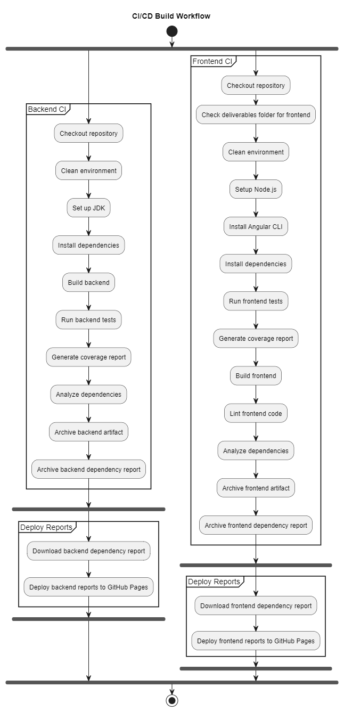
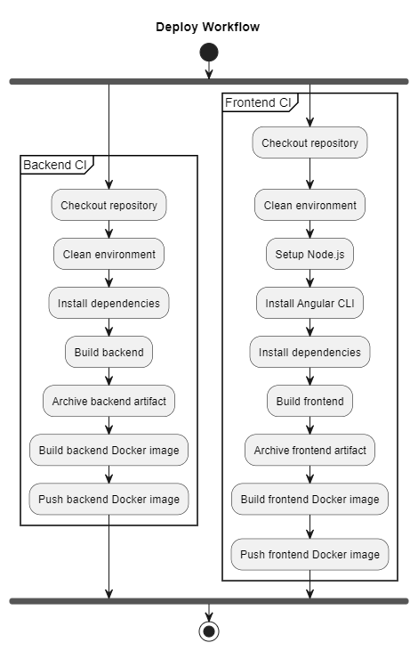
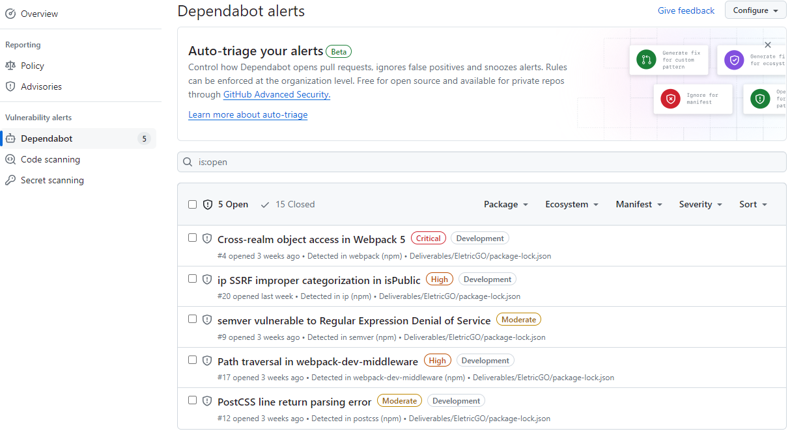
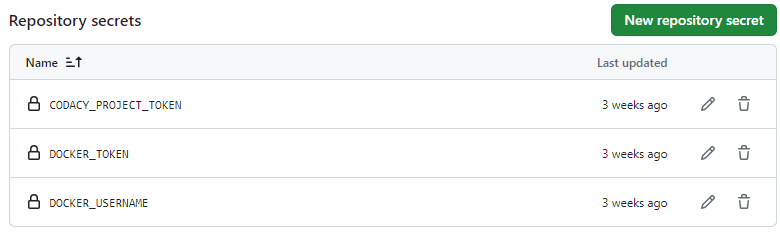
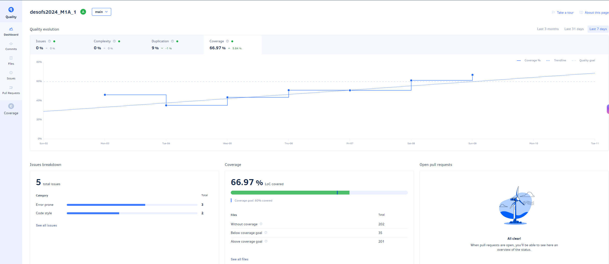
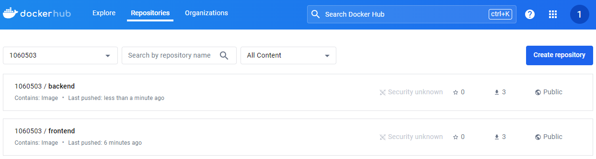
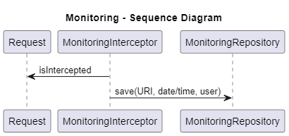
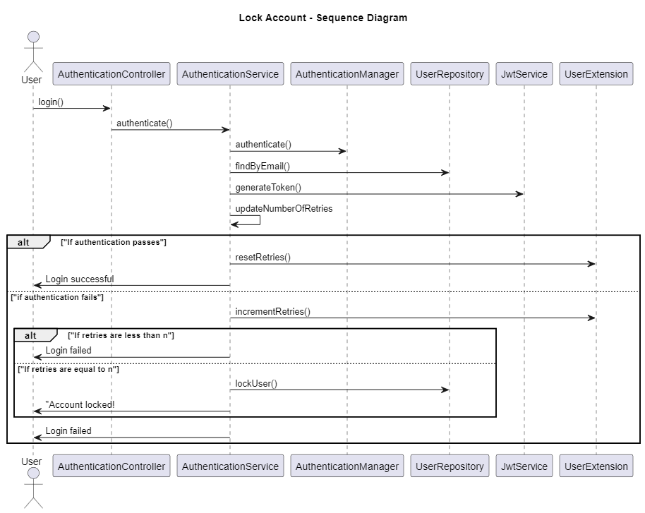
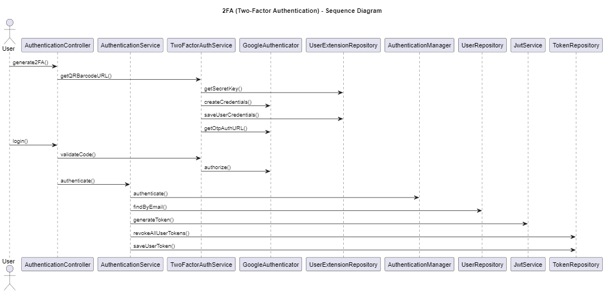
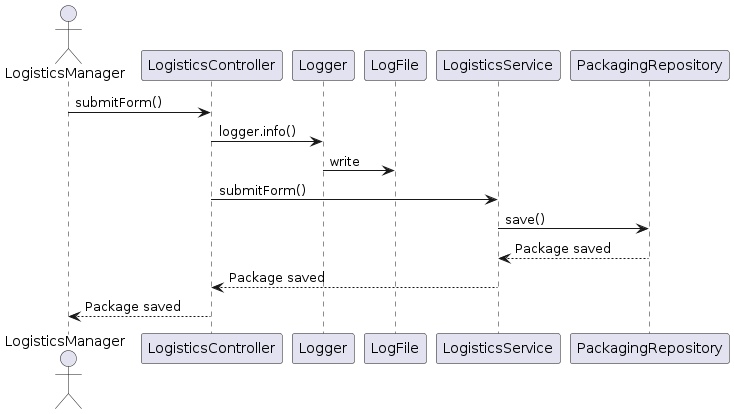

# DESFOS 2024_M1A_1

- Developed by:
  - 1060503 - Pedro Fernandes
  - 1170541 - Alexandra Leite
  - 1171540 - Fábio Cruz
  - 1180511 - Vitor Costa
  - 1191816 - Cristiano Soares

## Table of Contents

- [Introduction](#introduction)
- [Application Security Verification Standard (ASVS) Checklist](#application-security-verification-standard-asvs-checklist)
- [Issue Tracker](#issue-tracker)
- [Build and Deploy Process](#build-and-deploy-process)
  - [Continuous Integration (CI)](#continuous-integration-ci)
  - [Continuous Deployment (CD)](#continuous-deployment-cd)
  - [Automation Tools](#automation-tools)
  - [Pull and Run Docker Images](#pull-and-run-docker-images)
- [Frontend](#frontend)
  - [Key Features](#key-features)
  - [Development Setup](#development-setup)
  - [Testing](#testing)
- [Backend](#backend)
  - [Key Features](#key-features-1)
  - [Development Setup](#development-setup-1)
  - [Testing](#testing-1)
- [Database](#database)
- [Aggregate Specifications](#aggregate-specifications)
  - [Common](#common)
    - [Backend](#backend-1)
    - [Frontend](#frontend-1)
  - [User Aggregate](#user-aggregate)
  - [Warehouse Aggregate](#warehouse-aggregate)
  - [Delivery Aggregate](#delivery-aggregate)
  - [Truck Aggregate](#truck-aggregate)
  - [Logistics Aggregate](#logistics-aggregate)

## Introduction

The main objective of this document is to present the second sprint P2 implementation decisions.

As we decided in the previous document, we have three main components:

  1. Frontend
  2. Backend
  3. Database

The frontend is developed using Angular, the backend is developed using Java and the database is developed using PostgreSQL.

Additionally, we are using the GitHub Actions to automate the build and deploy process.

All of the work is tracked in the GitHub Issues.

## Application Security Verification Standard (ASVS) Checklist

In terms of security we followed the Application Security Verification Standard (ASVS) checklist.

The following file shows the ASVS requirements: [ASVS Check List](v4-ASVS-checklist-en_sprint_1.xlsx)

## Issue Tracker

We have created the following issues to track the tasks related to the DESFOS project:

- [#1 Documentation](https://github.com/pedrofern/desofs2024_M1A_1/issues/1)
- [#2 Users documentation](https://github.com/pedrofern/desofs2024_M1A_1/issues/2)
- [#3 Warehouse documentation](https://github.com/pedrofern/desofs2024_M1A_1/issues/3)
- [#4 Delivery Plan documentation](https://github.com/pedrofern/desofs2024_M1A_1/issues/4)
- [#5 Truck documentation](https://github.com/pedrofern/desofs2024_M1A_1/issues/5)
- [#6 Logistics documentation](https://github.com/pedrofern/desofs2024_M1A_1/issues/6)
- [#7 Pipeline/Common implementation](https://github.com/pedrofern/desofs2024_M1A_1/issues/7)
- [#8 BE - Users implementation](https://github.com/pedrofern/desofs2024_M1A_1/issues/8)
- [#9 BE - Warehouse implementation](https://github.com/pedrofern/desofs2024_M1A_1/issues/9)
- [#10 BE - Delivery Plan implementation](https://github.com/pedrofern/desofs2024_M1A_1/issues/10)
- [#11 BE - Truck implementation](https://github.com/pedrofern/desofs2024_M1A_1/issues/11)
- [#12 BE - Logistics implementation](https://github.com/pedrofern/desofs2024_M1A_1/issues/12)
- [#13 FE - Users implementation](https://github.com/pedrofern/desofs2024_M1A_1/issues/13)
- [#14 FE - Warehouse implementation](https://github.com/pedrofern/desofs2024_M1A_1/issues/14)
- [#15 FE - Delivery Plan implementation](https://github.com/pedrofern/desofs2024_M1A_1/issues/15)
- [#16 FE - Truck implementation](https://github.com/pedrofern/desofs2024_M1A_1/issues/16)
- [#17 FE - Logistics implementation](https://github.com/pedrofern/desofs2024_M1A_1/issues/17)

## Build and Deploy Process

We have set up a continuous integration and continuous deployment (CI/CD) pipeline using GitHub Actions. The pipeline is configured to automate the build, test, and

Deployment processes for both the frontend and backend components of the project is done when a tag v*.*.* is created.

Here there is a copy of the pipeline files:

- CI/CD Build Workflow file: [CI/CD Build Workflow](pipeline.yml)
- Deploy Images Release file: [Deploy Images](release.yml)

### Continuous Integration (CI)

The CI pipeline includes the following steps for both backend and frontend:

1. **Checkout Repository**: Clone the repository to the build server.
2. **Clean Environment**: Ensure the build environment is clean.
3. **Setup Environment**: Configure the necessary environment (JDK for backend, Node.js for frontend).
4. **Install Dependencies**: Install required dependencies for the project.
5. **Run Tests**: Execute unit tests and generate coverage reports.
6. **Static Analysis**: Perform static code analysis to check code quality and security.
7. **Build Artifacts**: Compile the code and build the artifacts (JAR files for backend, build files for frontend).
8. **Archive Artifacts**: Store the build artifacts for later use.
9. **Deploy Artifacts**: Deploy the artifacts to the appropriate environments.

### Continuous Deployment (CD)

The CD pipeline is triggered after the CI pipeline completes successfully. It involves:

1. **Download Reports**: Download dependency and coverage reports generated during the CI process.
2. **Deploy to GitHub Pages**: Deploy reports to GitHub Pages for easy access and review.

CI/CD Build Workflow diagram:



### Deploy Images

1. **Build Docker Images**: Build Docker images for both backend and frontend.
2. **Push Docker Images**: Push the Docker images to Docker Hub.

Deploy Images Release diagram:



### Automation Tools

- **Dependabot**:
  - GitHub tool enabled to keep dependencies up to date.

- **Codacy Quality**:
  - Enabled to monitor code quality.
  - [](https://app.codacy.com?utm_source=gh&utm_medium=referral&utm_content=&utm_campaign=Badge_grade)

- **Codacy Coverage**:
  - Enabled to monitor code coverage.
  - [](https://app.codacy.com?utm_source=gh&utm_medium=referral&utm_content=&utm_campaign=Badge_coverage)

- **Deploy to Docker Hub**:
  - Enabled to deploy Docker images to Docker Hub.

### Tools Evidence

- **Dependabot**:



- **GitHub Secrets**:

  

- **Codacy Quality and Coverage**:

  

- **Docker Hub**:



### Pull and Run Docker Images

#### Pull Backend Image
>
>docker pull 1060503/backend

#### Execute Backend Container
>
>docker run -d --name backend_container --platform linux/amd64 -p 8080:80 1060503/backend

#### Pull Frontend Image
>
>docker pull 1060503/frontend

#### Execute Frontend Container
>
>docker run -d --name frontend_container -p 8081:8081 1060503/frontend:latest

## Frontend

The frontend is developed using Angular. It is responsible for the user interface and user experience of the EletricGo application.

### Key Features

- **User Management**: Interfaces for managing user accounts and profiles.
- **Warehouse Management**: Interfaces for managing warehouse data and operations.
- **Delivery Plan**: Interfaces for planning and managing deliveries.
- **Truck Management**: Interfaces for managing truck data and operations.
- **Logistics Management**: Interfaces for managing logistics operations.

### Development Setup

1. **Node.js**: 20.9.0
2. **Angular CLI**: 15.0.4
3. **Install Dependencies**: Run `npm install` to install required dependencies.
4. **Run Development Server**: Start the application using `ng start`.

### Testing

- **Unit Tests**: Run unit tests using `npm run test-no-browser`.

## Backend

The backend is developed using Java and Spring Boot. It provides RESTful APIs for the frontend and handles business logic, data processing and integration with the database.

### Key Features

- **User Management**: APIs for user authentication, authorization, and profile management.
- **Warehouse Management**: APIs for managing warehouse data and operations.
- **Delivery Plan**: APIs for planning and managing deliveries.
- **Truck Management**: APIs for managing truck data and operations.
- **Logistics Management**: APIs for managing logistics operations.

### Development Setup

- **JDK**: JDK 17.
- **Install Dependencies**: Run `mvn clean install` to install required dependencies.
- **Run Application**: Start the application using `mvn spring-boot:run`.

### Testing

- **Unit Tests**: Run unit tests using `mvn test jacoco:report`.
- **Integration Tests**: Run integration tests using the Postman collection file `BackendAPI/EletricGo_BackEnd.postman_collection.json`.

## Database

The database is developed using PostgreSQL. It stores all the data related to the DESFOS application, including user data, warehouse information, delivery plans, truck data, and logistics operations.

## Aggregate Specifications

Many of security requirements are implemented in the backend, and the frontend is responsible for the user interface and user experience of the EletricGo application.

Some of them are common to all components, but others are specific to each component.

### Common

The backend was the focus of the security requirements and the frontend was the focus of the user interface and user experience of the EletricGo application.

#### Backend

The structure of the backend was designed to ensure that the data is secure and that the APIs are protected from unauthorized access.

> **We implemented user authentication and authorization, input validation, and data encryption to protect sensitive information, with many other security concerns.**

> **All of this was possible using interceptors for each request to the server.**

Other security requirement implemented in the backend was monitoing and logging of all activities on the system, to detect and respond to suspicious activity.

We implemented an interceptor witch has only the issue to persiste into the database all the requests, (user, date/time, endpoint) that are made to the server.



#### Frontend

Obviously, we had many security concerns in the frontend, such as ensuring that each logged-in user can only view their permitted information.

Aldo, we have specific requirements for each component.

### User Aggregate

The user aggregate is responsible for managing user accounts and profiles. It is probably the most critical part of the application, as it deals with sensitive information such as user credentials and personal data.

To solve this requirement and mitigate the risks, it was implemented 2FA (Two-Factor Authentication) and lock account after n failed login attempts.

> **Lock account after n failed login attempts**



> **2FA (Two-Factor Authentication)**

This requirement was implemented using the Google Authenticator app to generate a time-based one-time password (TOTP) for each user.



### Warehouse Aggregate

To prevent the abuse scenarios identified, various security measures have been implemented on both the backend and the frontend. In addition to what has been implemented for all aggregates, the following has also been implemented:

1. **Rate Limit Interceptor**:
    - We have implemented a rate limit interceptor to limit the number of requests a user can make to the API.
    - The limit is set to 1000 requests per minute, thus preventing brute force and DDoS attacks.

2. **Application Audit Aware**:
    - We've added application-aware auditing to monitor and log activities on the system.
    - This includes tracking user actions and system changes, helping to detect and respond to suspicious activity.

3. **Role-based authorization**:
    - We set up authorization based on roles to control access to different system functionalities:
        - **Operator**: Users with the operator role only have access to read operations (GET).
        - **Warehouse**: Users with the warehouse role have full access for all operations (CRUD).

4. **Validation of the object received by the geolocation API:**
    - Validation has been added to the object received by the external API for geolocation search to guarantee the integrity and compliance of the data received, avoiding code injections and malformed data.

5. **New rest template**:
    - A new REST template has been set up with improved HTTP connection settings to increase efficiency and avoid running out of resources.
    - A maximum total of 100 connections and a maximum time per connection of 5 seconds have been set.

### Delivery Aggregate

To prevent the abuse scenarios identified, various security measures have been implemented on both the backend and the frontend. In addition to what has been implemented for all aggregates, the following has also been implemented:

1. **Rate Limit Interceptor**:
    - We have implemented a rate limit interceptor to limit the number of requests a user can make to the API.
    - The limit is set to 1000 requests per minute, thus preventing brute force and DDoS attacks.

2. **Application Audit Aware**:
    - We've added application-aware auditing to monitor and log activities on the system.
    - This includes tracking user actions and system changes, helping to detect and respond to suspicious activity.

3. **Role-based authorization**:
    - We set up authorization based on roles to control access to different system functionalities:
        - **Operator**: Users with the operator role only have access to read operations (GET).
        - **Warehouse**: Users with the warehouse role have full access for all operations (CRUD).

### Truck Aggregate

The Truck Aggregate is responsible for managing all aspects of truck data, including creation, updating, and retrieval. This component ensures accurate and secure management of truck information essential for logistics operations.

#### Security Measures

> **User Authentication and Authorization**

Ensures only authorized users can manage truck data using role-based access control.

```java
// Only FLEET_MANAGER can access these endpoints
.requestMatchers(FLEET_LIST_URL).hasAnyRole(Role.ADMIN.getName(), Role.FLEET_MANAGER.getName())
```

```java
validateRole(): boolean {
        return this.token.getRole() === 'ADMIN' || this.token.getRole() === 'FLEET_MANAGER';
    }
```

> **Input Validation**

Prevents injection attacks by validating all input data.

```java
private void validateTruckDto(TruckDto truckDto) {
        if (truckDto.getBattery() == null) {
            throw new InvalidBatteryException("Battery information cannot be null");
        }
        if (truckDto.getTare() < 0) {
            throw new InvalidTruckException("Tare must be positive");
        }

        if (InputSanitizer.containsMaliciousContent(String.valueOf(truckDto.getTruckId())) ||
                InputSanitizer.containsMaliciousContent(String.valueOf(truckDto.getTare())) ||
                InputSanitizer.containsMaliciousContent(String.valueOf(truckDto.getLoadCapacity())) ||
                InputSanitizer.containsMaliciousContent(String.valueOf(truckDto.isActive())) ||
                InputSanitizer.containsMaliciousContent(truckDto.getBattery().toString())) {
            throw new InvalidTruckException("Request contains potentially malicious content");
        }
    }
```

> **Secure Error Handling**

- **Exception Handling:** Catches and manages errors gracefully, providing meaningful and non-sensitive messages to users.
- **Logging:** Logs detailed error information for debugging without exposing sensitive data.
- **Generic User Messages:** Ensures users receive generic error messages that do not reveal internal system details.

```java
@Override
public TruckDto getTruck(long truckId) {
    try {
        return truckRepository.findById(truckId)
            .orElseThrow(() -> new InvalidTruckException("Truck not found"));
    } catch (InvalidTruckException e) {
        logger.error("Error fetching truck: {}", e.getMessage());
        throw e;
    } catch (Exception e) {
        logger.error("Unexpected error fetching truck", e);
        throw new RuntimeException("Unexpected error occurred. Please try again later.");
    }
}
```

### Logistics Aggregate

The logistics aggregate is responsible for managing the packages, their delivery, their truck and the position inside the truck.

To mitigate the risk in this aggregate it was implemented:

- Input Validation to validate every input that reaches the system for SQL queries and/or scripts, using interceptors.

- Rate Limit so that the system does not get a an overload of requests, using interceptors.

- Logs so that is saved what which person did so that if a problem arises we know who did it.



- "Valid" annotations on the parameters on the controller and annotations on the request type (SubmitLogisticsForm) to mitigate Parameter Tampering.
