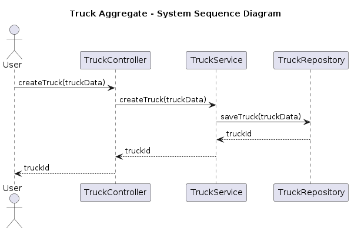
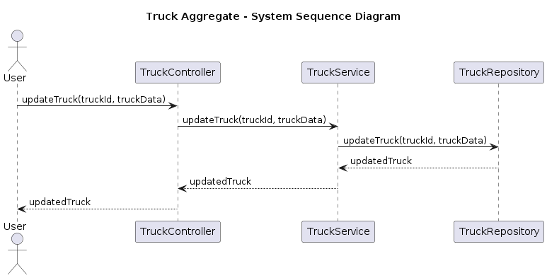
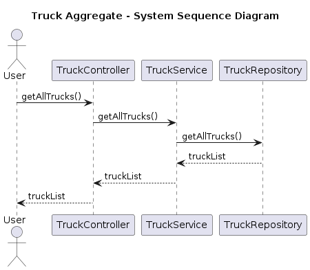
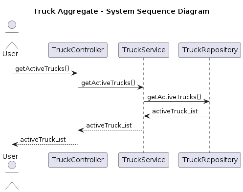
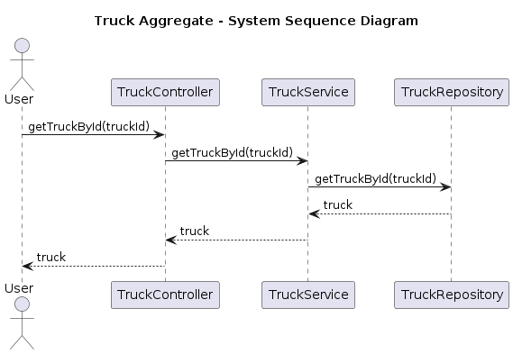
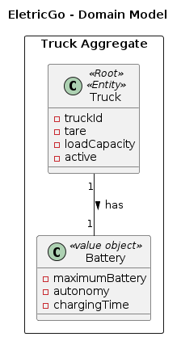
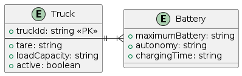
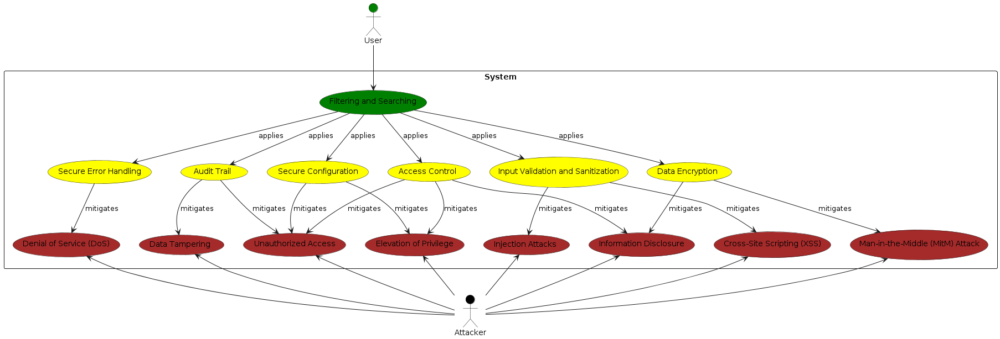
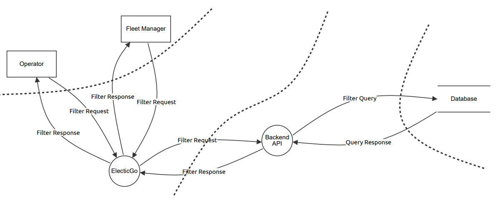
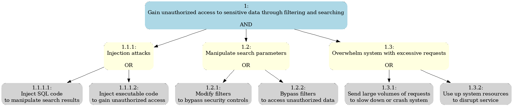

[Click here to show global document](../README.md)

# Software Architectural Analysis and Design of Truck Aggregate
- This document describes the architecture of EletricGo's Truck aggregate, providing an overview of the design decisions and architectural analysis made during development.
- Truck Aggregate is a sub-system developed to provide transportation services using electric trucks.
 
# Table of Contents
1. [Requirements Engineering](#1-requirements-engineering)
	1. [User Stories Description](#11-user-stories-description)
   2. [Customer Specifications and Clarifications](#12-customer-specifications-and-clarifications)
   3. [Acceptance Criteria](#13-acceptance-criteria)
   4. [Found out Dependencies](#14-found-out-dependencies)
   5. [Input and Output Data](#15-input-and-output-data)
   6. [System Sequence Diagram (SSD)](#16-system-sequence-diagram-ssd)
   7. [API Endpoints](#17-api-endpoints)
   8. [Database Schema](#18-database-schema)
   9. [Authorization Roles](#19-authorization-roles)
2. [Analysis](#2-analysis)
   1. [Preliminary Software Risk Analysis](#21-preliminary-software-risk-analysis)
   2. [Security Requirements Engineering](#22-security-requirements-engineering)
   3. [Abuse Cases](#23-abuse-cases)
   4. [Functional Security Requirements](#24-functional-security-requirements)
   5. [Non-Functional Security Requirements](#25-non-functional-security-requirements)
   6. [Secure Development Requirements](#26-secure-development-requirements)
3. [Design](#3-design)
   1. [Security Risk-Driven Design](#31-security-risk-driven-design)
   2. [Secure Architecture](#32-secure-architecture)
   3. [Secure Design Patterns](#33-secure-design-patterns)
   4. [Threat Modelling](#34-threat-modelling)
      1. [Threat Model Information](#341-threat-model-information)
      2. [External Dependencies](#342-external-dependencies)
      3. [Entry Points](#343-entry-points)
      4. [Exit Points](#344-exit-points)
      5. [Assets](#345-assets)
      6. [Trust Levels](#346-trust-levels)
      7. [Data Flow Diagrams](#347-data-flow-diagrams)
      8. [Threat Analysis](#348-threat-analysis)
      9. [Ranking of Threats](#349-ranking-of-threats)
      10. [Qualitative Risk Model](#3410-qualitative-risk-model)
      11. [Mitigation and Countermeasures](#3411-mitigation-and-countermeasures)
   5. [Security Test Planning](#35-security-test-planning)
   6. [Security Architecture Review](#36-security-architecture-review)

# 1. Requirements Engineering
 
## 1.1 User Stories Description
- As a System Administrator, I want to be able to create a new truck entry in the system, including its battery details.
- As a System Administrator, I want to be able to update the details of any truck, including its battery details.
- As a System Administrator, I want to be able to delete any truck from the system.
- As a Warehouse Manager, I want to be able to view the details of any truck, including its battery details.
- As a Fleet Manager, I want to be able to create a new truck entry in the system, including its battery details.
- As a Fleet Manager, I want to be able to update the details of any truck, including its battery details.
- As a Fleet Manager, I want to be able to delete any truck from the system.
- As a Logistics Manager, I want to be able to view the details of any truck, including its battery details.
- As an Operator, I want to be able to view the details of any truck, including its battery details.

## 1.2 Customer Specifications and Clarifications
1. **Truck Details**: Each truck in the system should have a unique identifier, tare, load capacity, and an active status. The active status indicates whether the truck is currently in use.

2. **Battery Details**: Each truck is equipped with one battery. The details of each battery, including its maximum capacity, autonomy, and charging time, should be stored in the system.

3. **Truck-Battery Relationship**: The system should maintain the relationship between each truck and its battery. 

4. **Truck Management**: System administrators and fleet managers should be able to create, update, and delete truck entries in the system. Warehouse managers, logistics managers, and operators should be able to view the details of any truck.

5. **Battery Management**: System administrators and fleet managers should also be able to manage the battery details of the trucks when creating or updating a truck entry.

## 1.3 Acceptance Criteria
- The system should allow the user to create a new truck entry, including its battery details, by sending a POST request to `/trucks`.
- The system should allow the user to update the details of a specific truck, including its battery details, by sending a PUT request to `/trucks/:truckId`.
- The system should retrieve a list of all trucks in the system, including their battery details, by sending a GET request to `/trucks`.
- The system should retrieve a list of active trucks in the system, including their battery details, by sending a GET request to `/trucks/active`.
- The system should retrieve the details of a specific truck, including its battery details, by sending a GET request to `/trucks/:truckId`.
- The system should validate the input fields to ensure data integrity. This includes the validation of the battery details.
- The system should generate a unique identifier for each truck entry.
- The system should provide an audit trail of all changes made to the truck entries, including changes to the battery details.
- The user should be able to search for trucks based on their load capacity, autonomy, and battery details.
- The user should be able to filter the list of trucks based on their status (active or inactive) and battery details.
- The user should be able to sort the list of trucks based on different criteria, such as truckId, load capacity, autonomy, and battery details.

## 1.4 Found out Dependencies
- The truck aggregate depends on the availability of a database management system to store and retrieve truck data.
- The truck aggregate depends on the authentication and authorization system to enforce access control and security.

## 1.5 Input and Output Data
The input and output data for the Truck aggregate are as follows:

### Input Data
- When creating a new truck entry, the input data should include the truck details such as tare, load capacity, and active status. It should also include the battery details such as maximum capacity, autonomy, and charging time.

### Output Data
- When retrieving a list of all trucks or a specific truck, the output data should include the truck details and the associated battery details.
- When creating or updating a truck entry, the output data should include the unique identifier assigned to the truck.
- When deleting a truck entry, there is no specific output data.

The input and output data should be formatted according to the API specifications and communicated through the appropriate HTTP request methods and response codes.

## 1.6 System Sequence Diagram (SSD)

### SSD for Use Case 1: Create Truck Entry

### SSD for Use Case 2: Update Truck Details

### SSD for Use Case 3: Retrieve All Trucks

### SSD for Use Case 4: Retrieve Active Trucks

### SSD for Use Case 5: Retrieve Specific Truck

## 1.7 API Endpoints
The following API endpoints are available for the Truck aggregate:

- `POST /trucks`: Creates a new truck entry in the system.
- `PUT /trucks/:truckId`: Updates the details of a specific truck.
- `GET /trucks`: Retrieves a list of all trucks in the system.
- `GET /trucks/active`: Retrieves a list of active trucks in the system.
- `GET /trucks/:truckId`: Retrieves the details of a specific truck.

These endpoints allow users to perform various operations on the truck aggregate, such as creating, updating, and retrieving truck information.

## 1.8 Database Schema: Relational Model
The Domain Model for the Truck Aggregate is as follows:

Considering the previous model, the Truck Aggregate has the following database schema:

## 1.9 Authorization Roles
The system has the following types of users:

- **System Administrator** - This user has full access to the truck aggregate. They can create, update, delete, and view details of any truck in the system.

- **Warehouse Manager** - This user has limited access to the truck aggregate. They can view details of trucks, but cannot create, update, or delete truck entries.

- **Fleet Manager** - This user has full access to the truck aggregate. They can create, update, delete, and view details of any truck in the system.

- **Logistics Manager** - This user has limited access to the truck aggregate. They can view details of trucks, but cannot create, update, or delete truck entries.

- **Operator** - This user has limited access to the truck aggregate. They can view details of trucks, but cannot create, update, or delete truck entries.

# 2. Analysis

## 2.1 Preliminary Software Risk Analysis
During the preliminary software risk analysis, it is important to focus on the security aspects related to filtering and searching in the truck aggregate's database queries. This includes identifying potential risks and vulnerabilities that may arise when querying the database for specific data.

Some of the risks that should be considered in the preliminary software risk analysis for the truck aggregate's filtering and searching functionality include:

1. **Injection Attacks**: The truck aggregate may be vulnerable to injection attacks, such as SQL injection or code injection, when constructing database queries based on user input. These attacks can allow malicious actors to execute arbitrary code or manipulate the database.

2. **Data Leakage**: There is a risk of unintentionally exposing sensitive data through improper filtering or searching mechanisms. This can lead to unauthorized access to sensitive information or privacy violations.

3. **Insufficient Input Validation**: Lack of proper input validation when constructing database queries can make the truck aggregate vulnerable to various attacks, such as cross-site scripting (XSS) or command injection.

4. **Insecure Query Construction**: Improper construction of database queries, such as using dynamic query strings or concatenating user input directly into the query, can introduce security vulnerabilities and allow for unintended data access.

5. **Inadequate Access Control**: Insufficient access control mechanisms when filtering or searching data can result in unauthorized access to sensitive information or data leakage.

To mitigate these risks, it is important to implement secure coding practices and apply appropriate security controls when filtering and searching data in the truck aggregate's database queries. This includes using parameterized queries or prepared statements to prevent injection attacks, implementing proper input validation to ensure data integrity, and enforcing access control mechanisms to restrict unauthorized access to sensitive information.

Additionally, regular security assessments and testing should be conducted to identify and address any vulnerabilities or weaknesses in the filtering and searching functionality of the truck aggregate. This can help ensure the security and integrity of the system and protect against potential threats.

## 2.2 Security Requirements Engineering
During the security requirements engineering phase, it is important to identify and define the specific security requirements for the truck aggregate. These requirements should address the potential risks and vulnerabilities identified in the preliminary software risk analysis.

Some examples of security requirements for the truck aggregate may include:

1. **Authentication and Authorization**: The system should implement a secure authentication and authorization mechanism to ensure that only authorized users can access and modify truck data.

2. **Secure Communication**: The system should use secure communication protocols, such as HTTPS, to protect the confidentiality and integrity of data transmitted between the client and the server.

3. **Input Validation**: The system should validate and sanitize all user input to prevent injection attacks, such as SQL injection or cross-site scripting (XSS).

4. **Access Control**: The system should enforce proper access control mechanisms to restrict unauthorized access to sensitive truck data and functionalities.

5. **Audit Trail**: The system should maintain an audit trail of all changes made to the truck entries, including changes to the battery details, to ensure accountability and traceability.

6. **Data Encryption**: The system should encrypt sensitive data, such as truck details and battery information, when stored in the database to protect against unauthorized access.

7. **Secure Error Handling**: The system should handle errors and exceptions in a secure manner, avoiding the disclosure of sensitive information that could be exploited by attackers.

8. **Secure Configuration**: The system should be configured securely, following best practices and industry standards, to minimize potential vulnerabilities and ensure a robust security posture.

## 2.3 Abuse Cases
Abuse cases are scenarios where the system can be intentionally misused or exploited. Here are some abuse cases for the Truck aggregate:

1. **Unauthorized Access**: An attacker tries to access the truck aggregate API endpoints without proper authentication or authorization.
2. **Injection Attacks**: An attacker attempts to inject malicious code or SQL queries through the input fields of the truck aggregate.
3. **Denial of Service (DoS)**: An attacker floods the truck aggregate with a high volume of requests, causing the system to become unresponsive or crash.
4. **Data Tampering**: An attacker modifies the data of a truck entry, leading to incorrect information being displayed or processed.
5. **Elevation of Privilege**: An unauthorized user tries to gain elevated privileges by exploiting vulnerabilities in the truck aggregate.
6. **Cross-Site Scripting (XSS)**: An attacker injects malicious scripts into the truck aggregate, which are then executed by other users' browsers.
7. **Information Disclosure**: A user gains access to sensitive information, such as truck details or API endpoints, that they are not authorized to view.
8. **Man-in-the-Middle (MitM) Attack**: An attacker intercepts the communication between the truck aggregate and its clients, potentially gaining access to sensitive data.

These abuse cases should be considered during the design and implementation of the truck aggregate to ensure its security and resilience against potential threats.
 

## 2.4 Functional Security Requirements
1. **Authentication and Authorization**: The system should require users to authenticate before accessing any truck-related functionalities. Only authorized users with the appropriate roles should be able to create, update, delete, and view truck entries.

2. **Secure Input Validation**: The system should validate and sanitize all user input to prevent injection attacks, such as SQL injection or cross-site scripting (XSS). It should also enforce input validation rules to ensure data integrity and prevent unauthorized access.

3. **Access Control**: The system should enforce proper access control mechanisms to restrict unauthorized access to sensitive truck data and functionalities. Each user should only have access to the truck entries and operations that are relevant to their role.

4. **Secure Communication**: The system should use secure communication protocols, such as HTTPS, to protect the confidentiality and integrity of data transmitted between the client and the server. It should also implement secure session management to prevent session hijacking or session fixation attacks.

5. **Audit Trail**: The system should maintain an audit trail of all changes made to the truck entries, including changes to the battery details. This audit trail should include information such as the user who made the change, the timestamp of the change, and the details of the change itself.

6. **Data Encryption**: The system should encrypt sensitive data, such as truck details and battery information, when stored in the database to protect against unauthorized access. It should also ensure that encryption keys are properly managed and protected.

7. **Secure Error Handling**: The system should handle errors and exceptions in a secure manner, avoiding the disclosure of sensitive information that could be exploited by attackers. Error messages should be generic and not reveal any implementation details or sensitive data.

8. **Secure Configuration**: The system should be configured securely, following best practices and industry standards. This includes properly configuring security settings, such as password policies, session timeouts, and access control rules.

These functional security requirements should be implemented to ensure the security and integrity of the truck aggregate and protect against potential threats and vulnerabilities.

## 2.5 Non-Functional Security Requirements
1. **Performance**: The system should be able to handle a high volume of requests without significant degradation in performance. This includes efficient handling of database queries and response times within acceptable limits.

2. **Scalability**: The system should be able to scale horizontally or vertically to accommodate increasing user load and data volume. This includes the ability to add more servers or resources as needed without compromising security.

3. **Availability**: The system should have a high level of availability, ensuring that it is accessible to authorized users at all times. This includes implementing redundancy and failover mechanisms to minimize downtime.

4. **Reliability**: The system should be reliable, ensuring that it operates consistently and accurately. This includes implementing error handling and recovery mechanisms to handle unexpected situations and prevent data corruption or loss.

5. **Usability**: The system should be user-friendly and intuitive, making it easy for authorized users to navigate and perform their tasks. This includes providing clear instructions, error messages, and feedback to guide users in using the system securely.

6. **Maintainability**: The system should be easy to maintain and update, allowing for efficient bug fixes, security patches, and feature enhancements. This includes following coding standards, modular design principles, and documentation practices.

7. **Compliance**: The system should comply with relevant security standards, regulations, and industry best practices. This includes adhering to data protection laws, encryption standards, and security audit requirements.

8. **Performance Monitoring**: The system should have performance monitoring capabilities to track and analyze system performance metrics. This includes monitoring response times, resource utilization, and identifying potential bottlenecks or performance issues.

These non-functional security requirements should be considered during the design and implementation of the truck aggregate to ensure that it meets the desired security objectives while also addressing important performance, scalability, availability, reliability, usability, maintainability, compliance, and performance monitoring aspects.

## 2.6 Secure Development Requirements
To ensure secure development practices, the following requirements should be considered:

1. **Secure Coding Guidelines**: Developers should follow secure coding guidelines and best practices to minimize the introduction of vulnerabilities and ensure the use of secure coding techniques.

2. **Code Review**: Regular code reviews should be conducted to identify and address security issues, such as insecure coding practices, potential vulnerabilities, and adherence to secure coding guidelines.

3. **Security Training**: Developers should receive regular security training to stay updated on the latest security threats, vulnerabilities, and best practices. This can help improve their awareness and understanding of secure development principles.

4. **Secure Development Lifecycle**: A secure development lifecycle should be implemented, including security activities at each phase of the software development process. This can help ensure that security is considered from the initial design to the final deployment of the system.

5. **Secure Third-Party Libraries**: When using third-party libraries or components, developers should ensure that they are from trusted sources and regularly update them to address any security vulnerabilities or weaknesses.

6. **Secure Configuration Management**: Proper configuration management practices should be followed to ensure that the system is configured securely. This includes securely storing and managing configuration files, credentials, and encryption keys.

7. **Secure Build and Deployment**: Secure build and deployment processes should be implemented to ensure that the system is built and deployed in a secure manner. This includes using secure build tools, signing and verifying software packages, and securely deploying the system to production environments.

8. **Secure Version Control**: Version control systems should be used to track and manage changes to the source code. Access controls and secure practices should be implemented to protect the integrity and confidentiality of the source code repository.

These secure development requirements can help mitigate security risks and ensure that the system is developed with security in mind throughout the software development lifecycle.

# 3. Design
 
## 3.1 Security Risk-Driven Design
To ensure a security risk-driven design, the following steps should be followed:

1. **Identify and prioritize potential security risks**: Conduct a thorough analysis of the system to identify potential security risks and vulnerabilities. Prioritize these risks based on their impact and likelihood.

2. **Define security requirements**: Based on the identified risks, define specific security requirements that need to be addressed in the design. These requirements should align with industry best practices and standards.

3. **Incorporate security controls**: Integrate appropriate security controls into the design to mitigate the identified risks. This may include implementing access controls, encryption mechanisms, input validation, and secure communication protocols.

4. **Perform threat modeling**: Conduct a threat modeling exercise to identify potential threats and attack vectors. This will help in refining the design and ensuring that it can withstand various security threats.

5. **Validate the design**: Review and validate the design with security experts and stakeholders to ensure that it adequately addresses the identified risks and meets the defined security requirements.

By following these steps, you can ensure that the design of the system is driven by security risks and effectively mitigates potential vulnerabilities.

## 3.2 Secure Architecture
A secure architecture is essential for building a robust and resilient system that can withstand potential security threats and vulnerabilities. It involves designing and implementing security controls and mechanisms at various layers of the system to protect against unauthorized access, data breaches, and other security risks.

Here are some key considerations for designing a secure architecture:

1. **Defense in Depth**: Implement multiple layers of security controls to create a layered defense mechanism. This includes measures such as network segmentation, firewalls, intrusion detection systems, and access controls at different levels of the system.

2. **Secure Communication**: Use secure communication protocols, such as HTTPS, to encrypt data transmitted between the client and the server. This helps protect the confidentiality and integrity of sensitive information.

3. **Authentication and Authorization**: Implement strong authentication mechanisms to verify the identity of users and ensure that only authorized individuals can access the system. Use role-based access control (RBAC) to enforce fine-grained access permissions based on user roles and responsibilities.

4. **Secure Data Storage**: Encrypt sensitive data, both at rest and in transit, to protect against unauthorized access. Implement proper key management practices to ensure the security of encryption keys.

5. **Secure Configuration**: Follow best practices for securely configuring the system, including secure default settings, disabling unnecessary services, and regularly updating and patching software components.

6. **Secure Coding Practices**: Adhere to secure coding guidelines and best practices to minimize the introduction of vulnerabilities. This includes input validation, output encoding, and protection against common attack vectors such as SQL injection and cross-site scripting (XSS).

7. **Logging and Monitoring**: Implement robust logging and monitoring mechanisms to detect and respond to security incidents. Monitor system logs, network traffic, and user activities to identify potential security breaches.

8. **Security Testing**: Conduct regular security testing, including vulnerability assessments and penetration testing, to identify and address any security weaknesses in the system. This helps ensure that the system is resilient against potential attacks.

By incorporating these principles and practices into the design of the system, you can create a secure architecture that provides a strong foundation for protecting sensitive data, ensuring the privacy and integrity of user information, and mitigating potential security risks.

## 3.3 Secure Design Patterns
Secure design patterns are proven architectural solutions that address specific security concerns and help mitigate common security risks. These patterns provide guidance on how to design and implement secure systems by incorporating security controls and mechanisms into the architecture.

Here are some commonly used secure design patterns:

1. **Layered Architecture**: This pattern involves dividing the system into multiple layers, each responsible for a specific set of functionalities. By implementing security controls at each layer, such as authentication and authorization at the presentation layer and data validation at the data layer, this pattern helps enforce security throughout the system.

2. **Access Control**: This pattern focuses on controlling access to resources based on user roles and permissions. It includes mechanisms like role-based access control (RBAC), attribute-based access control (ABAC), and mandatory access control (MAC). By implementing access control mechanisms, this pattern helps prevent unauthorized access to sensitive resources.

3. **Secure Communication**: This pattern ensures secure communication between different components of the system. It involves using encryption protocols like SSL/TLS to protect data transmitted over networks. Additionally, it includes techniques like message integrity checks and secure key exchange to ensure the confidentiality and integrity of data.

4. **Input Validation**: This pattern emphasizes validating and sanitizing user input to prevent common security vulnerabilities like SQL injection and cross-site scripting (XSS). By implementing input validation techniques, such as parameterized queries and output encoding, this pattern helps protect against malicious input.

5. **Audit Logging**: This pattern involves logging relevant security events and activities to provide an audit trail for forensic analysis and compliance purposes. By implementing robust logging mechanisms, this pattern helps detect and investigate security incidents.

6. **Secure Session Management**: This pattern focuses on managing user sessions securely. It includes techniques like session expiration, secure session storage, and protection against session hijacking and fixation attacks. By implementing secure session management, this pattern helps protect user sessions from unauthorized access.

7. **Secure Error Handling**: This pattern involves handling errors and exceptions in a secure manner. It includes techniques like avoiding detailed error messages that could reveal sensitive information and implementing proper error logging and reporting mechanisms.

8. **Secure Configuration**: This pattern emphasizes securely configuring the system and its components. It includes practices like using secure default settings, disabling unnecessary services, and encrypting sensitive configuration data. By implementing secure configuration practices, this pattern helps reduce the attack surface of the system.

These secure design patterns can be applied to various components and layers of the system to address specific security concerns and ensure a robust and resilient architecture.

## 3.4 Threat Modelling
 
### 3.4.1 Threat Model Information
The threat model information provides an overview of the system and its context, including the application name, version, description, document owner, participants, and reviewer.

**Application Name:** EletricGo
**Application Version:** 1.0
**Description:** The application EletricGo is a system created to manage the deliveries of packages through electric trucks.
**Document Owner:** Cristiano Soares
**Participants:**
- Pedro Fernandes
- Alexandra Leite
- Fábio Cruz
- Vitor Costa
- Cristiano Soares
**Reviewer:** Fábio Cruz

### 3.4.2 External Dependencies
| ID          | Description|
|----------------------------|------------|
| 1 | The database of the application will be a relational database. |
| 2 | The communication between the frontend and backend will be using RESTful API.|

### 3.4.3 Entry Points
| ID | Name | Description | Trust Level |
|------|------------|---------|-----------|
| 1 | UI | Users input filter and search criteria through the user interface, which is then processed by the backend to retrieve relevant data from the database. | (2) Logged-in User (3) Logistics Manager |
| 2 | Database Interface | This entry point allows the backend to interact with the database | (2) Logged-in User (3) Logistics Manager | 

### 3.4.4 Exit Points
| ID | Name | Description | Trust Level |
|----|------|-------------|-------------|
| 1 | Response Data | The backend API endpoint returns a response to the user interface based on the request made by the user. This response may include data related to form submission, validation results, or errors. | (2) Logged-in User (3) Logistics Manager |
| 2 | Database Response | After interacting with the database to retrieve filtered and searched data, the backend API endpoint receives a response indicating the success or failure of the database operation. This response may include status codes, error messages, or retrieved data. | (2) Logged-in User (3) Logistics Manager |

### 3.4.5 Assets
| ID | Name | Description | Trust Level |
|----|------|-------------|-------------|
| 1 | Filter Criteria | User-defined filter criteria used to search for specific data in the application. This may include parameters such as date range, keywords, categories, or other relevant attributes. | (2) Logged-in User (3) Logistics Manager |
| 2 | Search Query | The search query submitted by the user to retrieve relevant data from the database. This may include keywords, filters, sorting options, or other search parameters. | (2) Logged-in User (3) Logistics Manager |
| 3 | Search Results | The data returned by the backend API in response to the search query. This includes the filtered and sorted data that matches the user's search criteria. | (2) Logged-in User (3) Logistics Manager |

### 3.4.6 Trust Levels
| ID | Name | Description |
|----|------|-------------|
| 1 | Anonymous Web User | External entities accessing the application without authentication. They have limited access to public resources and functionalities. |
| 2 | Logged-in User | Authenticated users who have successfully logged into the application. They have access to additional features and functionalities compared to anonymous web users. |
| 3 | Logistics Manager | Authenticated users with administrative privileges responsible for managing logistics-related tasks and overseeing the application's operation. They have full access to all features, functionalities, and sensitive data within the application. |

### 3.4.7 Data Flow Diagrams
Data Flow Diagrams (DFDs) are graphical representations of the flow of data within a system. They provide a visual representation of how data moves through different processes, inputs, outputs, and storage within a system. By analyzing the data flow within the system, you can identify potential security vulnerabilities and design appropriate security controls to mitigate them.

### 3.4.8 Threat Analysis
| Category       | Property           | Violated Description |
|--------|--------------|--------------|
| Spoofing (S)   | Authentication  | **User Credential Theft**: Attackers may attempt to steal user credentials by spoofing login forms or tricking users into entering their credentials on malicious websites. |
|                |                    | **IP Spoofing**: Attackers may spoof IP addresses to bypass IP-based access controls and perform unauthorized filtering and searching. |
| Tampering (T)  | Integrity          | **Data Manipulation**: Attackers may tamper with filter and search parameters to manipulate system behavior or retrieve unauthorized data. |
|                |                    | **Parameter Tampering**: Attackers may tamper with filter and search parameters to bypass validation checks or gain unauthorized access to sensitive resources. |
| Repudiation (R)| Nonrepudiation     | **False Filtering Denial**: Users may deny performing certain filters, leading to difficulties in tracing and resolving disputes over the authenticity of filtered data. |
|                |                    | **False Search Denial**: Users may deny performing certain searches, leading to difficulties in tracing and resolving disputes over the authenticity of search results. |
| Information disclosure (I)    | Confidentiality    | **Sensitive Data Exposure**: Attackers may exploit vulnerabilities in filter and search functionalities to disclose sensitive information, such as personal information, payment details, or confidential documents. |
|                |                    | **Error Message Disclosure**: Insecure error handling may reveal sensitive information in error messages, aiding attackers in crafting targeted attacks or exploiting system vulnerabilities. |
| Denial of service (D)    | Availability       | **Filter Flooding**: Attackers may flood filter endpoints with a large volume of requests, overwhelming system resources and causing denial of service to legitimate users. |
|                |                    | **Search Flooding**: Attackers may flood search endpoints with a large volume of requests, overwhelming system resources and causing denial of service to legitimate users. |
| Elevation of privilege (E)  | Authorization     | **Unauthorized Access**: Exploitation of vulnerabilities may allow attackers to gain unauthorized access to filter and search functionalities, bypassing access controls. |
|                |                    | **Privilege Escalation**: Attackers may exploit vulnerabilities to elevate their privileges and gain access to administrative features or sensitive filter and search functionalities. |

Below is the Attack Tree illustrating the compromise of filter and search security.

### 3.4.9 Ranking of Threats
1. **Unauthorized Access**:
   - Damage potential: Unauthorized access to data, potential misuse (8).
   - Reproducibility: Fully reproducible if authentication is bypassed (9).
   - Exploitability: Requires knowledge of authentication bypass techniques (7).
   - Affected users: Affects all users (9).
   - Discoverability: Can be discovered through manual inspection or automated tools (8).
   - Overall DREAD score: (8 + 9 + 7 + 9 + 8) / 5 = 8.2.

2. **Injection Attacks**:
   - Damage potential: Data loss, unauthorized access, data corruption (9).
   - Reproducibility: Fully reproducible if the attacker knows the injection technique (9).
   - Exploitability: Requires knowledge of injection techniques (7).
   - Affected users: Affects all users (9).
   - Discoverability: Can be discovered through manual inspection or automated tools (8).
   - Overall DREAD score: (9 + 9 + 7 + 9 + 8) / 5 = 8.4.

3. **Denial of Service (DoS)**:
   - Damage potential: Disruption of service, loss of availability (8).
   - Reproducibility: Highly reproducible, common attack vector (9).
   - Exploitability: Requires knowledge of DoS techniques or tools (7).
   - Affected users: Affects all users trying to access the service (9).
   - Discoverability: Can be discovered through monitoring or experiencing service disruptions (8).
   - Overall DREAD score: (8 + 9 + 7 + 9 + 8) / 5 = 8.2.

4. **Data Tampering**:
   - Damage potential: Misinformation, potential for wrong decisions based on tampered data (8).
   - Reproducibility: Fully reproducible if the attacker can access and modify the data (9).
   - Exploitability: Requires access to the data and knowledge of how to modify it (7).
   - Affected users: Affects users who rely on the data (9).
   - Discoverability: Can be discovered through data integrity checks or noticing discrepancies in the data (8).
   - Overall DREAD score: (8 + 9 + 7 + 9 + 8) / 5 = 8.2.

5. **Elevation of Privilege**:
   - Damage potential: Unauthorized actions, potential for data loss or system compromise (9).
   - Reproducibility: Fully reproducible if the attacker knows the vulnerability to exploit (9).
   - Exploitability: Requires knowledge of the system vulnerabilities (7).
   - Affected users: Affects all users (9).
   - Discoverability: Can be discovered through manual inspection or automated vulnerability scanning (8).
   - Overall DREAD score: (9 + 9 + 7 + 9 + 8) / 5 = 8.4.

6. **Cross-Site Scripting (XSS)**:
   - Damage potential: Unauthorized execution of scripts, potential for data theft or defacement of web pages (8).
   - Reproducibility: Highly reproducible, common attack vector (9).
   - Exploitability: Requires knowledge of scripting languages and XSS vulnerabilities (7).
   - Affected users: Affects users who view the compromised pages (8).
   - Discoverability: Can be discovered through automated tools or manual inspection (8).
   - Overall DREAD score: (8 + 9 + 7 + 8 + 8) / 5 = 8.

7. **Information Disclosure**:
   - Damage potential: Unauthorized access to sensitive information, potential misuse (8).
   - Reproducibility: Fully reproducible if the information is not properly protected (9).
   - Exploitability: Requires access to the information (7).
   - Affected users: Affects users whose information is disclosed (9).
   - Discoverability: Can be discovered through manual inspection or automated tools (8).
   - Overall DREAD score: (8 + 9 + 7 + 9 + 8) / 5 = 8.2.

8. **Man-in-the-Middle (MitM) Attack**:
   - Damage potential: Unauthorized access to sensitive data, potential misuse (9).
   - Reproducibility: Fully reproducible if the communication is not properly secured (9).
   - Exploitability: Requires access to the communication channel and knowledge of MitM techniques (7).
   - Affected users: Affects users whose communication is intercepted (9).
   - Discoverability: Can be discovered through network monitoring or noticing discrepancies in the data (8).
   - Overall DREAD score: (9 + 9 + 7 + 9 + 8) / 5 = 8.4.

### 3.4.10 Qualitative Risk Model
1. **Unauthorized Access**:
  - Likelihood of occurrence: High, as unauthorized access attempts can be made by attackers with various motivations.
  - Potential impact: Significant, as successful unauthorized access can lead to data breaches, unauthorized actions, and compromise of sensitive information.

2. **Injection Attacks**:
  - Likelihood of occurrence: Moderate to high, as injection attacks are common and can be automated.
  - Potential impact: Significant, as successful injection attacks can lead to data corruption, unauthorized access, and system compromLikelihood of occurrence: Moderate to high, as DoS attacks can be launched remotely and exploit vulnerabilities in the system's infrastructure.
  - Potential impact: Significant, as DoS attacks can result in service disruptions, loss of revenue, and customer dissatisfaction.

4. **Data Tampering**:
  - Likelihood of occurrence: Moderate, as data tampering requires access to the data and knowledge of how to modify it.
  - Potential impact: Moderate, as tampered data can lead to misinformation, wrong decisions, and compromised system integrity.

5. **Elevation of Privilege**:
  - Likelihood of occurrence: Moderate to high, as privilege escalation vulnerabilities can be exploited by attackers.
  - Potential impact: Significant, as elevation of privilege can lead to unauthorized actions, data loss, and compromise of system security.

6. **Cross-Site Scripting (XSS)**:
  - Likelihood of occurrence: Moderate, as XSS vulnerabilities can be exploited by attackers with knowledge of scripting languages.
  - Potential impact: Moderate, as successful XSS attacks can lead to unauthorized execution of scripts and potential data theft.

7. **Information Disclosure**:
  - Likelihood of occurrence: Moderate to high, as information disclosure vulnerabilities can be exploited by attackers.
  - Potential impact: Significant, as unauthorized access to sensitive information can lead to misuse, reputational damage, and legal liabilities.

8. **Man-in-the-Middle (MitM) Attack**:
  - Likelihood of occurrence: Moderate, as MitM attacks require access to the communication channel and knowledge of attack techniques.
  - Potential impact: Significant, as MitM attacks can result in unauthorized access to sensitive data and potential misuse.

### 3.4.11 Mitigation and Countermeasures

#### Spoofing
1. **Strong Authentication**: Implement a robust authentication mechanism that includes multi-factor authentication, strong password policies, and secure password storage.

2. **Secure Communication**: Use secure protocols such as HTTPS to encrypt communication between the client and server, preventing eavesdropping and tampering.

3. **User Education**: Educate users about the risks of spoofing and provide guidance on how to identify and avoid phishing attacks and malicious websites.

4. **Secure Login Forms**: Implement measures to protect login forms from spoofing attacks, such as using CAPTCHA, CSRF tokens, and secure coding practices.

#### Tampering
1. **Input Validation**: Implement strict input validation to ensure that only valid and expected data is accepted by the system. This can include checking for data types, length limits, and format constraints.

2. **Data Integrity Checks**: Implement mechanisms to verify the integrity of data, such as checksums or digital signatures. This can help detect any unauthorized modifications to the data.

3. **Secure Storage**: Store sensitive data in encrypted form to protect it from tampering. Use strong encryption algorithms and ensure that encryption keys are properly managed.

4. **Secure Communication**: Use secure protocols such as HTTPS to encrypt communication between the client and server, preventing tampering of data in transit.

#### Repudiation
1. **Audit Logs**: Implement comprehensive logging of user actions and system events to create an audit trail. This can help in identifying and proving the occurrence of specific actions or events, preventing repudiation.

2. **Digital Signatures**: Use digital signatures to ensure the integrity and authenticity of important system transactions or documents. This can provide evidence of the origin and integrity of the data, preventing repudiation.

34. **User Accountability**: Implement user authentication mechanisms and enforce accountability for actions performed within the system. This can include strong user identification, access controls, and user activity monitoring.

4. **Third-party Verification**: Involve trusted third parties, such as auditors or regulators, to independently verify and validate important transactions or system activities. This can provide additional assurance and evidence in case of repudiation claims.

#### Information Disclosure
1. **Sensitive Data Classification**: Classify sensitive information based on its level of confidentiality and implement appropriate access controls to ensure that only authorized users can access the data.

2. **Secure File Handling**: Implement secure file handling practices, such as restricting file permissions, using secure file transfer protocols, and regularly monitoring file access logs.

3. **SQL Injection Prevention**: Implement input validation and parameterized queries to prevent SQL injection attacks. Sanitize user input and use prepared statements or stored procedures to mitigate the risk of unauthorized database access.

4. **Compliance with Regulations**: Ensure compliance with relevant data protection and privacy regulations, such as GDPR or HIPAA, to protect sensitive information and avoid legal and regulatory penalties.

#### Denial of Service
1. **Traffic Monitoring**: Implement traffic monitoring tools to detect and mitigate abnormal traffic patterns that may indicate a DoS attack. This can include network intrusion detection systems (NIDS) or distributed denial of service (DDoS) mitigation services.

2. **Load Balancing**: Use load balancing techniques to distribute incoming traffic across multiple servers or resources. This can help distribute the load and prevent a single point of failure that can be targeted by DoS attacks.

3. **Firewall Configuration**: Configure firewalls to filter and block malicious traffic that may be associated with DoS attacks. This can include setting up rules to block specific IP addresses or traffic patterns.

4. **Intrusion Prevention Systems**: Deploy intrusion prevention systems (IPS) to detect and block known DoS attack signatures or patterns. This can help prevent the exploitation of vulnerabilities and mitigate the impact of DoS attacks.

#### Elevation of Privilege
1. **Least Privilege Principle**: Implement the principle of least privilege by granting users only the minimum privileges necessary to perform their tasks. This reduces the risk of unauthorized elevation of privileges.

2. **Strong Authentication**: Implement strong authentication mechanisms, such as multi-factor authentication, to ensure that only authorized users can access privileged functionalities or perform privileged actions.

3. **Access Control**: Implement access control mechanisms, such as role-based access control (RBAC), to enforce restrictions on user privileges. Regularly review and update access control policies to prevent unauthorized privilege escalation.

4. **Privilege Separation**: Separate privileged and non-privileged functionalities to minimize the impact of privilege escalation. Use techniques such as privilege separation models or privilege separation architectures.

## 3.5 Security Test Planning
### Objective
The objective of the security testing is to identify and mitigate any vulnerabilities or weaknesses in the filtering and searching functionality of the system. This includes ensuring that the system properly handles user input, prevents injection attacks, and protects sensitive information.

### Scope
The scope of the security testing includes the following areas:
- **Input validation**: Testing the system's ability to properly validate and sanitize user input to prevent injection attacks.
- **Filtering functionality**: Testing the system's ability to accurately filter and retrieve data based on user-defined criteria.
- **Search functionality**: Testing the system's ability to perform efficient and accurate searches based on user input.
- **Data protection**: Testing the system's ability to protect sensitive information during filtering and searching operations.

### Tests:
1. **Injection attack testing**:
  - Test for SQL injection: Attempt to inject SQL statements into the filtering and searching inputs to check if the system properly sanitizes and validates the input.
  - Test for XSS attacks: Attempt to inject malicious scripts into the filtering and searching inputs to check if the system properly sanitizes and validates the input.

2. **Input validation testing**:
  - Test for input length limits: Test the system's response when input exceeds the defined length limits.
  - Test for input format constraints: Test the system's response when input does not meet the defined format constraints.

3. **Filtering functionality testing**:
  - Test for accurate filtering: Verify that the system accurately filters and retrieves data based on user-defined criteria.
  - Test for edge cases: Test the system's response when filtering criteria are at the boundaries or outside the expected range.

4. **Search functionality testing**:
  - Test for accurate search results: Verify that the system returns accurate search results based on user input.
  - Test for search performance: Test the system's response time for different search scenarios, including large datasets.

5. **Data protection testing**:
  - Test for sensitive information exposure: Verify that the system properly protects sensitive information during filtering and searching operations.
  - Test for encryption: Check if the system encrypts sensitive data during filtering and searching operations.

6. **Error handling testing**:
  - Test for proper error messages: Verify that the system provides clear and informative error messages when errors occur during filtering and searching operations.
  - Test for error handling: Test the system's response when unexpected errors occur during filtering and searching operations.

## 3.6 Security Architecture Review
### Objective
The objective of the security architecture review is to assess the overall security design and implementation of the system's filtering and searching functionality. This includes evaluating the effectiveness of security controls, identifying potential vulnerabilities, and recommending improvements to enhance the security posture.

### Scope
The scope of the security architecture review includes the following areas:
- **System architecture**: Assessing the overall design and structure of the system, including the components involved in filtering and searching.
- **Data flow**: Analyzing how data is processed and transmitted during filtering and searching operations, including any potential security risks.
- **Security controls**: Evaluating the effectiveness of security controls implemented to protect against threats and vulnerabilities.
- **Integration with other components**: Assessing the integration of the filtering and searching functionality with other system components, such as authentication and authorization mechanisms.
- **Compliance**: Ensuring compliance with relevant security standards, regulations, and best practices.

### Review Process
The security architecture review for "filtering and searching" typically follows these steps:
1. **Gather information**: Collect relevant documentation, such as system architecture diagrams, data flow diagrams, and security control specifications.
2. **Analyze the architecture**: Review the system architecture to understand how the filtering and searching functionality is implemented and integrated with other components.
3. **Identify potential vulnerabilities**: Identify potential security vulnerabilities or weaknesses in the architecture that could be exploited by attackers.
4. **Evaluate security controls**: Assess the effectiveness of security controls implemented to protect against identified threats and vulnerabilities.
5. **Recommend improvements**: Provide recommendations to enhance the security posture of the filtering and searching functionality, including suggestions for additional security controls or architectural changes.
6. **Document findings**: Document the findings of the security architecture review, including identified vulnerabilities, recommendations, and any compliance gaps.
7. **Communicate findings**: Present the findings to relevant stakeholders, such as development teams, architects, and management, to ensure awareness and facilitate decision-making.
8. **Implement recommendations**: Work with the development teams to implement the recommended security improvements based on the findings of the review.
9. **Validate changes**: Verify that the implemented changes effectively address the identified vulnerabilities and enhance the security of the filtering and searching functionality.
10. **Monitor and maintain**: Continuously monitor and maintain the security of the filtering and searching functionality, including regular security assessments and updates as needed.

