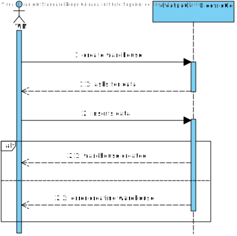
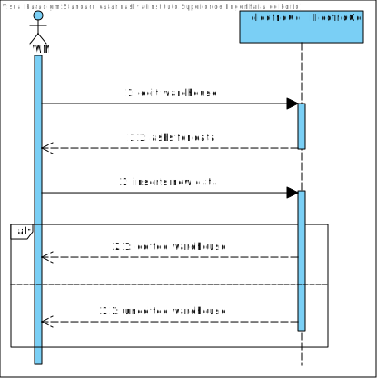
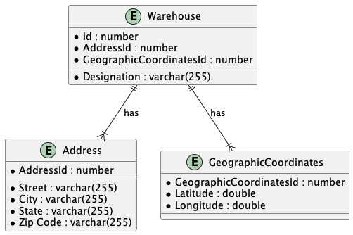
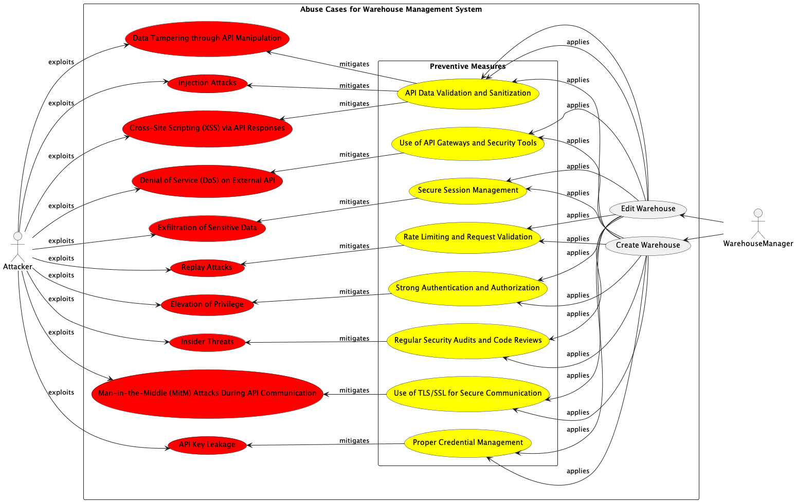
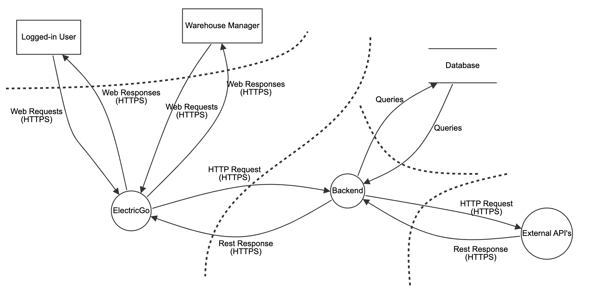
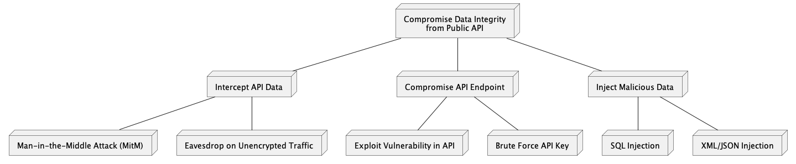

# Software Architectural Analysis and Design of Warehouse Aggregate
- This document describes the architecture of EletricGo's Warehouse aggregate, providing an overview of the design decisions and architectural analysis made during development.
- Warehouse Aggregate is a sub-system developed to ...

# Table of Contents
1. [Requirements Engineering](#1-requirements-engineering)
  1. [User Stories Description](#11-user-stories-description)
  2. [Customer Specifications and Clarifications](#12-customer-specifications-and-clarifications)
  3. [Acceptance Criteria](#13-acceptance-criteria)
  4. [Found out Dependencies](#14-found-out-dependencies)
  5. [Input and Output Data](#15-input-and-output-data)
  6. [System Sequence Diagram (SSD)](#16-system-sequence-diagram-ssd)
  7. [API Endpoints](#17-api-endpoints)
  8. [Database Schema](#18-database-schema-modelo-relacional)
  9. [Authorization Roles](#19-authorization-roles)
2. [Analysis](#2-analysis)
  1. [Preliminary Software Risk Analysis](#21-preliminary-software-risk-analysis)
  2. [Security Requirements Engineering](#22-security-requirements-engineering)
  3. [Abuse Cases](#23-abuse-cases)
  4. [Functional Security Requirements](#24-functional-security-requirements)
  5. [Non-Functional Security Requirements](#25-non-functional-security-requirements)
  6. [Secure Development Requirements](#26-secure-development-requirements)
3. [Design](#3-design)
  1. [Security Risk-Driven Design](#31-security-risk-driven-design)
  2. [Secure Architecture](#32-secure-architecture)
  3. [Secure Design Patterns](#33-secure-design-patterns)
  4. [Threat Modelling](#34-threat-modelling)
  5. [Security Test Planning](#35-security-test-planning)
  6. [Security Architecture Review](#36-security-architecture-review)

# 1. Requirements Engineering

## 1.1 User Stories Description

- As a warehouse manager, I want to be able to create a new warehouse.
- As a warehouse manager, I want to be able to update a warehouse.
- As a warehouse manager, I want to be able to delete a warehouse.
- As a warehouse manager, I want to be able to list all warehouses.

## 1.2 Customer Specifications and Clarifications

- The warehouse should contain the following information:
  - Id
  - Designation
  - Address
  - Geographic Coordinates

## 1.3 Acceptance Criteria

- The warehouse should be successfully created in the system.
- The log should be updated with the warehouse creation.
- The error message should be displayed if the warehouse is not created.

## 1.4 Found out Dependencies

- The warehouse aggregate depends on the following aggregates:
  - User

- The warehouse manager should be authenticated to create, update, and delete a warehouse.
- The Geographic Coordinates depend on the external api.

## 1.5 Input and Output Data

- Input:
  - Designation
  - Address (Street, City, State, Zip Code)
  - Geographic Coordinates (Latitude, Longitude)

## 1.6 System Sequence Diagram (SSD)

- Create Warehouse

- Update Warehouse

- Get All Warehouses

## 1.7 API Endpoints

- POST /warehouse/ - Create a new warehouse
- PUT /warehouse/{id} - Update a warehouse
- DELETE /warehouse/{id} - Delete a warehouse
- GET /warehouses/ - List all warehouses

## 1.8 Database Schema: modelo relacional

Considering the domain model, the Warehouse aggregate has the following database schema:

## 1.9 Authorization Roles

- Warehouse Manager: Access to functionalities related to warehouse data management and delivery tracking.
- Operator: Restricted access for querying and limited operations within each aggregate, with permissions tailored to their role responsibilities.

# 2. Analysis

## 2.1 Preliminary Software Risk Analysis
Given the user stories and system interactions with external APIs (specifically for geographic coordinates), there are several risks:
- **Data Integrity**: Risks associated with incorrect data from the external API affecting warehouse information.
- **Unauthorized Access**: If authentication mechanisms are weak, unauthorized users might access or manipulate warehouse data.
- **Dependency on External Services**: Reliance on external APIs for geographic coordinates could lead to failure in warehouse operations if these services are unavailable or responding with errors.

## 2.2 Security Requirements Engineering
- **Authentication**: Ensure that only authenticated users, specifically warehouse managers, can create, update, or delete warehouse information.
- **Authorization**: Implement role-based access control (RBAC) to enforce that only warehouse managers have write access while operators have limited read access.
- **Data Validation**: Inputs for warehouse creation and update (designation, address, geographic coordinates) must be validated to prevent injection attacks and ensure data integrity.
- **Secure Communication**: Ensure that all data transmitted to and from the external API is encrypted using TLS to protect against eavesdropping and man-in-the-middle attacks.

## 2.3 Abuse Cases

- **API Abuse**: An attacker might attempt to flood the system with rapid, repeated requests to the external geographic coordinates API, leading to denial of service.
- **Spoofing External API**: An attacker could spoof the external API to send incorrect geographic data, leading to erroneous warehouse locations being stored.
- **Unauthorized Data Access**: An attacker impersonates a warehouse manager to gain access to sensitive warehouse data or perform unauthorized operations.
- **Data Tampering through API Manipulation**: An attacker manipulates the data sent to or received from the external geographic coordinates API, potentially altering warehouse locations or corrupting the address data stored in the system.
- **Replay Attacks**: An attacker captures legitimate API requests and replays them to create unauthorized warehouse entries or duplicate transactions, which can disrupt inventory management and reporting.
- **Elevation of Privilege**: An attacker exploits vulnerabilities in the authentication or authorization process to gain higher-level privileges, such as those of a warehouse manager, allowing them to manipulate warehouse data and potentially disrupt operations.
- **Injection Attacks**: Through SQL injection, command injection, or similar attacks, an attacker could exploit insufficient input validation to execute arbitrary commands or queries within the system or the external API, leading to data breaches or unauthorized data alterations.
- **Exfiltration of Sensitive Data**: An attacker might exploit weak security configurations to access and exfiltrate sensitive data such as warehouse locations, inventory details, and personal information of the warehouse staff.
- **Denial of Service (DoS) on External API**: By overwhelming the external geographic coordinates API with high volumes of requests, an attacker could cause the service to become unavailable, leading to failures in warehouse operations that depend on real-time data.
- **Insider Threats**: An employee or insider could misuse their legitimate access to perform unauthorized actions, such as deleting or modifying critical warehouse information, either for personal gain or to cause damage to the organization.
- **Cross-Site Scripting (XSS) via API Responses**: If external API responses are not properly sanitized before being displayed on a user interface, an attacker could inject malicious scripts that are executed in the browsers of users viewing the data, leading to session hijacking or data leaks.
- **Man-in-the-Middle (MitM) Attacks During API Communication**: An attacker could intercept communications between the warehouse management system and the external APIs to steal or manipulate sensitive data transmitted during these exchanges.
- **API Key Leakage**: If API keys or credentials are not securely managed, they could be leaked or stolen, allowing an attacker to gain unauthorized access to the external APIs, leading to potential misuse or abuse of these services.

## 2.4 Functional Security Requirements
- **Secure API Gateway**: Use an API gateway to manage, throttle, and monitor access to the external geographic coordinates API to mitigate abuse.
- **Endpoint Security**: Each API endpoint (POST, PUT, DELETE, GET) should have security measures such as rate limiting, logging, and request validation.
- **Session Management**: Implement secure session management practices for warehouse managers to prevent session hijacking and unauthorized access.

## 2.5 Non-Functional Security Requirements
- **Availability**: Ensure high availability of the system, including during interactions with the external geographic coordinates API.
- **Performance**: The system should handle interactions with the external API efficiently, even under high load, without significant delays in response times.
- **Scalability**: The system should scale effectively as the number of warehouse operations and interactions with the external API increases.

## 2.6 Secure Development Requirements
- **Code Reviews**: Conduct regular security-focused code reviews to identify vulnerabilities early in the development process.
- **Security Training**: Provide security awareness and secure coding training to developers and involved personnel.
- **Automated Security Testing**: Integrate automated security testing tools into the development pipeline to detect vulnerabilities before deployment.

By addressing these points, the system's security posture can be significantly enhanced, especially in its interactions with external APIs and handling of sensitive warehouse data.

# 3. Design

## 3.1 Security Risk-Driven Design

The design will prioritize security risks identified in the analysis phase, particularly those related to the interactions with public APIs for geographic coordinates.

**Encapsulation of API Interactions**:
  - Purpose: To isolate API interaction logic from the rest of the application, reducing the risk of cascading failures and simplifying security updates.
  - Implementation: Create dedicated services or modules that handle all aspects of API communication, including request preparation, response processing, error handling, and data transformation.

**Design for Fail-Safe Operations**:
  - Purpose: To ensure the system remains operational even when external services fail.
  - Implementation: Implement circuit breakers to halt interactions after repeated failures, and use timeouts to prevent system hang-ups due to unresponsive external services.

**Data Integrity Checks**:
  - Purpose: To ensure that data from external sources remains unchanged and reliable throughout its transit.
  - Implementation: Use cryptographic hashes and checksums to validate the integrity of received data before processing it within the system.

## 3.2 Secure Architecture

**Layered Architecture**:
  - Purpose: To provide a clear separation of concerns, enhancing security by segregating systems into distinct layers that can be independently secured.
  - Implementation: Design the application with separate layers for presentation (UI), business logic, data access, and external API interactions. Apply specific security policies and controls to each layer as appropriate.

**Secure API Gateway**:
  - Purpose: To manage and secure all inbound and outbound API traffic.
  - Implementation: Deploy an API gateway that acts as a single entry point for all external communications. This gateway will authenticate API calls, enforce security policies, apply rate limiting, and log all transactions.

**Microservices for Modular Security**:
  - Purpose: To improve the security and maintenance of the system by dividing functionality into independently deployable services.
  - Implementation: Use a microservices architecture to separate functional areas of the application. Each microservice handles a specific aspect of the application and communicates with others via secure, well-defined interfaces.

## 3.3 Secure Design Patterns

**Proxy Pattern**:
  - Purpose: To control access and provide a layer of security between the client and the external API.
  - Implementation: Implement a proxy service that filters, validates, and relays requests to the external API. This service also handles responses by sanitizing data before passing it back to the client.

**Adapter Pattern**:
  - Purpose: To allow the system to interact with external APIs without changing internal data handling or exposing sensitive data structures.
  - Implementation: Design adapters that convert data between the format required by external APIs and the format used internally, shielding the internal systems from external changes.

**Singleton Pattern for API Client Instances**:
  - Purpose: To manage resources efficiently and ensure that critical API client instances are controlled and reused appropriately.
  - Implementation: Use the singleton pattern to create a single instance of each API client, which can be accessed by various parts of the application to ensure consistency and minimize resource usage.

## 3.4 Threat Modelling

## 3.4.1. Threat Model Information

Threat modeling is a systematic approach to identifying and mitigating potential security threats and vulnerabilities within a software system. It is a proactive technique used by security professionals and developers to anticipate potential attacks and prioritize security measures accordingly.

**Application Name:** ElectricGo.

**Application Version:** 1.0.

**Description:** The application ElectricGo is a system created to manage the deliveries of packages through eletric trucks.

**Document Owner:** Vitor Costa.

**Participants:**
- Pedro Fernandes
- Alexandra Leite
- Fábio Cruz
- Vitor Costa
- Cristiano Soares

**Reviewer:** Cristiano Soares.

## 3.4.2 External Dependencies

| ID | Description                                                                   |
|----|-------------------------------------------------------------------------------|
| 1  | The database of the application will be a relational database.                |
| 2  | The communication between the frontend and backend will be using RESTful API. |

## 3.4.3. Entry Points

| ID | Name               | Description                                                       | Trust Level                              |
|----|--------------------|-------------------------------------------------------------------|------------------------------------------|
| 1  | Backend            | Bakcend interact with External API's.                             | (2) Logged-in User (3) Warehouse Manager |
| 2  | Database Interface | This entry point allows the backend to interact with the database | (2) Logged-in User (3) Warehouse Manager | 

## 3.4.4. Exit Points

| ID | Name              | Description                                                                                                                                                                                                                                                             | Trust Level                              |
|----|-------------------|-------------------------------------------------------------------------------------------------------------------------------------------------------------------------------------------------------------------------------------------------------------------------|------------------------------------------|
| 1  | Response Data     | The backend API endpoint returns a response to the user interface based on the request made by the user. This response may include data related to External API's, validation results, or errors.                                                                       | (2) Logged-in User (3) Warehouse Manager |
| 2  | Database Response | After interacting with the database to store or retrieve form-related information, the backend API endpoint receives a response indicating the success or failure of the database operation. This response may include status codes, error messages, or retrieved data. | (2) Logged-in User (3) Warehouse Manager |

## 3.4.5. Assets

| ID | Name                          | Description                                                                                                                                | Trust Level           |
|----|-------------------------------|--------------------------------------------------------------------------------------------------------------------------------------------|-----------------------|
| 1  | User Data                     | Personal information of users, including names, email addresses, passwords, and other sensitive data stored in the application's database. | (3) Warehouse Manager |
| 2  | External API's Configurations | Configuration settings for API's, including base url, resource endpoints and http methods.                                                 | (3) Warehouse Manager |
| 3  | Authentication Settings       | Configuration settings for API's, including autjentication types, authentication endpoint and credentials.                                 | (3) Warehouse Manager |
| 4  | Security Settings             | Configuration settings for API's, including TLS/SSL configuration, rate limiting and input validation.                                     | (3) Warehouse Manager |

## 3.4.6. Trust Levels

| ID | Name               | Description                                                                                                                                                                                                                                        |
|----|--------------------|----------------------------------------------------------------------------------------------------------------------------------------------------------------------------------------------------------------------------------------------------|
| 1  | Anonymous Web User | External entities accessing the application without authentication. They have limited access to public resources and functionalities.                                                                                                              |
| 2  | Logged-in User     | Authenticated users who have successfully logged into the application. They have access to additional features and functionalities compared to anonymous web users.                                                                                |
| 3  | Warehouse Manager  | Authenticated users with administrative privileges responsible for managing warehouse related tasks and overseeing the application's operation. They have full access to all features, functionalities, and sensitive data within the application. |

## 3.4.7. Data Flow Diagrams
Data Flow Diagrams (DFDs) are a highly effective tool used in systems analysis and software engineering for visualizing the flow of data within a system.
The Diagram would illustrate the flow of data from user inputs through processing in the backend, interactions with external APIs, and back to the user or other systems.

## 3.4.8. Threat Analysis

| Category                       | Property Violated | Description                                                                                                                                                                             |
|--------------------------------|-------------------|-----------------------------------------------------------------------------------------------------------------------------------------------------------------------------------------|
| **Spoofing (S)**               | Authentication    | **API Impersonation**: Attackers may impersonate legitimate APIs by setting up malicious endpoints that mimic real APIs, leading users to inadvertently disclose sensitive information. |
|                                |                   | **Endpoint Spoofing**: Attackers may spoof DNS settings or manipulate network traffic to redirect legitimate API requests to malicious endpoints.                                       |
| **Tampering (T)**              | Integrity         | **Data Interception and Modification**: Data transmitted to or from public APIs may be intercepted and altered, impacting the integrity of the data exchange.                           |
|                                |                   | **Parameter Injection**: Attackers may inject malicious parameters or modify API requests to alter behavior or manipulate the response.                                                 |
| **Repudiation (R)**            | Nonrepudiation    | **Request Denial**: Users may deny having made certain API requests, complicating auditing and tracking of interactions with public APIs.                                               |
|                                |                   | **Log Tampering**: Attackers or malicious insiders may tamper with logs to hide their activities or the origin of API requests.                                                         |
| **Information Disclosure (I)** | Confidentiality   | **Sensitive Data Leaks**: Insecure API endpoints may inadvertently expose sensitive data to unauthorized parties.                                                                       |
|                                |                   | **Insufficient Data Protection**: Lack of encryption or improper handling of data can lead to the exposure of confidential information during API transactions.                         |
| **Denial of Service (D)**      | Availability      | **API Rate Limit Abuse**: Attackers may intentionally exhaust the rate limits of a public API, denying service to legitimate users.                                                     |
|                                |                   | **Resource Starvation**: Excessive API calls can lead to resource exhaustion, impacting the availability of the API service.                                                            |
| **Elevation of Privilege (E)** | Authorization     | **Privilege Escalation**: Attackers may exploit vulnerabilities in API authentication mechanisms to gain higher-level privileges than intended.                                         |
|                                |                   | **Unauthorized Operations**: Lack of strict access controls may allow attackers to perform unauthorized operations through the API.                                                     |

This structured threat analysis for public API security can guide developers and security teams in identifying and mitigating potential vulnerabilities, ensuring robust security measures are integrated during the development and deployment phases of API consumption.
Below it shows us the Attack Tree of compromising form security.

## 3.4.9. Ranking of Threats

### 1. API Impersonation
- **Damage potential**: Threat to data integrity and confidentiality (9)
- **Reproducibility**: Can be repeatedly exploited with sufficient technical setup (7)
- **Exploitability**: Requires setup of fake API endpoints, moderate technical difficulty (6)
- **Affected users**: Potentially affects a large number of users (8)
- **Discoverability**: Moderately discoverable with some technical knowledge (5)
- **Overall DREAD score**: \( (9+7+6+8+5) / 5 \) = 7.0

### 2. Endpoint Spoofing
- **Damage potential**: Leads to data theft or malware distribution (8)
- **Reproducibility**: Can be reproduced under specific network conditions (6)
- **Exploitability**: Requires DNS manipulation or traffic interception (7)
- **Affected users**: Affects all users accessing the spoofed endpoint (7)
- **Discoverability**: Requires specific detection tools to discover (4)
- **Overall DREAD score**: \( (8+6+7+7+4) / 5 \) = 6.4

### 3. Data Interception and Modification
- **Damage potential**: Directly impacts the integrity and confidentiality of data (8)
- **Reproducibility**: Needs access to data transmission, moderately reproducible (6)
- **Exploitability**: Depends on the security of the data transmission channel (5)
- **Affected users**: Affects users depending on the intercepted data (7)
- **Discoverability**: Difficult to detect without monitoring (3)
- **Overall DREAD score**: \( (8+6+5+7+3) / 5 \) = 5.8

### 4. Parameter Injection
- **Damage potential**: Alters system behavior, potentially leading to unauthorized actions (7)
- **Reproducibility**: Specific knowledge of API required, but reproducible (5)
- **Exploitability**: Technical skills needed to craft and inject parameters (6)
- **Affected users**: Directly affects users interacting with the manipulated API (5)
- **Discoverability**: Detectable with input validation and logging (6)
- **Overall DREAD score**: \( (7+5+6+5+6) / 5 \) = 5.8

### 5. Request Denial
- **Damage potential**: Denial complicates auditing and accountability (4)
- **Reproducibility**: Very easy to deny a request without proper logging (8)
- **Exploitability**: Minimal technical requirements (2)
- **Affected users**: Individual or small group impact (3)
- **Discoverability**: Detectable with robust logging mechanisms (5)
- **Overall DREAD score**: \( (4+8+2+3+5) / 5 \) = 4.4

### 6. Log Tampering
- **Damage potential**: Erases evidence of activity, compromising security audits (7)
- **Reproducibility**: Requires access to log management systems (4)
- **Exploitability**: Needs system access but is a common attack vector (5)
- **Affected users**: Indirect effect on users but critical for security (4)
- **Discoverability**: Difficult to discover without integrity checks (3)
- **Overall DREAD score**: \( (7+4+5+4+3) / 5 \) = 4.6

### 7. Sensitive Data Leaks
- **Damage potential**: Significant threat to user confidentiality and trust (9)
- **Reproducibility**: Common in systems with insufficient data protections (6)
- **Exploitability**: No special expertise needed if protections are weak (5)
- **Affected users**: Potentially affects all users whose data is exposed (8)
- **Discoverability**: Often discovered once exploited data is misused (6)
- **Overall DREAD score**: \( (9+6+5+8+6) / 5 \) = 6.8

### 8. Insufficient Data Protection
- **Damage potential**: Leads to unauthorized data access (8)
- **Reproducibility**: Common vulnerability across many systems (7)
- **Exploitability**: Simple to exploit if data protection is lacking (6)
- **Affected users**: Affects a large portion of the user base (7)
- **Discoverability**: Can be detected with proper security testing (5)
- **Overall DREAD score**: \( (8+7+6+7+5) / 5 \) = 6.6

### 9. API Rate Limit Abuse
- **Damage potential**: Disrupts service but typically no permanent damage (5)
- **Reproducibility**: Easily reproducible with automated tools (7)
- **Exploitability**: Simple to perform, just needs API access (4)
- **Affected users**: Can impact availability for a moderate number of users (6)
- **Discoverability**: Usually evident when monitoring traffic patterns (6)
- **Overall DREAD score**: \( (5+7+4+6+6) / 5 \) = 5.6

### 10. Resource Starvation
- **Damage potential**: Can cause significant disruption to service availability (7)
- **Reproducibility**: Requires capacity to send multiple requests (5)
- **Exploitability**: Limited by API defenses but possible (3)
- **Affected users**: Affects all users if successful (6)
- **Discoverability**: May be mistaken for high traffic initially (4)
- **Overall DREAD score**: \( (7+5+3+6+4) / 5 \) = 5.0

### 11. Privilege Escalation
- **Damage potential**: Unauthorized access can severely compromise system security (9)
- **Reproducibility**: Depends on exploiting specific security vulnerabilities (5)
- **Exploitability**: Requires deep knowledge of system vulnerabilities (7)
- **Affected users**: Affects all users under compromised privileges (7)
- **Discoverability**: Hard to detect without specific security measures (4)
- **Overall DREAD score**: \( (9+5+7+7+4) / 5 \) = 6.4

### 12. Unauthorized Operations
- **Damage potential**: Unauthorized actions can severely impact system and data integrity (8)
- **Reproducibility**: Depends on access control weaknesses (6)
- **Exploitability**: Requires specific knowledge of the API and its vulnerabilities (7)
- **Affected users**: Impacts users relying on the security of the system (6)
- **Discoverability**: Detectable with monitoring and alert mechanisms (5)
- **Overall DREAD score**: \( (8+6+7+6+5) / 5 \) = 6.4

## 3.4.10. Qualitative Risk Model

### Introduction
This risk assessment focuses on the security threats associated with reading data from public APIs. 
Each threat is analyzed based on its likelihood of occurrence (ease of exploitation) and its potential impact, taking 
into account the number of affected system components and the potential damage caused.

### 1. **API Impersonation**
- **Ease of Exploitation**
  - **Can an attacker exploit this remotely?** Yes, attackers can set up fake API endpoints remotely to impersonate legitimate services.
  - **Does the attacker need to be authenticated?** No, impersonation can occur without needing legitimate user credentials.
  - **Can the exploit be automated?** Yes, automation tools can be used to deploy multiple fake APIs to lure unsuspecting users.
- **Impact**
  - **Can an attacker completely take over and manipulate the system?** No, but they can manipulate user interactions and data flows.
  - **Can an attacker gain administration access to the system?** No direct system control but can influence user actions.
  - **Can an attacker crash the system?** No, the main threat is data theft.
  - **Can the attacker obtain access to sensitive information?** Yes, personal and financial information can be exposed.
- **Affected Components**
  - **How many connected data sources and systems can be impacted?** Potentially large if the API is widely integrated.
  - **How many layers into infrastructure components can the threat agent traverse?** Primarily affects the presentation and application layers where users interact with APIs.

### 2. **Endpoint Spoofing**
- **Ease of Exploitation**
  - **Remote Exploitation**: Yes, attackers can remotely manipulate DNS settings or intercept traffic.
  - **Authentication Needed**: No, the spoofing can occur at the network level without requiring user credentials.
  - **Automation of Exploit**: Medium, requires some setup but can be sustained once in place.
- **Impact**
  - **Damage Potential**: High, due to potential data theft and malware distribution.
  - **Administration Access**: No direct access but can redirect users to malicious sites.
  - **System Crash**: No, focuses more on data interception and redirection.
  - **Sensitive Information Access**: Yes, can lead to significant information breaches.
- **Affected Components**
  - **Connected Data Sources**: Affects all data transferred to and from the compromised endpoint.
  - **Infrastructure Layers**: Affects network and potentially the service access layers.

### 3. **Data Interception and Modification**
- **Ease of Exploitation**
  - **Remote Exploitation**: Yes, especially if data is transmitted without proper encryption.
  - **Authentication Needed**: No, can occur passively by listening to unsecured communications.
  - **Automation of Exploit**: Medium, requires tools to intercept and possibly alter data.
- **Impact**
  - **Damage Potential**: High, corrupts data integrity and confidentiality.
  - **Administration Access**: No, but data manipulation can have significant indirect effects.
  - **System Crash**: No, targeted at data rather than system operations.
  - **Sensitive Information Access**: Yes, especially if personal or financial data is intercepted.
- **Affected Components**
  - **Connected Data Sources**: Multiple, particularly where data flows across networks.
  - **Infrastructure Layers**: Mainly affects data transmission and application layers.

### 4. **Parameter Injection**
- **Ease of Exploitation**
  - **Remote Exploitation:** Yes, attackers can manipulate query parameters or API body content from a remote location without direct access to the underlying system.
  - **Authentication Needed:** No, this threat can be executed without needing to authenticate if the API does not properly validate or sanitize input.
  - **Automation of Exploit:** Medium, as scripting tools can be employed to automate parameter injections across various endpoints to test for vulnerabilities.
- **Impact**
  - **Can an attacker manipulate the system?** Yes, by altering parameters, attackers can change the behavior of the application, leading to unauthorized functionalities being accessed or critical operations being performed incorrectly.
  - **Sensitive Information Access:** Potentially, if the parameter injection leads to an exploit that bypasses security checks, it could allow access to restricted data.
- **Affected Components**
  - **Number of connected data sources/systems impacted:** Multiple, as APIs often interact with a variety of backend systems and databases which can all be compromised through crafted inputs.
  - **Infrastructure layers affected:** Primarily impacts the application layer, but effects can propagate to the data layer if the injection alters database queries or manipulates data handling.

### 5. **Request Denial**
- **Ease of Exploitation**
  - **Remote Exploitation:** Yes, this can be done by sending crafted requests that exploit vulnerabilities in the API, such as those that cause the server to enter an infinite loop, consume excessive resources, or incorrectly handle exceptions.
  - **Authentication Needed:** No, attackers can potentially send anonymous requests that cause denial unless proper rate limiting and authentication mechanisms are in place.
  - **Automation of Exploit:** High, as attackers can use bots or other automated tools to send a large volume of malicious requests rapidly.
- **Impact**
  - **Can an attacker deny actions?** Yes, by overwhelming the system or causing it to fail to process legitimate requests, attackers can prevent normal operations and access, affecting service availability and integrity.
- **Affected Components**
  - **Number of connected data sources/systems impacted:** Generally few, as the primary target is the service's availability rather than the data it handles.
  - **Infrastructure layers affected:** Affects primarily the network and application layers, impacting data integrity and availability due to the inability to process requests properly.

### 6. **Log Tampering**
- **Ease of Exploitation**
  - **Remote Exploitation:** Yes, especially if the logging system is accessible via the network and not secured against unauthorized access.
  - **Authentication Needed:** Yes, typically requires access credentials, unless there are vulnerabilities in the logging system that can be exploited.
  - **Automation of Exploit:** Medium, as it may require tailored approaches to modify or delete logs without detection.
- **Impact**
  - **Can an attacker erase evidence of activity?** Yes, by tampering with logs, attackers can erase traces of their activities, making it difficult for forensic analysis to pinpoint the breach or understand its extent.
- **Affected Components**
  - **Number of connected data sources/systems impacted:** Few, directly affects only the components responsible for logging and monitoring.
  - **Infrastructure layers affected:** Affects integrity and auditing layers, crucial for maintaining reliable records for security auditing and compliance.

### 7. **Sensitive Data Leaks**
- **Ease of Exploitation**
  - **Remote Exploitation:** Yes, vulnerabilities such as insufficient data encryption during transmission or insecure storage practices can be exploited remotely.
  - **Authentication Needed:** No, leaks can occur without authentication if data is improperly protected or inadvertently exposed through misconfigurations.
  - **Automation of Exploit:** High, especially with tools designed to scan for and exploit exposed endpoints or weak encryption.
- **Impact**
  - **Can an attacker obtain access to sensitive information?** Yes, data leaks pose a direct threat to user confidentiality, exposing personal, financial, or business-critical information to unauthorized parties.
- **Affected Components**
  - **Number of connected data sources/systems impacted:** Many, as APIs often handle sensitive data that, if leaked, can affect a wide array of connected systems.
  - **Infrastructure layers affected:** Impacts storage and processing layers, with potential repercussions on network security if transmission channels are compromised.

### Calculating the Risk
For each threat, risk is calculated by considering the ease of exploitation (remote capabilities, authentication requirements, 
automation potential) alongside the impact (damage potential, system access, data access) and the extent of affected components (data sources, infrastructure layers). 
This thorough analysis helps prioritize security measures, focusing on the most critical threats to ensure robust protection in API interactions.

## 3.4.11. Mitigation and Countermeasures

### 1. **Spoofing Identity**
- **Threat**: Attackers impersonate legitimate API endpoints or users to steal data or gain unauthorized access.
- **Mitigation Techniques**:
  1. **Robust Authentication**: Implement strong authentication mechanisms like OAuth2, API keys, or JWTs (JSON Web Tokens) to ensure that only legitimate users and services can access the API.
  2. **Certificate Pinning**: Use SSL/TLS certificate pinning in client applications to prevent attackers from using fake certificates to spoof trusted APIs.
  3. **Endpoint Validation**: Validate and verify all API endpoints using a combination of whitelist approaches and ensuring secure communication channels.

### 2. **Tampering with Data**
- **Threat**: Data being sent to or from the API is altered or tampered with during transit.
- **Mitigation Techniques**:
  1. **Encryption**: Use HTTPS to encrypt data in transit, protecting data from being tampered with by intercepting parties.
  2. **Integrity Checks**: Implement checksums, hashes, or Message Authentication Codes (MACs) to verify that data has not been altered before processing.
  3. **Secure Protocols**: Employ protocols that support integrity checks and secure data transfer, such as TLS.

### 3. **Repudiation**
- **Threat**: Users deny performing an action or a transaction, which can lead to disputes.
- **Mitigation Techniques**:
  1. **Logging and Auditing**: Implement comprehensive logging and auditing capabilities to track user actions and API calls, which can be used as evidence of operations.
  2. **Digital Signatures**: Use digital signatures where critical transactions are involved to provide non-repudiation.

### 4. **Information Disclosure**
- **Threat**: Sensitive data exposed through APIs either by mistake or through insufficient protection.
- **Mitigation Techniques**:
  1. **Data Encryption**: Encrypt sensitive data at rest and in transit, using strong encryption standards.
  2. **Access Controls**: Implement strict access control measures, including least privilege principles to ensure that only authorized entities have access to sensitive data.
  3. **Data Masking and Redaction**: Employ data masking techniques for any sensitive data displayed in logs or error messages.

### 5. **Denial of Service**
- **Threat**: API services are overwhelmed by excessive requests, leading to unavailability or denial of service.
- **Mitigation Techniques**:
  1. **Rate Limiting**: Implement rate limiting to control the number of requests a user can make to the API within a certain period.
  2. **Load Balancers**: Use load balancers to distribute incoming API traffic across multiple servers, mitigating the effects of an attack.
  3. **Robust Infrastructure**: Design the infrastructure to handle high loads and use cloud services that can scale automatically in response to traffic spikes.

### 6. **Elevation of Privilege**
- **Threat**: Attackers gain elevated privileges or access rights, allowing them to perform unauthorized actions.
- **Mitigation Techniques**:
  1. **Role-Based Access Control (RBAC)**: Implement RBAC to ensure that users have access only to resources necessary for their roles.
  2. **Regular Audits**: Conduct regular security audits and reviews to ensure permissions are correctly assigned and no excessive privileges are granted.
  3. **Security Patches and Updates**: Keep all systems up-to-date with the latest security patches to minimize vulnerabilities that could be exploited to elevate privileges.

## Conclusion
Implementing these STRIDE-based countermeasures will significantly enhance the security and integrity of public API interactions, protecting both data and infrastructure from potential threats.

## 3.5 Security Test Planning

### 3.5.1 Automated Security Testing

**Objective:** Implement automated testing processes to continuously scan for vulnerabilities that could affect the system, particularly those related to the integration with external APIs.

**Implementation:**
- **Static Application Security Testing (SAST):** Use SAST tools to analyze source code for security vulnerabilities, particularly in the code managing API calls.
- **Dynamic Application Security Testing (DAST):** Regularly run DAST tools against deployed applications to detect runtime vulnerabilities and improper handling of API responses.
- **API Security Testing:** Focus on testing API endpoints for issues such as injection attacks, improper error handling, and excessive data exposure using tools like Postman and Swagger.
- **Integration with CI/CD Pipeline:** Ensure all security testing tools are integrated with the CI/CD pipeline to automatically evaluate the security posture of the system upon each build and deployment.

### 3.5.2 Manual Security Testing

**Objective:** Complement automated tests with manual testing techniques to uncover more complex security issues, especially those involving business logic and multi-step processes with external APIs.

**Implementation:**
- **Penetration Testing:** Conduct regular manual penetration tests where security experts attempt to exploit potential security issues and validate the effectiveness of the controls in place.
- **Threat Modeling Sessions:** Organize periodic threat modeling sessions involving security teams, developers, and operations to discuss potential threats related to public API consumption and to refine security strategies.

### 3.5.3 Security Audits

**Objective:** Ensure compliance with security policies and standards, focusing on the handling of data received from or sent to public APIs.

**Implementation:**
- **Regular Security Audits:** Schedule regular audits to review the security measures and policies in place, focusing on data protection mechanisms, authentication practices, and authorization processes.
- **Third-Party Security Assessments:** Engage external security firms to conduct in-depth assessments of the system’s security, particularly for components interacting with external APIs.

## 3.6 Security Architecture Review

### 3.6.1 Review of Architectural Components

**Objective:** Evaluate the design and implementation of architectural components involved in API interactions to ensure they adhere to security best practices.

**Implementation:**
- **Component Isolation:** Ensure that components interacting with public APIs are isolated from core system components to limit the scope of potential compromise.
- **Secure Communication Channels:** Verify that all data transmitted to and from public APIs is done over secure channels using TLS encryption.
- **Error Handling:** Review error handling routines to ensure that they do not leak sensitive information and can gracefully handle API failures without compromising system stability.

### 3.6.2 Security Controls Review

**Objective:** Assess the effectiveness of implemented security controls designed to protect against threats arising from public API interactions.

**Implementation:**
- **Authentication and Authorization:** Ensure that all API interactions are properly authenticated and that the system enforces appropriate authorization checks before consuming API data.
- **Data Validation:** Review the mechanisms in place for validating incoming data from public APIs to prevent injection attacks and other data integrity issues.
- **Rate Limiting and Monitoring:** Confirm that rate limiting is in place to prevent abuse of the API interfaces and that monitoring systems can detect and alert on abnormal API activity.

### 3.6.3 Integration and Dependency Management

**Objective:** Ensure that dependencies on external APIs do not compromise the system's overall security posture.

**Implementation:**
- **Dependency Review:** Regularly review and update the list of external APIs the system depends on, assessing the security posture of each to ensure compliance with the system’s security standards.
- **Fallback Mechanisms:** Ensure that fallback mechanisms are in place for critical processes that depend on external APIs, allowing the system to maintain functionality even if the external API is unavailable.

