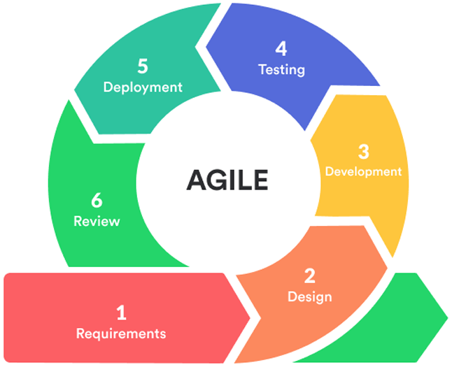
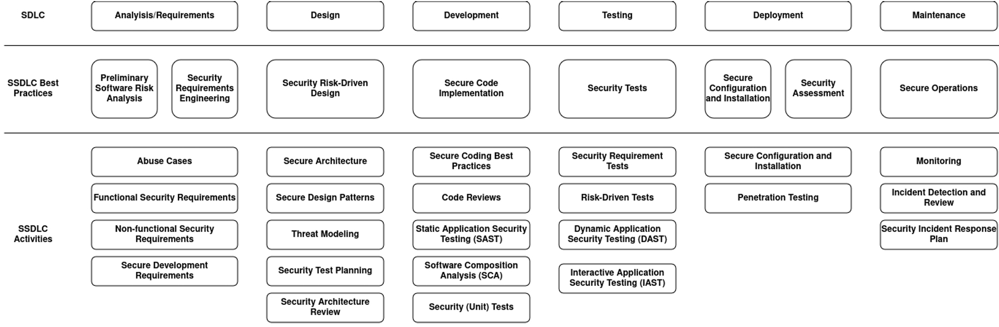

# DESFOS 2024_M1A_1

- Developed by:
  - 1060503 - Pedro Fernandes
  - 1170541 - Alexandra Leite
  - 1171540 - Fábio Cruz
  - 1180511 - Vitor Costa
  - 1191816 - Cristiano Soares

## Table of Contents

- [Introduction](#introduction)
- [Aggregate's Documentation](#aggregate-documentatio)
- [Issue Tracker](#issue-tracker)
- [Domain Model](#domain-model)
- [Infrastructure View](#infrastructure-view)
- [Data Flow Diagram](#data-flow-diagram)

## Introduction

The main objective of this document is to present da Analysis and Design of the DESFOS project. This project is a system for planning distribution of deliveries between warehouses using a fleet of electric vehicles.

This means that we will demonstrate the first two (of six) phases of Software Development Life Cycle (SDLC):

The first phase is the **Analysis** phase, where we will analyze the requirements and constraints of the system. The second phase is the **Design** phase, where we will design the system's architecture and components. 

One of the goals is to focus on security, so we adopt the Secure Software Development Life Cycle (SSDLC). The following image represent all stages of this process and we will demonstrate specifically the first two stages:

## Aggregate's Documentation

For each aggregate, a specific analysis and design were performed. On the following pages, it is possible to consult:

- [User Documentation](user/README_User.md)
- [Warehouse Documentation](warehouse/README_Warehouse.md)
- [Delivery Documentation](delivery/README_Delivery.md)
- [Truck Documentation](truck/README_Truck.md)
- [Logistics Documentation](logistics/README_Logistics.md)

## Issue Tracker

We have created the following issues to track the tasks related to the DESFOS project:

- [#1 Documentation](https://github.com/pedrofern/desofs2024_M1A_1/issues/1): Global documentation
- [#2 Users documentation](https://github.com/pedrofern/desofs2024_M1A_1/issues/2): Users documentation
- [#3 Warehouse documentation](https://github.com/pedrofern/desofs2024_M1A_1/issues/3): Warehouse documentation
- [#4 Delivery Plan documentation](https://github.com/pedrofern/desofs2024_M1A_1/issues/4): Delivery Plan documentation
- [#5 Truck documentation](https://github.com/pedrofern/desofs2024_M1A_1/issues/5): Truck documentation
- [#6 Logistics documentation](https://github.com/pedrofern/desofs2024_M1A_1/issues/6): Logistics documentation

## Domain Model

### Users

- The system will have the following types of users:
  - **System Administrator** - manages user accounts and permissions
  - **Warehouse Manager** - manages warehouse data and deliveries
  - **Fleet Manager** - manages truck data
  - **Logistics Manager** - manages route data and distribution planning
  - **Operator** - has basic access for querying and limited operations within each aggregate

## Infrastucture View

## Data Flow Diagram

# Glossary

**Terms, Expressions and Acronyms (TEA) organized alphabetically.**

| **_TEA_** (EN)                     | **_TEA_** (PT)              | **_Description_** (EN)                                                                                                      |                                       
|:-----------------------------------|:----------------------------|:----------------------------------------------------------------------------------------------------------------------------|
| Address                            | Morada                      | The particulars of the place where a store or a warehouse is situated.                                                      |
| Autonomy                           | Autonomia                   | Truck range with full load capacity and fully charged electric batteries.                                                   |
| Battery Capacity                   | Capacidade da bateria       | Maximum load of the truck's electric battery pack, energy stored in the batteries.                                          |
| Charging Time                      | Tempo de Carregamento       | Fast charging time of the truck's batteries.                                                                                |
| Date                               | Data                        | Date of delivery.                                                                                                           |
| Delivery                           | Entrega                     | Transportation of goods from the warehouse to a other warehouse.                                                            |
| Delivery Plan                      | Plano de entrega            | Document with a set of routes where it contains the various deliveries for the trucks to follow.                            |
| Distribution Requirements Planning | Planeamento de distribuição | Process with the objective of serving the various orders placed by the stores without running out or overstocking products. |
| Electric Truck                     | Camião Elétrico             | Type of truck used in this company.                                                                                         |
| EletricGo                          | EletricGo                   | A system for planning distribution of deliveries between warehouses using a fleet of electric vehicles.                     |
| FM                                 | FM                          | Fleet manager                                                                                                               |
| Geographic Coordinates             | Coordenadas Geográficas     | Location system used to locate stores and warehouses, used for deliveries.                                                  |
| ID                                 | Identificador               | Delivery identifier                                                                                                         |
| LM                                 | LM                          | Logistics manager                                                                                                           |
| Load Capacity                      | Capacidade de carga         | The mass that can be carried on the truck.                                                                                  |
| Load Time                          | Tempo de Carga              | Time to place delivery on truck in minutes.                                                                                 |
| Logistics                          | Logística                   | A set of methods and means, designed to deliver the right products, to the right place, at the right time.                  |
| Route                              | Rota                        | Paths taken by trucks in the deliveries. It contains a starting point and an ending point.                                  |
| Store                              | Loja                        | Place where the products are sold. Each store contains a warehouse.                                                         |
| Tare                               | Tara                        | Weight of the truck without load.                                                                                           |
| Truck                              | Camião                      | Vehicle used for deliveries.                                                                                                |
| Unload Time                        | Tempo de Descarga           | Time to remove delivery from truck in minutes.                                                                              |
| Warehouse                          | Armazém                     | Place where the products will be delivered.                                                                                 |
| Warehouse ID                       | Identificador do Armazém    | Warehouse to make the delivery, store identifier.                                                                           |
| Warehouse Management               | Gestão de armazéns          | Warehouse management is directly related to the process of transferring products to the end customers.                      |
| WM                                 | WM                          | Warehouse manager                                                                                                           |
| Weight                             | Peso                        | Mass of the delivery associated to the weight of the products to deliver.                                                   |