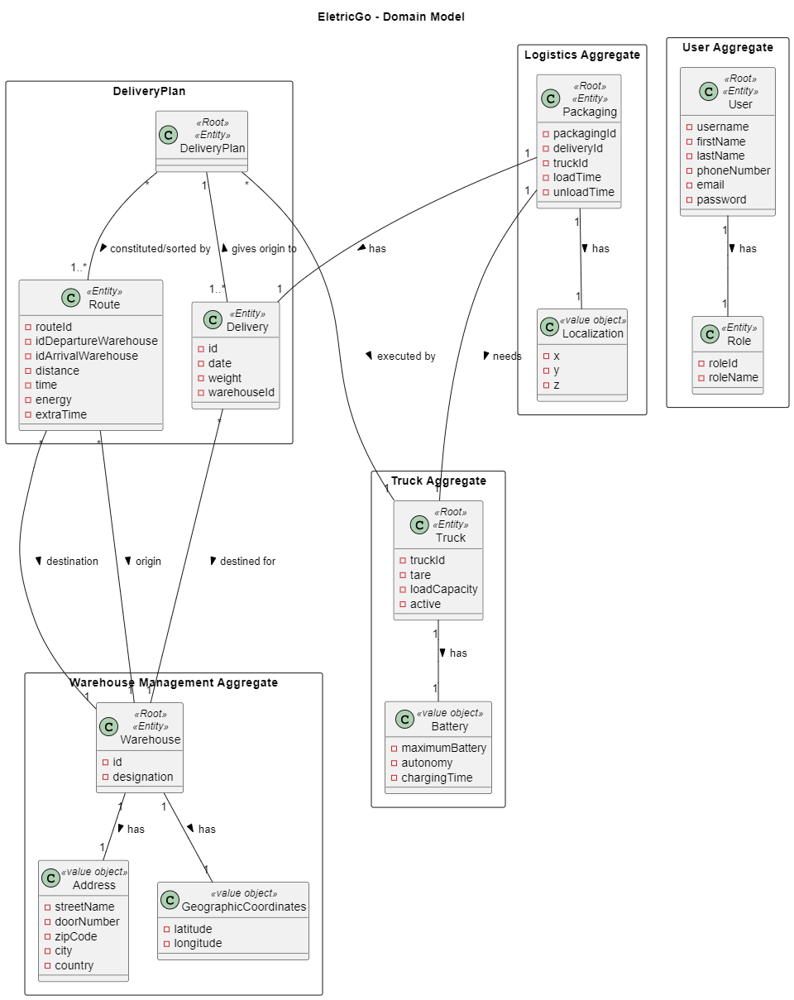
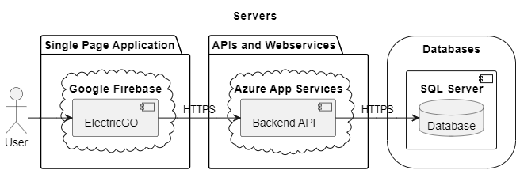
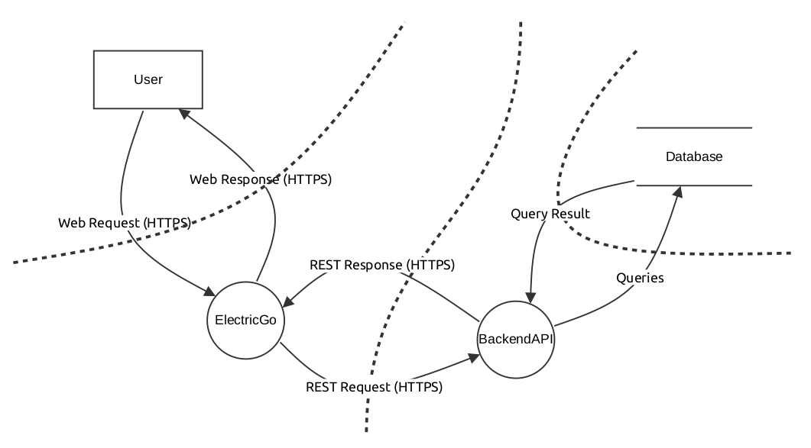

# DESFOS 2024_M1A_1

- Developed by:
  - 1060503 - Pedro Fernandes
  - 1170541 - Alexandra Leite
  - 1171540 - Fábio Cruz
  - 1180511 - Vitor Costa
  - 1191816 - Cristiano Soares

## Table of Contents

- [Introduction](#introduction)
- [Aggregate's Documentation](#aggregate-documentatio)
- [Issue Tracker](#issue-tracker)
- [Domain Model](#domain-model)
- [Infrastructure View](#infrastructure-view)
- [Data Flow Diagram](#data-flow-diagram)

## Introduction

## Aggregate's Documentation

For each aggregate, a specific analysis and design were performed. On the following pages, it is possible to consult:

- [User Documentation](user/README_User.md)
- [Warehouse Documentation](warehouse/README_Warehouse.md)
- [Delivery Documentation](delivery/README_Delivery.md)
- [Truck Documentation](truck/README_Truck.md)
- [Logistics Documentation](logistics/README_Logistics.md)

## Issue Tracker

We have created the following issues to track the tasks related to the DESFOS project:

- [#1 Documentation](https://github.com/pedrofern/desofs2024_M1A_1/issues/1): Global documentation
- [#2 Users documentation](https://github.com/pedrofern/desofs2024_M1A_1/issues/2): Users documentation
- [#3 Warehouse documentation](https://github.com/pedrofern/desofs2024_M1A_1/issues/3): Warehouse documentation
- [#4 Delivery Plan documentation](https://github.com/pedrofern/desofs2024_M1A_1/issues/4): Delivery Plan documentation
- [#5 Truck documentation](https://github.com/pedrofern/desofs2024_M1A_1/issues/5): Truck documentation
- [#6 Logistics documentation](https://github.com/pedrofern/desofs2024_M1A_1/issues/6): Logistics documentation

## Domain Model

## Infrastucture View

## Data Flow Diagram

