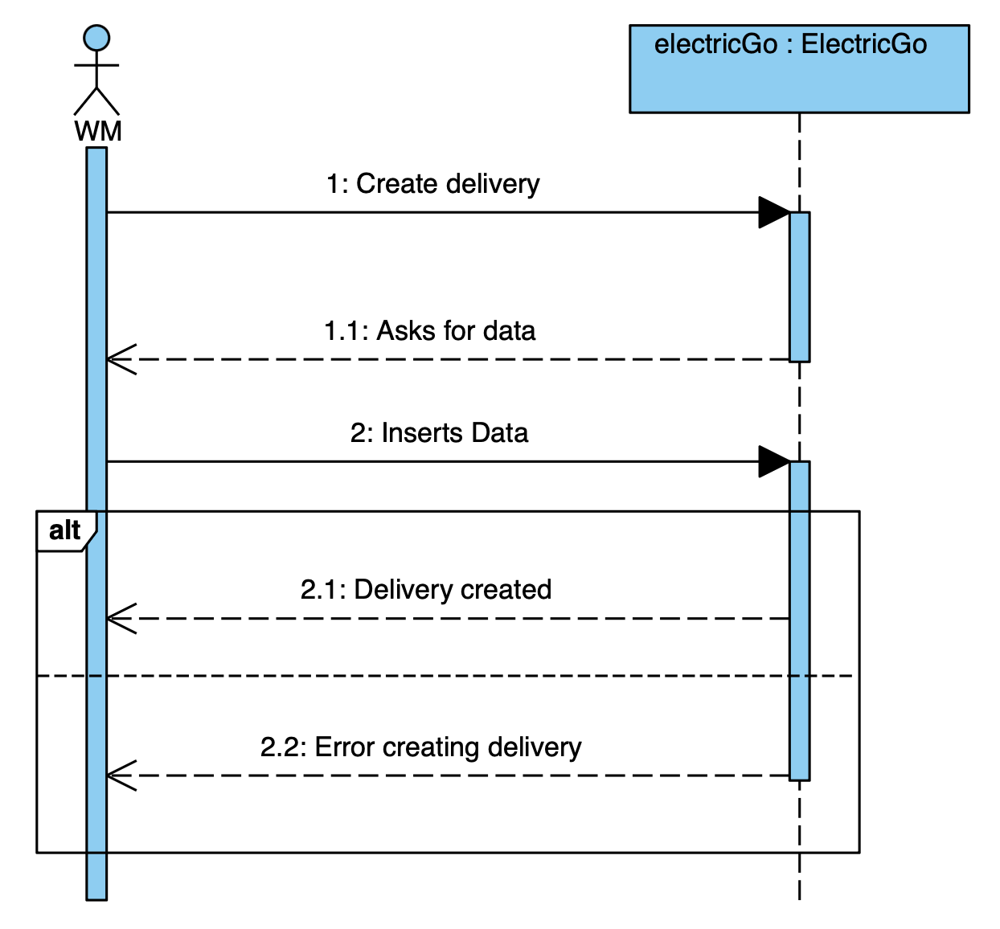
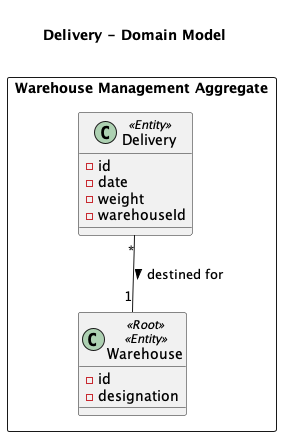

# Create a Delivery

## 1. Requirements Engineering

### 1.1. User Story Description

**US1** - As a warehouse manager I want to create a delivery.

* Area/Application:
  * Logistics

### 1.2. Customer Specifications and Clarifications

n/a

### 1.3. Acceptance Criteria

n/a

### 1.4. Found out Dependencies

There is a dependency on creating a delivery and getting all warehouses from the API, in order to view/search the deliveries and warehouses.

### 1.5 Input and Output Data

**Input Data:**

* Selected data:
  * Warehouse

* Input data:
  * Delivery Date
  * Weight

**Output Data:**

* The success of the operation

### 1.6. System Sequence Diagram (SSD)

## 2. Analysis

### 2.1. Relevant Domain Model Excerpt

## 3. Design

### 3.1. Sequence Diagram (SD)

### Systematization

According to the taken rationale, the conceptual classes promoted to software classes are:

* Delivery

Other software classes (i.e. Pure Fabrication) identified:

* DeliveryService
* CreateDeliveryDTO
* IDeliveryCreate

### 4 Tests

n/a

## 5. Implementation

n/a

## 6. Integration and Demo

* It was added a Delivery button to the web app menu, which opens the Deliveries page with a form to create one on the left and the list of the existing deliveries on the right.

## 7. Observations

n/a
