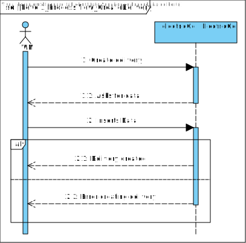
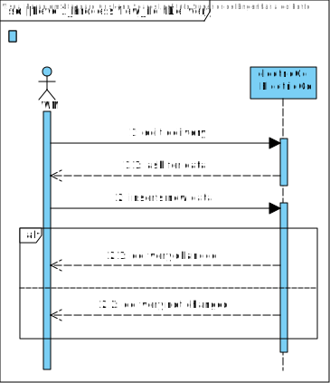
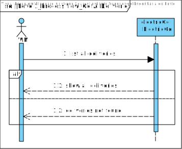
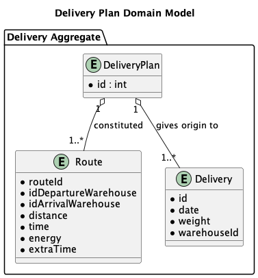
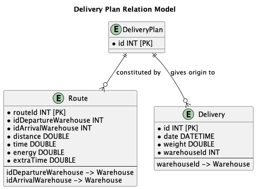
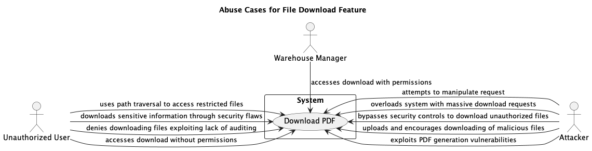

# Software Architectural Analysis and Design of Delivery Aggregate

- This document de describes the architecture of ElectricGo's Delivery aggregate, providing an overview of the design decisions and architectural analysis made during development.
- Delivery Aggregate is a sub-system developed to manage the delivery of products to customers. It is responsible for managing the delivery process, from the moment the order is placed until the product is delivered to the customer.

## Table of Contents

1. [Requirements Engineering](#1-requirements-engineering)
    1. [User Stories Description](#11-user-stories-description)
    2. [Customer Specifications and Clarifications](#12-customer-specifications-and-clarifications)
    3. [Acceptance Criteria](#13-acceptance-criteria)
    4. [Found out Dependencies](#14-found-out-dependencies)
    5. [Input and Output Data](#15-input-and-output-data)
    6. [System Sequence Diagram (SSD)](#16-system-sequence-diagram-ssd)
    7. [API Endpoints](#17-api-endpoints)
    8. [Database Schema](#18-database-schema-relational-model)
    9. [Authorization Roles](#19-authorization-roles)
2. [Analysis](#2-analysis)
    1. [Preliminary Software Risk Analysis](#21-preliminary-software-risk-analysis)
    2. [Security Requirements Engineering](#22-security-requirements-engineering)
    3. [Abuse Cases](#23-abuse-cases)
    4. [Functional Security Requirements](#24-functional-security-requirements)
    5. [Non-Functional Security Requirements](#25-non-functional-security-requirements)
    6. [Secure Development Requirements](#26-secure-development-requirements)
3. [Design](#3-design)
    1. [Security Risk-Driven Design](#31-security-risk-driven-design)
    2. [Secure Architecture](#32-secure-architecture)
    3. [Secure Design Patterns](#33-secure-design-patterns)
    4. [Threat Modelling](#34-threat-modelling)
    5. [Security Test Planning](#35-security-test-planning)
    6. [Security Architecture Review](#36-security-architecture-review)

## 1. Requirements Engineering

### 1.1 User Stories Description

- As a Warehouse Manager, I want to be able to register a new delivery order.
- As a Warehouse Manager, I want to be able to list and update a delivery order.
- As a Warehouse Manager, I want to be able to download the delivery plan as a PDF.

### 1.2 Customer Specifications and Clarifications

- The delivery plan should contain the following information:
    - Delivery Orders
    - Routes (already registered in the system)

- The delivery order should contain the following information:
    - Order ID
    - Order Date
    - Weight
    - Warehouse

### 1.3 Acceptance Criteria

- The delivery order should be successfully registered in the system.
- The delivery order should be successfully listed and updated in the system.
- The delivery plan should be successfully downloaded as a PDF if the warehouse manager is logged in.

### 1.4 Found out Dependencies

- The warehouse manager must be logged in to download the delivery order.
- The warehouses must be registered in the system before a delivery order can be created.
- The routes must be registered in the system before a delivery plan can be created.

### 1.5 Input and Output Data

#### Selected Data
- Warehouse

#### Input Data
- Order Date
- Weight

### 1.6 System Sequence Diagram (SSD)

- Create Delivery

- Edit Delivery

- Get All Deliveries

- 

### 1.7 API Endpoints

- GET /deliveries - List all delivery orders
- POST /deliveries - Create a new delivery order
- PUT /deliveries/{id} - Update a delivery order
- DELETE /deliveries/{id} - Delete a delivery order
- GET /deliveries/plan/{id}/download - Download the delivery plan as a PDF

### 1.8 Database Schema: Relational Model

#### Diagram of the Relational Model

The Domain Model for the Delivery Aggregate is as follows:

Considering the previous model, the user aggregate has the following database schema:

### 1.9 Authorization Roles

- Warehouse Manager: Access to functionalities related to the management of delivery data.
- Operator: Access only to the visualization functionalities related to the management of delivery data.

## 2. Analysis

### 2.1 Preliminary Software Risk Analysis

- **Risk:** Unauthorized access to the download feature.
    - **Mitigation:** Implement strong, multi-factor authentication and comprehensive authorization checks before allowing access to the download feature.

- **Risk:** Insecure file handling leading to path traversal attacks.
    - **Mitigation:** Enforce strict input validation and file path sanitization to prevent path traversal attacks.

- **Risk:** Data corruption during the download process.
    - **Mitigation:** Implement checksum validation or similar data integrity checks post-download to ensure file integrity.

- **Risk:** Lack of encryption during data transmission.
    - **Mitigation:** Use TLS encryption for all data transmissions to ensure confidentiality and integrity of data in transit.

- **Risk:** Denial of Service (DoS) attacks targeting the files download feature.
    - **Mitigation:** Employ rate limiting, anomaly detection, and network security solutions to identify and mitigate potential DoS attacks effectively.

- **Risk:** PDF generation could expose the system to service disruption attacks.
    - **Mitigation:** Apply rate limiting, resource allocation limits, and regular monitoring to detect and prevent abuse during PDF generation.

- **Risk:** Insecure PDF generation library leading to code execution vulnerabilities.
    - **Mitigation:** Ensure that the PDF generation library is up-to-date with the latest security patches and perform regular security assessments.

- **Risk:** Lack of auditing and monitoring capabilities.
    - **Mitigation:** Implement comprehensive logging and real-time monitoring systems to track all activities related to file downloads and generate alerts for suspicious actions.

### 2.2 Security Requirements Engineering

Security requirements engineering is a fundamental process in the software development lifecycle that involves identifying and addressing potential security threats before they can be exploited.

- **Requirement Identification:** Identify potential threats specific to the system's file download functionalities.
- **Security Risk Assessment:** Perform risk assessments to evaluate the potential impact and likelihood of identified threats.
- **Definition of Security Controls:** Define specific security controls and measures to address identified risks.
- **Security Requirements Documentation:** Document all security requirements clearly and concisely.
- **Integration with Development and Testing:** Use static and dynamic analysis tools that can identify security flaws related to file handling, during the development and testing.
- **Ongoing Evaluation and Update:** Regularly review and update security requirements to adapt to new threats, technological advances, and changes in business strategy.

### 2.3 Abuse Cases

#### Case 1: Unauthorized access
- **Description:** An unauthorized user tries to access the file transfer functionality without the proper permissions.
- **Response:** The system should apply rigorous authentication and authorization checks, denying access and logging the attempt for security monitoring and analysis.

#### Case 2: Path traversal attack
- **Description:** An unauthorized user exploits path traversal vulnerabilities to access restricted files.
- **Response:** Implement robust input validation to sanitize file paths and prevent directory traversal, ensuring that user inputs cannot alter file paths.

#### Case 3: Downloading confidential information
- **Description:** An unauthorized user downloads sensitive information by exploiting security flaws.
- **Response:** Apply encryption to sensitive data and use secure access controls to ensure that only authorized personnel can access sensitive information.

#### Case 4: Denial of file download
- **Description:** An unauthorized user denies having downloaded files, exploiting the lack of auditing.
- **Response:** Implement comprehensive logging and auditing mechanisms that capture all download activities with user identifiers and timestamps.

#### Case 5: Manipulation of download requests
- **Description:** An attacker manipulates the download request to cause damage or gain unauthorized access.
- **Response:** Use parameterized queries and regularly update and patch systems to prevent request manipulation.

#### Case 6: System overload
- **Description:** An attacker sends a large number of download requests to overload the system (DoS attack).
- **Response:** Implement rate limiting and anomaly detection to identify and mitigate potential DoS attacks.

#### Case 7: Bypassing security controls
- **Description:** An attacker bypasses security controls to download unauthorized files.
- **Response:** Regularly review and update security controls. Employ a layered security approach to reduce the risk of unauthorized access.

#### Case 8: Exploitation of PDF generation vulnerabilities
- **Description:** An attacker exploits vulnerabilities in the PDF generation process to execute malicious code.
- **Response:** Ensure that the PDF generation library is up-to-date with all applied security patches. Use sandboxing, if available, to isolate the PDF generation process.

### 2.4 Functional Security Requirements

- **Authentication and Authorization:** Ensure robust authentication before allowing file download requests. Utilize multi-factor authentication (MFA) for sensitive file accesses.
- **Data Validation and Sanitization:** Implement rigorous input validation to prevent injection attacks through download requests, such as SQL injection or command injection. Sanitize file paths to prevent directory traversal or path manipulation attacks.
- **Secure File Transmission:** Use TLS (Transport Layer Security) for all file transmissions to ensure that files are encrypted during transit.
- **Audit Trails:** Log all file download activities, ensuring that these logs are immutable and securely stored.
- **Rate Limiting:** Implement rate limiting to prevent abuse of the file download feature, which could lead to Denial of Service (DoS) attacks or system overloads.
- **File Integrity Checks:** Provide checksums or cryptographic hashes for files before download, allowing users to verify the integrity of files post-download.

### 2.5 Non-Functional Security Requirements

- **Performance:** Security mechanisms must not degrade system performance beyond acceptable limits.
- **Scalability:** Security architectures must keep pace with system growth without compromising security effectiveness.
- **Reliability:** The system must remain available and functional.
- **Usability:** Security measures must be implemented in such a way that they do not degrade the usability of the system.
- **Compliance:** The system must comply with applicable legal and regulatory requirements relating to security and data protection.

### 2.6 Secure Development Requirements

Secure development requirements ensure that security is integrated into the software development lifecycle (SDLC) from the initial design through deployment and maintenance.

- **Secure Coding Practices:** Developers follow secure coding guidelines to prevent common vulnerabilities like injection attacks.
- **Secure Coding Standards:** Adhere to industry-standard secure coding guidelines such as OWASP Top 10, CWE/SANS TOP 25, and language-specific best practices.
- **Static and Dynamic Analysis Tools:** Using static application security testing (SAST) tools to automatically detect vulnerabilities in code before it is deployed and employ dynamic application security testing (DAST) tools to test running applications for vulnerabilities.
- **Third-Party Component Management:** Reviewing and update these components to ensure they are not introducing known vulnerabilities into the application.
- **Secure Deployment Practices:** Using automated deployment tools that integrate security checks to prevent misconfigurations and vulnerabilities from reaching production environments.
- **Regular Security Audits:** Conducting security audits of the application to assess the effectiveness of implemented security measures.
- **Incident Response and Patch Management:** Implementing a systematic patch management process to quickly deploy fixes for newly discovered vulnerabilities.

## 3. Design

### 3.1 Security Risk-Driven Design

Security risk-oriented design is an approach that integrates security into the architecture design process, directly addressing the risks identified during the security requirements engineering phase.

- **Threat Modeling Integration:** Revising the threat models created during the analysis phase, ensuring that all significant threats have corresponding mitigation strategies.
- **Design of Secure Architectures:** Design a layered architecture that segregates different areas of the application according to their security needs.
- **Encryption and Data Protection:** Determining the appropriate encryption standards and protocols. Incorporate encryption into the design for all data, designing the system to enforce strong encryption standards such as AES-256 for file transfers.
- **Access control mechanisms:** Design fine-grade access control mechanisms that are closely integrated into the system's authentication infrastructure.
- **Audit trails and monitoring:** Ensure that all file download activities are logged, tamper-resistant, with sufficient detail to identify who downloaded what, when and from where.

### 3.2 Secure Architecture

Secure architecture involves structuring the system’s components and their interactions to enhance security capabilities while maintaining functionality and performance.

- **Component Isolation:** Using a modular architecture that isolates sensitive components, ensuring that a breach in one area does not compromise the entire system.
- **Secure Communication Channels:** Designing all communications between components and external systems to occur over secure channels.
- **Minimal Privilege Access:** Ensuring that components operate with only the permissions necessary for their functionality.
- **Intrusion Detection and Prevention Systems (IDPS):** Integrating IDPS at strategic points within the architecture to detect and respond to potential security threats in real-time.
- **Data Encryption and Integrity Checks:** Designing the system to automatically encrypt all stored and transmitted data. Implementing mechanisms such as end-to-end encryption to protect data from the point of origin to the point of consumption.

### 3.3 Secure Design Patterns

Secure design patterns are proven solutions to common security problems encountered in software design.

- **Authentication Pattern:** Implement the Chain of Responsibility pattern to delegate authentication tasks to the centralized authentication service using OAuth or OpenID Connect.
- **Proxy Pattern:** Using a proxy to control access to a resource, intercepting and validating requests before they reach the actual resource, adding an extra layer of security for file downloads.
- **API Security Pattern:** Leverage the API Gateway pattern as a single entry point for API requests. This allows for centralized enforcement of security measures like authentication, authorization, rate limiting, and input validation before requests reach internal services.
- **Singleton Pattern:** Implement critical security components, like cryptographic engines or security configuration managers, as singletons to ensure controlled access and consistent security configurations across the application.
- **Secure Logging and Monitoring Pattern:** Implementing the Centralized Logging pattern to capture all relevant events, including user activity, system events, and potential security incidents.
- **Observer Pattern:** Applying the observer pattern to monitor changes to critical data or configuration and automatically update dependent components in a secure manner.

### 3.4 Threat Modelling

#### 3.4.1 Threat Model Information

#### 3.4.2 External Dependencies

- **Centralized Authentication Service (CAS):** A system responsible for user authentication.
- **Database Management System (DBMS):** A system for storing delivery order data.
- **Network Infrastructure:** The network components that allow communication between the backend, frontend, and other external systems.

#### 3.4.3 Entry Points

- **API Gateway:** The entry points for API requests to manage deliveries. (Highest Trust)
- **Web application:** A web interface for warehouse managers to manage deliveries. (Medium Trust - External user interface)
- **Database Interface:** This entry point allows the backend to interact with the database. (Highest Trust)

#### 3.4.4 Exit Points

- **API Gateway (Highest Trust):** Delivery plan PDFs downloaded by authorized warehouse managers.
- **Web application (optional) (Medium Trust - External user interface):** Delivery information displayed to authorized users.
- **Mobile application (optional) (Medium Trust - External user interface):** Delivery information displayed to authorized users.

#### 3.4.5 Assets

- **Delivery Order Data (Highest Trust):** Information about deliveries such as order ID, weight, warehouse location.
- **User Information (Highest Trust, if stored within Delivery Aggregate):** Warehouse manager and operator credentials.
- **Delivery Plans (Highest Trust):** Documents containing route and order details, potentially containing sensitive information.

#### 3.4.6 Trust Levels

- **Highest Trust:** Internal systems directly managed by ElectricGo with strong security controls (e.g., secure coding practices, regular security testing).
- **Medium Trust:** External dependencies with a good reputation for security (e.g., well-established cloud service providers) or authorized users with specific roles (Warehouse Manager, Operator).
- **Low Trust:** Untrusted external sources or users attempting to access the Delivery Aggregate.

### 3.5 Security Test Planning

### 3.6 Security Architecture Review
