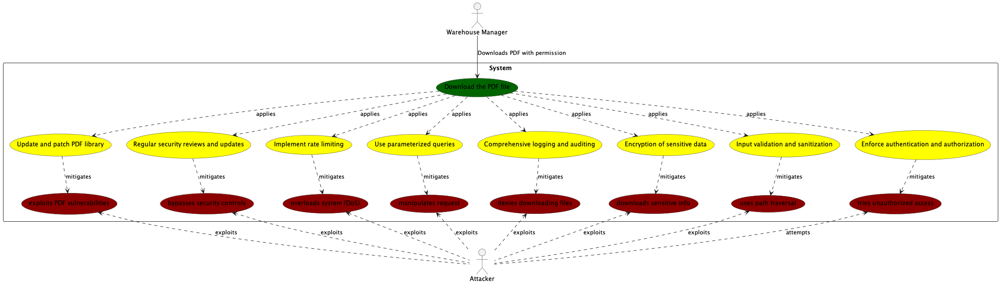
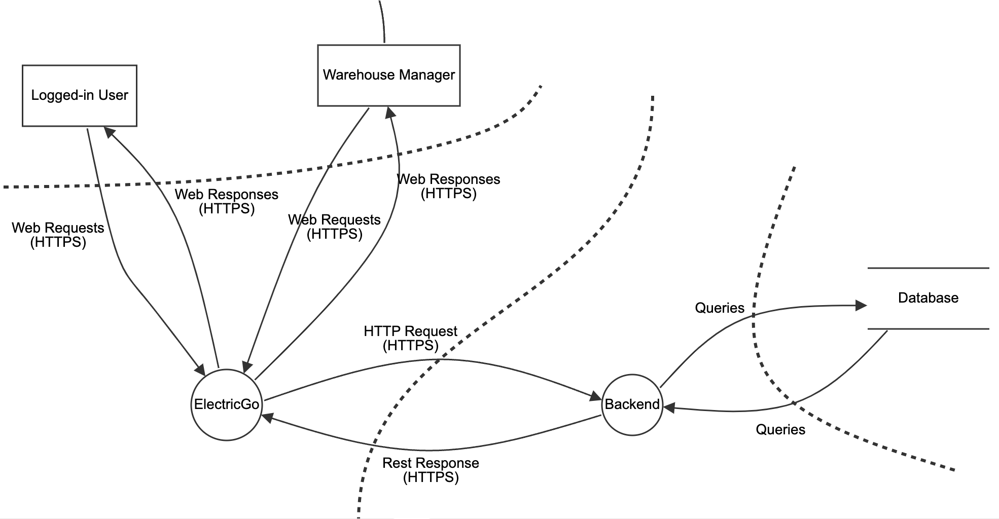

# Software Architectural Analysis and Design of Delivery Aggregate

- This document de describes the architecture of ElectricGo's Delivery aggregate, providing an overview of the design decisions and architectural analysis made during development.
- Delivery Aggregate is a sub-system developed to manage the delivery of products to customers. It is responsible for managing the delivery process, from the moment the order is placed until the product is delivered to the customer.

## Table of Contents

1. [Requirements Engineering](#1-requirements-engineering)
    1. [User Stories Description](#11-user-stories-description)
    2. [Customer Specifications and Clarifications](#12-customer-specifications-and-clarifications)
    3. [Acceptance Criteria](#13-acceptance-criteria)
    4. [Found out Dependencies](#14-found-out-dependencies)
    5. [Input and Output Data](#15-input-and-output-data)
    6. [System Sequence Diagram (SSD)](#16-system-sequence-diagram-ssd)
    7. [API Endpoints](#17-api-endpoints)
    8. [Database Schema](#18-database-schema-relational-model)
    9. [Authorization Roles](#19-authorization-roles)
2. [Analysis](#2-analysis)
    1. [Preliminary Software Risk Analysis](#21-preliminary-software-risk-analysis)
    2. [Security Requirements Engineering](#22-security-requirements-engineering)
    3. [Abuse Cases](#23-abuse-cases)
    4. [Functional Security Requirements](#24-functional-security-requirements)
    5. [Non-Functional Security Requirements](#25-non-functional-security-requirements)
    6. [Secure Development Requirements](#26-secure-development-requirements)
3. [Design](#3-design)
    1. [Security Risk-Driven Design](#31-security-risk-driven-design)
    2. [Secure Architecture](#32-secure-architecture)
    3. [Secure Design Patterns](#33-secure-design-patterns)
    4. [Threat Modelling](#34-threat-modelling)
    5. [Security Test Planning](#35-security-test-planning)
    6. [Security Architecture Review](#36-security-architecture-review)

## 1. Requirements Engineering

### 1.1 User Stories Description

- As a Warehouse Manager, I want to be able to register a new delivery order.
- As a Warehouse Manager, I want to be able to list and update a delivery order.
- As a Warehouse Manager, I want to be able to download the delivery plan as a PDF.

### 1.2 Customer Specifications and Clarifications

- The delivery plan should contain the following information:
    - Delivery Orders
    - Routes (already registered in the system)

- The delivery order should contain the following information:
    - Order ID
    - Order Date
    - Weight
    - Warehouse

### 1.3 Acceptance Criteria

- The delivery order should be successfully registered in the system.
- The delivery order should be successfully listed and updated in the system.
- The delivery plan should be successfully downloaded as a PDF if the warehouse manager is logged in.

### 1.4 Found out Dependencies

- The warehouse manager must be logged in to download the delivery order.
- The warehouses must be registered in the system before a delivery order can be created.
- The routes must be registered in the system before a delivery plan can be created.

### 1.5 Input and Output Data

#### Selected Data
- Warehouse

#### Input Data
- Order Date
- Weight

### 1.6 System Sequence Diagram (SSD)

- Create Delivery

- Edit Delivery

- Get All Deliveries

### 1.7 API Endpoints

- GET /deliveries - List all delivery orders
- POST /deliveries - Create a new delivery order
- PUT /deliveries/{id} - Update a delivery order
- DELETE /deliveries/{id} - Delete a delivery order
- GET /deliveries/plan/{id}/download - Download the delivery plan as a PDF

### 1.8 Database Schema: Relational Model

#### Diagram of the Relational Model

The Domain Model for the Delivery Aggregate is as follows:

Considering the previous model, the user aggregate has the following database schema:

### 1.9 Authorization Roles

- Warehouse Manager: Access to functionalities related to the management of delivery data.
- Operator: Access only to the visualization functionalities related to the management of delivery data.

## 2. Analysis

### 2.1 Preliminary Software Risk Analysis

- **Risk:** Unauthorized access to the download feature.
    - **Mitigation:** Implement strong, multi-factor authentication and comprehensive authorization checks before allowing access to the download feature.

- **Risk:** Insecure file handling leading to path traversal attacks.
    - **Mitigation:** Enforce strict input validation and file path sanitization to prevent path traversal attacks.

- **Risk:** Data corruption during the download process.
    - **Mitigation:** Implement checksum validation or similar data integrity checks post-download to ensure file integrity.

- **Risk:** Lack of encryption during data transmission.
    - **Mitigation:** Use TLS encryption for all data transmissions to ensure confidentiality and integrity of data in transit.

- **Risk:** Denial of Service (DoS) attacks targeting the files download feature.
    - **Mitigation:** Employ rate limiting, anomaly detection, and network security solutions to identify and mitigate potential DoS attacks effectively.

- **Risk:** PDF generation could expose the system to service disruption attacks.
    - **Mitigation:** Apply rate limiting, resource allocation limits, and regular monitoring to detect and prevent abuse during PDF generation.

- **Risk:** Insecure PDF generation library leading to code execution vulnerabilities.
    - **Mitigation:** Ensure that the PDF generation library is up-to-date with the latest security patches and perform regular security assessments.

- **Risk:** Lack of auditing and monitoring capabilities.
    - **Mitigation:** Implement comprehensive logging and real-time monitoring systems to track all activities related to file downloads and generate alerts for suspicious actions.

### 2.2 Security Requirements Engineering

Security requirements engineering is a fundamental process in the software development lifecycle that involves identifying and addressing potential security threats before they can be exploited.

- **Requirement Identification:** Identify potential threats specific to the system's file download functionalities.
- **Security Risk Assessment:** Perform risk assessments to evaluate the potential impact and likelihood of identified threats.
- **Definition of Security Controls:** Define specific security controls and measures to address identified risks.
- **Security Requirements Documentation:** Document all security requirements clearly and concisely.
- **Integration with Development and Testing:** Use static and dynamic analysis tools that can identify security flaws related to file handling, during the development and testing.
- **Ongoing Evaluation and Update:** Regularly review and update security requirements to adapt to new threats, technological advances, and changes in business strategy.

### 2.3 Abuse Cases

#### Case 1: Unauthorized access
- **Description:** An unauthorized user tries to access the file transfer functionality without the proper permissions.
- **Response:** The system should apply rigorous authentication and authorization checks, denying access and logging the attempt for security monitoring and analysis.

#### Case 2: Path traversal attack
- **Description:** An unauthorized user exploits path traversal vulnerabilities to access restricted files.
- **Response:** Implement robust input validation to sanitize file paths and prevent directory traversal, ensuring that user inputs cannot alter file paths.

#### Case 3: Downloading confidential information
- **Description:** An unauthorized user downloads sensitive information by exploiting security flaws.
- **Response:** Apply encryption to sensitive data and use secure access controls to ensure that only authorized personnel can access sensitive information.

#### Case 4: Denial of file download
- **Description:** An unauthorized user denies having downloaded files, exploiting the lack of auditing.
- **Response:** Implement comprehensive logging and auditing mechanisms that capture all download activities with user identifiers and timestamps.

#### Case 5: Manipulation of download requests
- **Description:** An attacker manipulates the download request to cause damage or gain unauthorized access.
- **Response:** Use parameterized queries and regularly update and patch systems to prevent request manipulation.

#### Case 6: System overload
- **Description:** An attacker sends a large number of download requests to overload the system (DoS attack).
- **Response:** Implement rate limiting and anomaly detection to identify and mitigate potential DoS attacks.

#### Case 7: Bypassing security controls
- **Description:** An attacker bypasses security controls to download unauthorized files.
- **Response:** Regularly review and update security controls. Employ a layered security approach to reduce the risk of unauthorized access.

#### Case 8: Exploitation of PDF generation vulnerabilities
- **Description:** An attacker exploits vulnerabilities in the PDF generation process to execute malicious code.
- **Response:** Ensure that the PDF generation library is up-to-date with all applied security patches. Use sandboxing, if available, to isolate the PDF generation process.

### 2.4 Functional Security Requirements

- **Authentication and Authorization:** Ensure robust authentication before allowing file download requests. Utilize multi-factor authentication (MFA) for sensitive file accesses.
- **Data Validation and Sanitization:** Implement rigorous input validation to prevent injection attacks through download requests, such as SQL injection or command injection. Sanitize file paths to prevent directory traversal or path manipulation attacks.
- **Secure File Transmission:** Use TLS (Transport Layer Security) for all file transmissions to ensure that files are encrypted during transit.
- **Audit Trails:** Log all file download activities, ensuring that these logs are immutable and securely stored.
- **Rate Limiting:** Implement rate limiting to prevent abuse of the file download feature, which could lead to Denial of Service (DoS) attacks or system overloads.
- **File Integrity Checks:** Provide checksums or cryptographic hashes for files before download, allowing users to verify the integrity of files post-download.

### 2.5 Non-Functional Security Requirements

- **Performance:** Security mechanisms must not degrade system performance beyond acceptable limits.
- **Scalability:** Security architectures must keep pace with system growth without compromising security effectiveness.
- **Reliability:** The system must remain available and functional.
- **Usability:** Security measures must be implemented in such a way that they do not degrade the usability of the system.
- **Compliance:** The system must comply with applicable legal and regulatory requirements relating to security and data protection.

### 2.6 Secure Development Requirements

Secure development requirements ensure that security is integrated into the software development lifecycle (SDLC) from the initial design through deployment and maintenance.

- **Secure Coding Practices:** Developers follow secure coding guidelines to prevent common vulnerabilities like injection attacks.
- **Secure Coding Standards:** Adhere to industry-standard secure coding guidelines such as OWASP Top 10, CWE/SANS TOP 25, and language-specific best practices.
- **Static and Dynamic Analysis Tools:** Using static application security testing (SAST) tools to automatically detect vulnerabilities in code before it is deployed and employ dynamic application security testing (DAST) tools to test running applications for vulnerabilities.
- **Third-Party Component Management:** Reviewing and update these components to ensure they are not introducing known vulnerabilities into the application.
- **Secure Deployment Practices:** Using automated deployment tools that integrate security checks to prevent misconfigurations and vulnerabilities from reaching production environments.
- **Regular Security Audits:** Conducting security audits of the application to assess the effectiveness of implemented security measures.
- **Incident Response and Patch Management:** Implementing a systematic patch management process to quickly deploy fixes for newly discovered vulnerabilities.

## 3. Design

### 3.1 Security Risk-Driven Design

Security risk-oriented design is an approach that integrates security into the architecture design process, directly addressing the risks identified during the security requirements engineering phase.

- **Threat Modeling Integration:** Revising the threat models created during the analysis phase, ensuring that all significant threats have corresponding mitigation strategies.
- **Design of Secure Architectures:** Design a layered architecture that segregates different areas of the application according to their security needs.
- **Encryption and Data Protection:** Determining the appropriate encryption standards and protocols. Incorporate encryption into the design for all data, designing the system to enforce strong encryption standards such as AES-256 for file transfers.
- **Access control mechanisms:** Design fine-grade access control mechanisms that are closely integrated into the system's authentication infrastructure.
- **Audit trails and monitoring:** Ensure that all file download activities are logged, tamper-resistant, with sufficient detail to identify who downloaded what, when and from where.

### 3.2 Secure Architecture

Secure architecture involves structuring the system’s components and their interactions to enhance security capabilities while maintaining functionality and performance.

- **Component Isolation:** Using a modular architecture that isolates sensitive components, ensuring that a breach in one area does not compromise the entire system.
- **Secure Communication Channels:** Designing all communications between components and external systems to occur over secure channels.
- **Minimal Privilege Access:** Ensuring that components operate with only the permissions necessary for their functionality.
- **Intrusion Detection and Prevention Systems (IDPS):** Integrating IDPS at strategic points within the architecture to detect and respond to potential security threats in real-time.
- **Data Encryption and Integrity Checks:** Designing the system to automatically encrypt all stored and transmitted data. Implementing mechanisms such as end-to-end encryption to protect data from the point of origin to the point of consumption.

### 3.3 Secure Design Patterns

Secure design patterns are proven solutions to common security problems encountered in software design.

- **Authentication Pattern:** Implement the responsibility pattern to delegate authentication tasks to the centralized authentication service using OAuth or OpenID Connect.
- **Proxy Pattern:** Using a proxy to control access to a resource, intercepting and validating requests before they reach the actual resource, adding an extra layer of security for file downloads.
- **API Security Pattern:** Leverage the API Gateway pattern as a single entry point for API requests. This allows for centralized enforcement of security measures like authentication, authorization, rate limiting, and input validation before requests reach internal services.
- **Singleton Pattern:** Implement critical security components, like cryptographic engines or security configuration managers, as singletons to ensure controlled access and consistent security configurations across the application.
- **Logging and Monitoring Pattern:** Implementing the Centralized Logging pattern to capture all relevant events, including user activity, system events, and potential security incidents.
- **Observer Pattern:** Applying the observer pattern to monitor changes to critical data or configuration and automatically update dependent components in a secure manner.

### 3.4 Threat Modelling

#### 3.4.1 Threat Model Information

**Application Name:** ElectricGo.

**Application Version:** 1.0.

**Description:** The application ElectricGo is a system created to manage the deliveries of packages through electric trucks.

**Document Owner:** Cristiano Soares

**Participants:**

- Alexandra Leite
- Cristiano Soares
- Fábio Cruz
- Pedro Fernandes
- Vitor Costa

**Reviewer:** Fábio Cruz

#### 3.4.2 External Dependencies

| ID | Description                                                                                                |
|----|------------------------------------------------------------------------------------------------------------|
| 1  | A system responsible for user authentication.                                                              |
| 2  | A system for storing delivery order data.                                                                  |
| 3  | The network components that allow communication between the backend, frontend, and other external systems. |

#### 3.4.3 Entry Points

| ID | Name               | Description                                                        | Trust Levels                                                                                         |
|----|--------------------|--------------------------------------------------------------------|------------------------------------------------------------------------------------------------------|
| 1  | API Gateway        | The entry points for API requests to manage deliveries.            | (1) Anonymous User (2) User with Valid Login Credentials (3) User with Invalid Login Credentials     |
| 2  | Web application    | A web interface for warehouse managers to manage deliveries.       | (1) Anonymous Web User (2) User with Valid Login Credentials (3) User with Invalid Login Credentials |
| 3  | Database Interface | This entry point allows the backend to interact with the database. | (1) Anonymous Web User (2) User with Valid Login Credentials (3) User with Invalid Login Credentials |

#### 3.4.4 Exit Points

| ID | Name               | Description                                                     | Trust Levels                                                                                     |
|----|--------------------|-----------------------------------------------------------------|--------------------------------------------------------------------------------------------------|
| 1  | API Gateway        | Delivery plan PDFs downloaded by authorized warehouse managers. | (1) Anonymous User (2) User with Valid Login Credentials (3) User with Invalid Login Credentials |
| 2  | Web application    | Delivery information displayed to authorized users.             | (1) Anonymous User (2) User with Valid Login Credentials (3) User with Invalid Login Credentials |
| 3  | Database Interface | Delivery information displayed to authorized users.             | (1) Anonymous User (2) User with Valid Login Credentials (3) User with Invalid Login Credentials |

#### 3.4.5 Assets

| ID | Name                | Description                                                                                 | Trust Levels                                                                                     |
|----|---------------------|---------------------------------------------------------------------------------------------|--------------------------------------------------------------------------------------------------|
| 1  | Delivery Order Data | Information about deliveries such as order ID, weight, warehouse location.                  | (1) Anonymous User (2) User with Valid Login Credentials (3) User with Invalid Login Credentials |
| 2  | Delivery Plans      | Documents containing route and order details, potentially containing sensitive information. | (1) Anonymous User (2) User with Valid Login Credentials (3) User with Invalid Login Credentials |

#### 3.4.6 Trust Levels

| ID | Name                                | Description                                                                      |
|----|-------------------------------------|----------------------------------------------------------------------------------|
| 1  | Anonymous User                      | Untrusted external sources or users attempting to access the Delivery Aggregate. |
| 2  | User with Valid Login Credentials   | Authorized users with specific roles (Warehouse Manager, Operator).              |
| 3  | User with Invalid Login Credentials | Unauthorized users attempting to access the Delivery Aggregate.                  |

#### 3.4.7. Data Flow Diagrams

Data Flow Diagrams (DFDs) are graphical representations of the flow of data within a system. They help identify potential threats and vulnerabilities in the system.

#### 3.4.8. Threat Analysis

**STRIDE Threat Categories**

| Category                   | Property Violated  | Description                                                                                                                      |
|----------------------------|--------------------|----------------------------------------------------------------------------------------------------------------------------------|
| **Spoofing**               | Authentication     | Threat action aimed at accessing and using another user's credentials, such as username and password.                            |
| **Tampering**              | Integrity          | Threat action intending to maliciously change or modify persistent data or data in transit over an open network.                 |
| **Repudiation**            | Non-Repudiation    | Threat action aimed at performing operations in a system that lacks the ability to trace the operations.                         |
| **Information Disclosure** | Confidentiality    | Threat action intending to expose data to unauthorized parties, such as reading data one was not granted access to.              |
| **Denial of Service**      | Availability       | Threat action attempting to deny access to valid users, such as by making a web server temporarily unavailable.                  |
| **Elevation of Privilege** | Authorization      | Threat action intending to gain privileged access to resources, often to compromise a system or access unauthorized information. |

#### 3.4.9. Ranking of Threats

1. Man-in-the-Middle (MitM) Attack During Download
   - **Damage Potential**: High - File replaced with malware, potential system compromise (9)
   - **Reproducibility**: High - MitM attacks are common and often replicable (8)
   - **Exploitability**: Moderate - Requires some knowledge and access to the network between the user and the server (7)
   - **Affected Users**: High - All users during the download can be affected (8)
   - **Discoverability**: Moderate - Can be detected with adequate network security tools (6)
   - **Overall DREAD Score**: (9+8+7+8+6) / 5 = 7.6

2. File Corruption Due to Network Failures
   - **Damage Potential**: Moderate - Damaged or incomplete files (6)
   - **Reproducibility**: Variable - Dependent on network quality and external conditions (5)
   - **Exploitability**: Low - Generally not a malicious action, more circumstantial (3)
   - **Affected Users**: Medium - Users in unstable network conditions are more affected (6)
   - **Discoverability**: Low - May not be immediately apparent without file integrity checks (4)
   - **Overall DREAD Score**: (6+5+3+6+4) / 5 = 4.8

3. Malicious Code Injection on the Download Server
   - **Damage Potential**: High - Execution of malicious code, significant potential impact on the user's system and data (9)
   - **Reproducibility**: High - Once the server is compromised, multiple downloads can be affected (8)
   - **Exploitability**: Medium - Requires access to the server, which can be challenging (7)
   - **Affected Users**: High - All users downloading files from the compromised server (9)
   - **Discoverability**: Medium - May be difficult to detect until the malware is activated (6)
   - **Overall DREAD Score**: (9+8+7+9+6) / 5 = 7.8

#### 3.4.10. Qualitative Risk Model

1. **API Impersonation**
   - **Likelihood**: High due to the possibility of remote setup and automation.
   - **Impact**: Moderate as it involves data manipulation but lacks direct system control.
   - **Risk Score**: 7 x 6 = 42

2. **Endpoint Spoofing**
   - **Likelihood**: Moderate, depends on the ability to manipulate DNS or intercept traffic.
   - **Impact**: High due to the potential for significant data theft and malware spread.
   - **Risk Score**: 6 x 8 = 48

3. **Data Interception and Modification**
   - **Likelihood**: Moderate, especially if data is transmitted without robust encryption.
   - **Impact**: High as it directly affects the integrity and confidentiality of data.
   - **Risk Score**: 6 x 8 = 48

4. **Parameter Injection**
   - **Likelihood**: Moderate, requires specific knowledge about the API and its parameters.
   - **Impact**: High, could lead to unauthorized actions or access to sensitive data.
   - **Risk Score**: 6 x 7 = 42

5. **Request Denial**
   - **Likelihood**: High, easily automated and executed remotely without authentication.
   - **Impact**: Moderate, mainly affects service availability and user access.
   - **Risk Score**: 8 x 6 = 48

6. **Log Tampering**
   - **Likelihood**: Moderate, requires access but can be critical if achieved.
   - **Impact**: High, erases activity evidence and hampers security audits.
   - **Risk Score**: 6 x 8 = 48

7. **Sensitive Data Leaks**
   - **Likelihood**: High, particularly with inadequate data protections.
   - **Impact**: High, significant confidentiality breaches and regulatory implications.
   - **Risk Score**: 8 x 9 = 72

#### 3.4.11. Mitigation and Countermeasures

1. Spoofing
- **Threat**: Impersonation of legitimate users or services to gain unauthorized access.
- **Mitigation Techniques**:
    1. **Strong Authentication**: Implement Multi-Factor Authentication (MFA) using industry-standard protocols such as OAuth2 and OpenID Connect to robustly verify user identities.
    2. **Credential Security**: Utilize encryption for storing sensitive data like API keys and tokens. Implement secure secret management systems that rotate secrets periodically.
    3. **Endpoint Verification**: Regularly verify and authenticate API endpoints using certificate pinning to prevent spoofing through fake certificates.

2. Tampering
- **Threat**: Unauthorized alteration of data in transit or at rest, leading to data integrity issues.
- **Mitigation Techniques**:
    1. **Data Integrity Protocols**: Use HTTPS and TLS for data in transit and employ cryptographic techniques like hashes and MACs for verifying data integrity.
    2. **Authorization Controls**: Enforce strict authorization checks using role-based access controls (RBAC) to ensure only authorized users can alter data.
    3. **Immutable Logs**: Implement immutable logging mechanisms to preserve the integrity of data logs, preventing tampering.

3. Repudiation
- **Threat**: Users deny performing actions, complicating audit and accountability.
- **Mitigation Techniques**:
    1. **Non-repudiation with Digital Signatures**: Use digital signatures to ensure actions cannot be repudiated, providing cryptographic proof of origin and authenticity.
    2. **Comprehensive Auditing**: Deploy extensive logging and monitoring that includes detailed timestamps and user actions to support forensic activities and dispute resolution.

4. Information Disclosure
- **Threat**: Exposure of sensitive information to unauthorized parties.
- **Mitigation Techniques**:
    1. **Encryption Everywhere**: Implement end-to-end encryption for data at rest and in transit using AES-256 or similar strong encryption standards.
    2. **Least Privilege Access**: Apply the principle of least privilege across all systems and services to minimize access to sensitive information.
    3. **Data Masking**: Use data masking and redaction techniques to protect sensitive information displayed in user interfaces or logs.

5. Denial of Service (DoS)
- **Threat**: Service availability is compromised by overwhelming the system with excessive requests.
- **Mitigation Techniques**:
    1. **Traffic Management**: Implement rate limiting and request throttling to control the load on the application servers.
    2. **Advanced Monitoring**: Utilize advanced network monitoring tools to detect early signs of DoS attacks and automate responses.
    3. **Resilient Architecture**: Design the system architecture to automatically scale and distribute loads across multiple resources to mitigate the impact of DoS attacks.

6. Elevation of Privilege
- **Threat**: Attackers gain higher access levels than intended, enabling unauthorized actions.
- **Mitigation Techniques**:
    1. **Enforced Access Controls**: Strengthen security by implementing dynamic access controls that adjust based on context and risk assessments.
    2. **Continuous Security Audits**: Regularly audit security configurations and access rights to identify and rectify excessive permissions or configuration errors.
    3. **Patch Management**: Keep all systems updated with the latest security patches to close vulnerabilities that could be exploited for privilege escalation.

### 3.5 Security Test Planning

#### Objectives
- Verify that the security measures implemented are functioning as intended.
- Identify any security vulnerabilities within the application.
- Ensure that the application meets all relevant security standards and regulations.

#### Test Scope
- **Application Layer**: Testing all endpoints for proper authentication, authorization, input validation, and session management.
- **Network Layer**: Ensuring data is transmitted securely across networks and that the application is resilient against network attacks.
- **Data Storage**: Verifying encryption of sensitive data at rest and ensuring that data integrity and access controls are enforced.

#### Testing Strategies

* Automated Security Testing
  - **Static Application Security Testing (SAST)**: Automated tools will analyze the source code to detect security vulnerabilities without executing the program.
  - **Dynamic Application Security Testing (DAST)**: Automated tools will test the running application to find vulnerabilities that are visible while the application is in operation.

* Manual Security Testing
  - **Penetration Testing**: Skilled security professionals will simulate attacks to identify and exploit vulnerabilities in the application.
  - **Code Review**: Security experts will manually review the application's source code for security weaknesses and deviations from best practices.

#### Testing Tools
- **Static Analysis Tools**: Such as SonarQube, Fortify, and Checkmarx.
- **Dynamic Analysis Tools**: Such as OWASP ZAP, Burp Suite, and Nessus.
- **Penetration Testing Tools**: Such as Metasploit, Kali Linux toolsets, and custom scripts.

#### Test Cases
- **SQL Injection**: Attempt to inject SQL commands into input fields to test for improper input handling.
- **Cross-Site Scripting (XSS)**: Inject scripts into web pages to test for script handling and output encoding.
- **Authentication Bypass**: Try to access application resources without proper credentials to test the effectiveness of authentication mechanisms.
- **Data Encryption**: Verify that sensitive data is encrypted using the correct algorithms and keys.

#### Test Schedule
- **Initial Testing**: Conducted at the completion of major development milestones.
- **Regression Testing**: Performed after each update or patch to ensure new vulnerabilities have not been introduced.
- **Continuous Testing**: Automated tests will run continuously during development to identify and resolve issues as they arise.

#### Reporting and Remediation
- **Vulnerability Reports**: All findings from security tests will be documented in detailed reports outlining the nature of the vulnerability, its potential impact, and recommended remedial actions.
- **Remediation Plan**: A prioritized action plan for addressing identified vulnerabilities will be developed and implemented.
- **Follow-up Testing**: Tests will be repeated post-remediation to ensure vulnerabilities have been effectively resolved.

### 3.6 Security Architecture Review

#### Objectives
- Ensure the architecture adheres to best security practices and aligns with the overall security strategy.
- Identify potential security issues in the architectural design and development practices.
- Provide actionable recommendations to enhance the security posture of the application.

#### Scope
- **Review of architectural design**: Evaluating the overall structure and components of the application for security implications.
- **Assessment of security controls**: Checking the effectiveness and adequacy of the implemented security controls.
- **Validation of data flow diagrams**: Ensuring that data flows securely between components and that data protection measures are adequately applied.

#### Methodology
    
Document Review
- **Architecture diagrams**: Analyze all architectural diagrams for potential security flaws and vulnerabilities.
- **Security policies and standards**: Ensure that the architecture complies with relevant security policies and standards.

Interviews
- **Development team**: Discuss the security considerations that influenced the architectural decisions.
- **Security team**: Gather insights on the perceived security risks and the rationale behind specific security measures.

Automated and Manual Checks
- **Static analysis of architecture**: Use tools to perform static analysis on the architectural components.
- **Manual inspection**: Conduct a thorough manual inspection of the architecture to identify any discrepancies that automated tools might miss.

#### Key Areas of Focus
- **Component Security**: Ensure that each component is designed with security in mind and is capable of resisting attacks.
- **Threat Modeling**: Revisit and update threat models to reflect the current understanding of potential threats.
- **Secure Communication**: Verify that all communication channels are secured with appropriate encryption and authentication mechanisms.
- **Access Controls**: Assess the implementation and effectiveness of access controls throughout the system.
- **Data Security**: Review how data is stored, processed, and transmitted to ensure it is protected against unauthorized access and leaks.

#### Reporting and Recommendations
- **Findings Report**: Document all findings from the security architecture review, categorizing them by risk level.
- **Recommendations**: Provide specific, actionable recommendations for addressing each identified issue.
- **Implementation Plan**: Develop a timeline and strategy for implementing the recommended changes.
