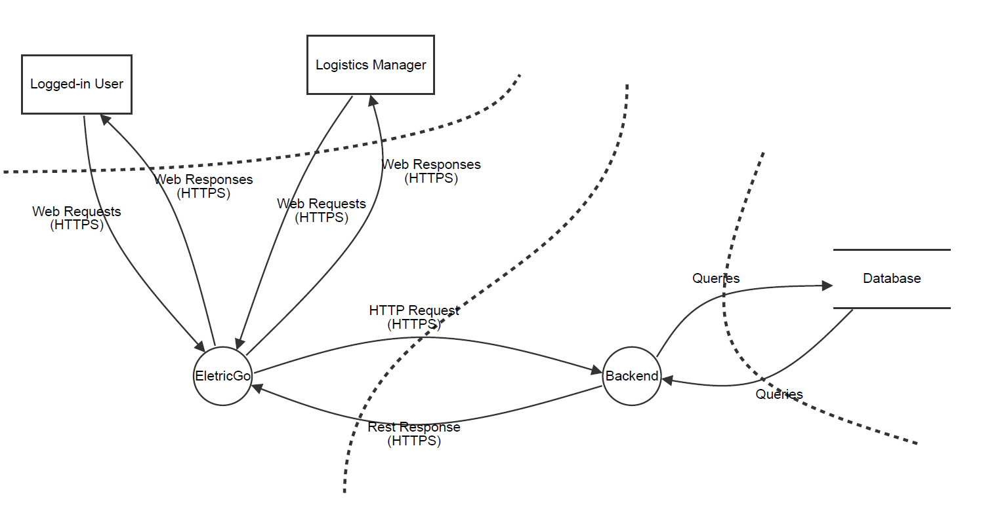
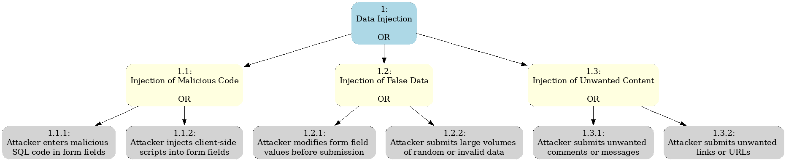

# Software Architectural Analysis and Design of Logistics Aggregate

- This document describes the architecture of EletricGo's Logistics aggregate, providing an overview of the design decisions and architectural analysis made during development.

- Logistics Aggregate is a sub-system developed to manage the data of the deliveries, more specifically the load and unloading of the truck and the position of packages in the truck.

# Table of Contents
1. [Requirements Engineering](#1-requirements-engineering)
   1. [User Stories Description](#11-user-stories-description)
   2. [Customer Specifications and Clarifications](#12customer-specifications-and-clarifications)
   3. [Acceptance Criteria](#13acceptance-criteria)
   4. [Found out Dependencies](#14found-out-dependencies)
   5. [Input and Output Data](#15-input-and-output-data)
   6. [System Sequence Diagram (SSD)](#16-system-sequence-diagram-ssd)
   7. [API Endpoints](#17-api-endpoints)
   8. [Database Schema](#18-database-schema)
   9. [Authorization Roles](#19-authorization-roles)
2. [Analysis](#2-analysis)
   1. [Preliminary Software Risk Analysis](#21-preliminary-software-risk-analysis)
   2. [Security Requirements Engineering](#22-security-requirements-engineering)
   3. [Abuse Cases](#23-abuse-cases)
   4. [Functional Security Requirements](#24-functional-security-requirements)
   5. [Non-Functional Security Requirements](#25-non-functional-security-requirements)
   6. [Secure Development Requirements](#26-secure-development-requirements)
3. [Design](#3-design)
   1. [Security Risk-Driven Design](#31-security-risk-driven-design)
   2. [Secure Architecture](#32-secure-architecture)
   3. [Secure Design Patterns](#33-secure-design-patterns)
   4. [Threat Modelling](#34-threat-modelling)
   5. [Security Test Planning](#35-security-test-planning)
   6. [Security Architecture Review](#36-security-architecture-review)
 
# 1. Requirements Engineering
 
## 1.1 User Stories Description

For this aggregate we have two User Stories:

- As a Logistics Manager I want to submit a Logistics Form

- As a logged-in user I want to list the Logistics Forms

 
## 1.2 Customer Specifications and Clarifications

- The application should provide a user-friendly process for submiting a Logistics form.

- Only the Logistics Manager should have the authority to submit a Form.

## 1.3 Acceptance Criteria
 
- A Logistic Manager should only submit a form if there already exists a delivery and a truck in the system.

- The position of each package in the truck must be unique.

## 1.4 Found out Dependencies

- The process to submit a Logistics Form depends on the authentication system so that only the Logistics Manager can perfrom this action.

- The application depends on database system to store the data that is created.
 
## 1.5 Input and Output Data
 
1. Submiting a Logistics Form
    - The input data includes the identification of a delivery, the identification of a truck, the time that takes to load the truck, the time that it takes to unload the truck and the position that each package takes in the truck.
    - The output data includes a success message in case of sucessful submition of a form and an insucess messsage in case of failed submition.
2. Listing Logistics Forms
    - The input data may include the identification of the form.
    - The output data includes the data of the Logistics Forms.

## 1.6 System Sequence Diagram (SSD)

- Submiting a Logistics Form

- List Logistics Form

 
## 1.7 API Endpoints

- POST /logitsics/form - Submit a Logistics Form
(accessible only by the Logistics Manager)
- GET /logistics/form - List all Logistics Forms
- GET /logistics/form/{id} - Get the logistic form by id
 
## 1.8 Database Schema: modelo relacional

The Domain Model for the Logistics Aggregate is as follows:

Considering the previous model, the logistics aggregate has the following database schema:

 
## 1.9 Authorization Roles

- Logistics Manager: Access to functionalities related to route data management and distribution planning.
- Operator: Restricted access for querying and limited operations within each aggregate, with permissions tailored to their role responsibilities.
 
# 2. Analysis
 
## 2.1 Preliminary Software Risk Analysis

In this section, we conduct a preliminary analysis to identify potential risks associated with the software development process. 

Risks can arise from various factors such as technical challenges, project management issues, and external dependencies. 

The aim of this analysis is to proactively identify and prioritize these risks to mitigate their impact on the project. 

We employ techniques such as risk identification, assessment, and mitigation planning to ensure that the project progresses smoothly and delivers the desired outcomes within the defined constraints.
 
## 2.2 Security Requirements Engineering

Security requirements engineering involves the process of eliciting, analyzing, specifying, and validating security requirements for a software system. 

In this section, we focus on identifying the security needs of the system, considering factors such as confidentiality, integrity, availability, and accountability. 

We collaborate with stakeholders to understand their security concerns and align the security requirements with the overall project objectives. By applying established methodologies and frameworks, we ensure that the software system is designed and developed with robust security measures to protect against potential threats and vulnerabilities.
 
## 2.3 Abuse Cases

Abuse cases, also known as misuse cases, outline potential scenarios where a system might be intentionally misused or exploited. 

  1. **Data Injection**:
     An attacker attempts to inject malicious code or SQL commands into form fields to gain unauthorized access to the system or manipulate the database.
  2. **Cross-Site Scripting (XSS)**:
     A malicious user injects scripts into form fields, which are then executed by other users' browsers, potentially compromising their sessions or stealing their data.
  3. **Cross-Site Request Forgery (CSRF)**:
     An attacker tricks an authenticated user into submitting a form without their knowledge, potentially causing unwanted actions or disclosing sensitive information.
  4. **Brute Force Attacks**:
     An attacker attempts to guess login credentials by repeatedly submitting form submissions, exploiting weak authentication mechanisms.
  5. **Data Exfiltration**:
     A malicious insider or external attacker attempts to steal sensitive data entered into the forms, such as personal information or medical records, for financial gain or espionage.
  6. **Session Hijacking**:
     An attacker intercepts a user's session token, gained from form submissions, to impersonate the user and gain unauthorized access to the system.
  7. **Denial of Service (DoS)**:
     An attacker floods the form submission endpoint with a large volume of requests, overwhelming the system's resources and causing it to become unavailable to legitimate users.
  8. **Parameter Tampering**:
    A user with malicious intent manipulates form parameters, such as changing hidden fields or altering URLs, to bypass security controls or access unauthorized resources.

We will see in detail a specific use case witch is the common one and it will be done several times in the system, the submit Form process.

 
## 2.4 Functional Security Requirements

Functional security requirements specify the security-related functions or features that a system must possess to protect against potential threats and vulnerabilities. 

  1. **Authentication**: 
    Ensure that users are who they claim to be before allowing access to form submission features. This may involve various methods such as username/password, multi-factor authentication, or single sign-on.
  2. **Authorization**: 
    Restrict access to forms based on users' roles or permissions to prevent unauthorized submissions or access to sensitive information.
  3. **Input Validation**: 
    Verify the correctness and integrity of data entered into forms to prevent common attacks like SQL injection and cross-site scripting.
  4. **Data Encryption**: 
    Protect sensitive data (such as medical records) by encrypting it during transmission and storage, using protocols like TLS and encryption algorithms such as AES.
  5. **Session Management**: 
    Securely manage user sessions to prevent session hijacking and ensure confidentiality and integrity, including generating unique session identifiers and implementing session timeouts.
  6. **Rate Limiting and CAPTCHA**: 
    Implement mechanisms to limit the rate of form submissions to prevent brute force attacks and distinguish between human users and bots, possibly using CAPTCHA.
  7. **Error Handling and Reporting**: 
    Handle errors securely to prevent revealing sensitive information that could aid attackers, ensuring that error messages are generic and do not expose internal details of the system.
  8. **Secure Configuration Management**: 
    Manage system configurations securely to reduce the attack surface and avoid using default or insecure settings that could be exploited by attackers.
  9. **Backup**:
    The system must have a robust backup mechanism in place to ensure that data related to form submissions is regularly backed up and can be restored in the event of data loss or system failure.
  10. **Server Clustering**:
    The system must be designed with server clustering capabilities to distribute incoming traffic across multiple servers and ensure high availability and fault tolerance.
 
## 2.5 Non-Functional Security Requirements

Non-functional security requirements specify the attributes of a system that are not directly related to its functional behaviour but are critical for ensuring its security and performance.

  1. **Performance**:
    The system should handle form submissions efficiently, even under peak loads, to prevent denial of service attacks and ensure responsiveness to user interactions.
  2. **Scalability**:
    The system should be designed to scale effectively as the number of users and form submissions increases, ensuring that performance and security are maintained.
  3. **Availability**:
    The system should maintain high availability to ensure that users can access form submission functionality whenever needed, minimizing downtime and service disruptions.
  4. **Reliability**:
    The system should be reliable, ensuring that form submissions are processed accurately and consistently without data loss or corruption.
  5. **Interoperability**:
    The system should be compatible with various web browsers, operating systems, and devices, ensuring seamless interoperability for users accessing the forms from different platforms.
  6. **Compliance**:
    The system should comply with relevant regulations and standards governing data privacy and security, such as GDPR, HIPAA, and PCI DSS, to protect users' sensitive information and avoid legal liabilities.
  7. **Usability**:
    The system should be user-friendly, with intuitive form layouts and clear instructions, to facilitate easy and error-free submission of information by users.
  8. **Auditability**:
    The system should support auditing capabilities to track and monitor user activities, form submissions, and security-related events for compliance, troubleshooting, and forensic analysis purposes.
  9. **Redundancy and Disaster Recovery**:
    The system should incorporate redundancy and disaster recovery measures to ensure data integrity and availability in the event of hardware failures, natural disasters, or other catastrophic events.

 
## 2.6 Secure Development Requirements

Secure development requirements outline the practices and procedures that developers should follow during the software development lifecycle to ensure that security is integrated into every stage of the process.

  1. **Secure Coding Practices**:
    Developers must follow secure coding practices, such as input validation, output encoding, and proper error handling, to prevent common vulnerabilities like injection attacks and buffer overflows.
  2. **Security Training**:
    Developers should receive regular training on secure coding practices, security vulnerabilities, and secure development methodologies to raise awareness and improve their ability to identify and mitigate security risks.
  3. **Code Reviews**:
    All code changes related to form submission functionality should undergo thorough code reviews by peers or security experts to identify and address security flaws, logic errors, and potential vulnerabilities.
  4. **Static Code Analysis**:
    Automated static code analysis tools should be used to scan the codebase for security vulnerabilities, coding errors, and adherence to secure coding guidelines before deployment.
  5. **Secure Authentication and Authorization**:
    Developers should implement secure authentication mechanisms, such as password hashing and session management, and enforce proper authorization controls to restrict access to form submission functionality based on user roles and permissions.
  6. **Data Encryption**:
    Developers must ensure that sensitive data entered into forms is encrypted both in transit and at rest, using strong encryption algorithms and secure key management practices to protect against unauthorized access and disclosure.
  7. **Secure Configuration**:
    Default configurations should be securely configured, and unnecessary features or services should be disabled to minimize the attack surface and reduce the risk of exploitation by attackers.
  8. **Secure Third-Party Libraries**:
    Developers should carefully vet and monitor third-party libraries and dependencies used in the form submission system to ensure that they are up-to-date, free from known vulnerabilities, and securely configured.
  9. **Secure Deployment Practices**:
    Secure deployment practices, such as least privilege access, secure transport protocols, and encryption of configuration files, should be followed to prevent unauthorized access to production environments and protect sensitive data during deployment.
  10. **Security Testing**:
    Comprehensive security testing, including penetration testing, vulnerability scanning, and security-focused testing techniques, should be performed regularly throughout the development lifecycle to identify and remediate security issues proactively.
 
# 3. Design
 
## 3.1 Security Risk-Driven Design

Security Risk-Driven Design is an approach that prioritizes security considerations throughout the software design process. Instead of treating security as an afterthought, this methodology integrates security measures from the outset, aligning them closely with identified risks. By analyzing potential security threats and vulnerabilities early in the design phase, teams can make informed decisions to mitigate risks effectively.

### Key Components:
- **Risk Assessment:** Conducting a comprehensive analysis of potential security risks and their potential impact on the software system.
- **Threat Modeling:** Identifying and prioritizing potential threats to the system, considering various attack vectors and their likelihood.
- **Security Controls:** Implementing appropriate security controls and countermeasures to mitigate identified risks.
- **Continuous Monitoring:** Establishing mechanisms for ongoing monitoring and assessment of security posture to detect and respond to emerging threats.

## 3.2 Secure Architecture

For the case in mind designing a secure architecture involves considering various layers and components of the system to ensure the confidentiality, integrity, and availability of sensitive data. Here's a high-level overview of a secure architecture for the form submission system:

### Client-Side Security
- Utilize HTTPS for encrypted communication between client and server.
- Implement client-side input validation and CAPTCHA to prevent injection attacks and automated form submissions.

### Authentication and Authorization Layer
- Use secure authentication mechanisms like password hashing and multi-factor authentication.
- Enforce role-based access control (RBAC) to restrict access to form submission functionality based on user roles.

### Form Submission Processing
- Perform input validation and sanitization on all form submissions to prevent security vulnerabilities.
- Encrypt sensitive data in transit and at rest using strong encryption algorithms.

### Server-Side Security
- Follow secure coding practices and conduct regular code reviews to identify and remediate security vulnerabilities.
- Configure server environments securely and deploy intrusion detection/prevention systems (IDS/IPS) for real-time monitoring.

### Data Storage and Persistence
- Implement secure database configurations with encryption at rest, access controls, and regular backups.
- Use data masking techniques to obfuscate sensitive data in non-production environments.

### Logging and Monitoring
- Log security-relevant events and deploy security information and event management (SIEM) solutions for centralized log management and correlation.

### Third-Party Integrations and Dependencies
- Conduct security assessments of third-party integrations and dependencies to ensure compliance with security best practices.

### Incident Response and Disaster Recovery
- Develop an incident response plan outlining procedures for detecting, responding to, and recovering from security incidents.
- Implement disaster recovery measures such as backup and restore procedures, failover mechanisms, and redundancy configurations.
 
## 3.3 Secure Design Patterns

1. **Layered Architecture:**
   - Implement a layered architecture with distinct tiers for presentation, business logic, and data access to enforce separation of concerns and minimize the attack surface.

2. **Secure Communication:**
   - Use the Transport Layer Security (TLS) protocol to encrypt communication between clients and servers, ensuring data confidentiality and integrity.

3. **Authentication and Authorization:**
   - Implement secure authentication mechanisms such as OAuth 2.0 or OpenID Connect for user authentication and authorization.
   - Utilize JSON Web Tokens (JWT) or session tokens with limited validity to manage user sessions securely.

4. **Input Validation and Sanitization:**
   - Apply input validation and sanitization techniques to prevent injection attacks such as SQL injection, XSS, and command injection.
   - Use whitelisting approaches to validate input against expected patterns and reject any input that does not adhere to these patterns.

5. **Output Encoding:**
   - Encode output data using appropriate encoding mechanisms (e.g., HTML encoding) to prevent XSS attacks and ensure that user-supplied data is displayed safely.

6. **Secure Storage of Sensitive Data:**
   - Encrypt sensitive data at rest using strong encryption algorithms and secure key management practices to protect against unauthorized access.

7. **Access Controls:**
   - Implement role-based access control (RBAC) or attribute-based access control (ABAC) to enforce fine-grained access controls and restrict access to sensitive functionality and data.

8. **Auditing and Logging:**
   - Log security-relevant events, user activities, and access control decisions to facilitate auditing, forensic analysis, and compliance with regulatory requirements.

9. **Secure Configuration Management:**
   - Apply secure configuration management practices to ensure that default configurations are securely configured and unnecessary features or services are disabled.

10. **Error Handling and Reporting:**
    - Implement robust error handling mechanisms to prevent information leakage and ensure that error messages do not disclose sensitive information about the system's internals.

11. **Rate Limiting and Throttling:**
    - Enforce rate limiting and throttling mechanisms to mitigate the risk of brute force attacks and prevent abuse of form submission functionality by limiting the number of requests per unit of time.

12. **Fail-Safe Design:**
    - Design the system with fail-safe mechanisms and redundancy configurations to ensure graceful degradation and maintain availability in the event of failures or disruptions.
 
## 3.4 Threat Modelling

## 3.4.1. Threat Model Information

Threat modeling is a systematic approach to identifying and mitigating potential security threats and vulnerabilities within a software system. It is a proactive technique used by security professionals and developers to anticipate potential attacks and prioritize security measures accordingly.

**Application Name:** EletricGo.

**Application Version:** 1.0.

**Description:** The application EletricGo is a system created to manage the deliveries of packages through eletric trucks.

**Document Owner:** Cristiano Soares.

**Participants:** 
  - Pedro Fernandes
  - Alexandra Leite
  - Fábio Cruz
  - Vitor Costa
  - Cristiano Soares

**Reviewer:** Fábio Cruz.

## 3.4.2 External Dependencies

| ID          | Description|
|----------------------------|------------|
| 1 | The database of the application will be a relational database. |
| 2 | The communication between the frontend and backend will be using RESTful API.|

## 3.4.3. Entry Points

| ID | Name | Description | Trust Level |
|------|------------|---------|-----------|
| 1 | UI | Users interact with forms through the user interface, making HTTP requests to the backend API endpoints. | (2) Logged-in User (3) Logistics Manager |
| 2 | Database Interface | This entry point allows the backend to interact with the database | (2) Logged-in User (3) Logistics Manager | 

## 3.4.4. Exit Points

| ID | Name | Description | Trust Level |
|----|------|-------------|-------------|
| 1 | Response Data | The backend API endpoint returns a response to the user interface based on the request made by the user. This response may include data related to form submition, validation results, or errors. | (2) Logged-in User (3) Logistics Manager |
| 2 | Database Response | After interacting with the database to store or retrieve form-related information, the backend API endpoint receives a response indicating the success or failure of the database operation. This response may include status codes, error messages, or retrieved data. | (2) Logged-in User (3) Logistics Manager |

## 3.4.5. Assets

| ID | Name | Description | Trust Level |
|----|------|-------------|-------------|
| 1 | User Data | Personal information of users, including names, email addresses, passwords, and other sensitive data stored in the application's database. | (3) Logistics Manager |
| 2 | Form Configurations | Configuration settings for forms, including form titles, descriptions, field types, validation rules, and submission settings. | (3) Logistics Manager |
| 3 | Form Submissions | Data submitted by users through forms, including responses to form fields, uploaded files, and timestamps of submissions. | (3) Logistics Manager |

## 3.4.6. Trust Levels

| ID | Name | Description |
|----|------|-------------|
| 1 | Anonymous Web User | External entities accessing the application without authentication. They have limited access to public resources and functionalities. |
| 2 | Logged-in User | Authenticated users who have successfully logged into the application. They have access to additional features and functionalities compared to anonymous web users. |
| 3 | Logistics Manager | Authenticated users with administrative privileges responsible for managing logistics-related tasks and overseeing the application's operation. They have full access to all features, functionalities, and sensitive data within the application. |

## 3.4.7. Data Flow Diagrams

Data Flow Diagrams (DFDs) are graphical representations of the flow of data within a system. They illustrate how data is input, processed, stored, and output in a system. In the context of our logistics application, DFDs can help visualize the journey of data from the moment a logistics form is created, through its various updates, to its final storage and potential retrieval.

## 3.4.8. Threat Analysis

| Category       | Property Violated          | Description |
|--------|--------------|--------------|
| Spoofing (S)   | Authentication  | **User Credential Theft**: Attackers may attempt to steal user credentials by spoofing login forms or tricking users into entering their credentials on malicious websites. |
|                |                    | **IP Spoofing**: Attackers may spoof IP addresses to bypass IP-based access controls and submit forms from unauthorized locations.                                  |
| Tampering (T)  | Integrity          | **Data Manipulation**: Attackers may tamper with form data, such as modifying hidden fields or intercepting and modifying data in transit, to manipulate system behavior or submit unauthorized requests. |
|                |                    | **Parameter Tampering**: Attackers may tamper with form parameters to bypass validation checks or gain unauthorized access to sensitive resources.                     |
| Repudiation (R)| Nonrepudiation     | **False Submission Denial**: Users may deny submitting certain forms or actions, leading to difficulties in tracing and resolving disputes over the authenticity of submitted data. |
|                |                    | **Transaction Disputes**: Users may repudiate form submissions, claiming that they did not initiate certain transactions, leading to disputes and challenges in establishing accountability. |
| Information disclosure (I)    | Confidentiality    | **Sensitive Data Exposure**: Attackers may exploit vulnerabilities in form processing to disclose sensitive information entered by users, such as personal information, payment details, or confidential documents. |
|                |                    | **Error Message Disclosure**: Insecure error handling may reveal sensitive information in error messages, aiding attackers in crafting targeted attacks or exploiting system vulnerabilities. |
| Denial of service (D)    | Availability       | **Form Flooding**: Attackers may flood form submission endpoints with a large volume of requests, overwhelming system resources and causing denial of service to legitimate users. |
|                |                    | **Resource Exhaustion**: Attackers may exploit vulnerabilities to exhaust system resources, such as memory or CPU, leading to degradation or unavailability of form submission services. |
| Elevation of privilege (E)  | Authorization     | **Session Hijacking**: Attackers may hijack user sessions to gain unauthorized access to form submission functionalities and perform actions on behalf of legitimate users. |
|                |                    | **Unauthorized Access**: Exploitation of vulnerabilities may allow attackers to elevate their privileges and gain access to administrative features or sensitive form submission functionalities. |

Below it shows us the Attack Tree of compromising form security.

## 3.4.9. Ranking of Threats

1. **Injection Attacks**:
   - Damage potential: Loss of data integrity, unauthorized access to sensitive information (8)
   - Reproducibility: Highly reproducible, common attack vector (9)
   - Exploitability: Relatively easy to exploit with knowledge of SQL or scripting languages (8)
   - Affected users: Potentially affects all users interacting with the form (9)
   - Discoverability: Easily discoverable by attackers through automated tools or manual inspection (8)
   - Overall DREAD score: (8 + 9 + 8 + 9 + 8) / 5 = 8.4

2. **Authentication Attacks**:
   - Damage potential: Compromise of user accounts, unauthorized access to sensitive resources (7)
   - Reproducibility: Moderately reproducible, requires knowledge of authentication mechanisms (7)
   - Exploitability: Requires knowledge of authentication vulnerabilities, social engineering, or brute force attacks (7)
   - Affected users: Affects users with accounts on the system (8)
   - Discoverability: Can be discovered through reconnaissance or targeted attacks (7)
   - Overall DREAD score: (7 + 7 + 7 + 8 + 7) / 5 = 7.2

3. **Session Attacks**:
   - Damage potential: Compromise of user sessions, unauthorized access to user accounts and sensitive data (8)
   - Reproducibility: Highly reproducible, common attack vector (9)
   - Exploitability: Requires knowledge of session management vulnerabilities and techniques (7)
   - Affected users: Affects users with active sessions (8)
   - Discoverability: Can be discovered through reconnaissance or monitoring network traffic (8)
   - Overall DREAD score: (8 + 9 + 7 + 8 + 8) / 5 = 8

4. **Data Theft**:
   - Damage potential: Loss of sensitive data, breach of confidentiality (9)
   - Reproducibility: Highly reproducible, common attack vector (9)
   - Exploitability: Requires knowledge of data handling vulnerabilities or social engineering (8)
   - Affected users: Affects users whose data is stored or transmitted through the form (9)
   - Discoverability: Can be discovered through monitoring or auditing (8)
   - Overall DREAD score: (9 + 9 + 8 + 9 + 8) / 5 = 8.6

5. **Denial of Service**:
   - Damage potential: Disruption of service, loss of availability (8)
   - Reproducibility: Highly reproducible, common attack vector (9)
   - Exploitability: Requires knowledge of denial of service techniques or tools (7)
   - Affected users: Affects all users trying to access the form or system (9)
   - Discoverability: Can be discovered through monitoring or experiencing service disruptions (8)
   - Overall DREAD score: (8 + 9 + 7 + 9 + 8) / 5 = 8.2

## 3.4.10. Qualitative Risk Model

1. **Injection Attacks**:
   - Likelihood of occurrence: High, as injection attacks can often be exploited remotely and automated (e.g., SQL injection).
   - Potential impact: Significant, as successful injection attacks can lead to data breaches, system compromise, and financial losses.

2. **Authentication Attacks**:
   - Likelihood of occurrence: Moderate to high, depending on the strength of authentication mechanisms and user awareness.
   - Potential impact: Moderate to significant, as compromised user accounts can lead to unauthorized access, data breaches, and reputational damage.

3. **Session Attacks**:
   - Likelihood of occurrence: Moderate, as session attacks may require specific vulnerabilities in session management.
   - Potential impact: Moderate, as compromised sessions can lead to unauthorized access to user accounts and sensitive data.

4. **Data Theft**:
   - Likelihood of occurrence: Moderate to high, as data theft can occur through various means such as exploitation of vulnerabilities or social engineering attacks.
   - Potential impact: Significant, as loss of sensitive data can result in regulatory fines, legal liabilities, reputational damage, and financial losses.

5. **Denial of Service**:
   - Likelihood of occurrence: Moderate to high, as denial of service attacks can be launched remotely and may exploit vulnerabilities in the system's infrastructure.
   - Potential impact: Significant, as service disruptions can lead to loss of revenue, reputational damage, and customer dissatisfaction.
 

## 3.4.11. Mitigation and Countermeasures

### Spoofing:
- **Threat**: Spoofing involves an attacker impersonating a legitimate user to gain unauthorized access or submit malicious data.
- **Mitigation Techniques**:
  1. **Appropriate authentication**: Implement robust authentication mechanisms such as CAPTCHA, reCAPTCHA, or multi-factor authentication to verify the identity of form submitters.
  2. **Protect secret data**: Encrypt sensitive data such as user credentials or session tokens to prevent unauthorized access or spoofing.
  3. **Don’t store secrets**: Avoid storing sensitive information in form fields or hidden inputs, especially in plaintext, to minimize the risk of data exposure.

### Tampering:
- **Threat**: Tampering involves unauthorized modification of data submitted through forms, leading to integrity breaches or manipulation of system behavior.
- **Mitigation Techniques**:
  1. **Appropriate authentication**: Ensure that only authenticated users have permission to modify form data.
  2. **Hashes**: Implement hashing techniques to create checksums of form data, detecting any modifications during transmission or processing.
  3. **MACs (Message Authentication Codes)**: Apply MACs to validate the integrity and authenticity of form submissions, ensuring that data has not been tampered with.
  4. **Tamper-resistant protocols**: Use secure communication protocols such as HTTPS to protect form submissions from tampering during transmission over the network.

### Repudiation:
- **Threat**: Repudiation involves a user denying their actions, leading to disputes over the authenticity of form submissions.
- **Mitigation Techniques**:
  1. **Logging and Auditing**: Keep detailed logs of form submissions, including user actions and timestamps, to provide evidence in case of disputes.
  2. **Digital Signatures**: Implement digital signatures or non-repudiation mechanisms to ensure that form submissions are securely authenticated and verified.

### Information Disclosure:
- **Threat**: Information disclosure occurs when sensitive data entered into forms is exposed to unauthorized users.
- **Mitigation Techniques**:
  1. **Input Validation**: Implement strict input validation to filter out malicious data and prevent common attacks such as SQL injection or cross-site scripting.
  2. **Data Encryption**: Encrypt sensitive information entered into forms during transmission and storage to protect it from unauthorized access.
  3. **Access Controls**: Enforce access controls to restrict who can view or access certain form submissions, ensuring that only authorized users can access sensitive data.

### Denial of Service:
- **Threat**: Denial of service attacks aim to disrupt the availability of form submission services, rendering them inaccessible to legitimate users.
- **Mitigation Techniques**:
  1. **Rate Limiting**: Implement rate-limiting mechanisms to prevent excessive form submissions from overwhelming the system.
  2. **Resource Scaling**: Scale resources such as servers or bandwidth to handle increased traffic during peak periods or in response to DoS attacks.
  3. **DDoS Protection**: Use DDoS protection services or appliances to mitigate the impact of distributed denial of service attacks on form submission services.

### Elevation of Privilege:
- **Threat**: Elevation of privilege involves attackers gaining unauthorized access to privileged features or functionalities within the form submission system.
- **Mitigation Techniques**:
  1. **Access Controls**: Implement role-based access controls to restrict user privileges and permissions, ensuring that users only have access to the functionalities necessary for their roles.
  2. **Session Management**: Securely manage user sessions to prevent session hijacking or unauthorized access to privileged features.
  3. **Input Validation**: Validate and sanitize input data to prevent privilege escalation attacks through injection vulnerabilities.

## 3.5 Security Test Planning
 
## Security Test Planning

### Objective:
The objective of security testing for the form submission system is to identify and mitigate vulnerabilities that could compromise the confidentiality, integrity, and availability of data entered into forms.

### Scope:
The security test will focus on evaluating the security measures implemented within the form submission system, including authentication mechanisms, data validation procedures, encryption protocols, access controls, and resilience against common attacks such as SQL injection, cross-site scripting (XSS), and brute force attacks.

### Testing Approach:
The testing approach will involve a combination of automated and manual techniques to comprehensively assess the security posture of the form submission system. This will include:

1. **Automated Vulnerability Scanning**: Utilize automated scanning tools such as Burp Suite, OWASP ZAP, or Nessus to identify common security vulnerabilities such as injection flaws, broken authentication, and sensitive data exposure.

2. **Penetration Testing**: Conduct manual penetration testing to simulate real-world attack scenarios and identify potential weaknesses in the form submission system. This will involve attempting to bypass authentication controls, manipulate form data, and exploit vulnerabilities to gain unauthorized access.

3. **Security Code Review**: Perform a thorough review of the source code underlying the form submission system to identify potential security flaws such as insecure coding practices, improper input validation, or lack of error handling.

4. **User Access Controls Testing**: Evaluate the effectiveness of access controls implemented within the system by attempting to access restricted functionalities or sensitive data without proper authorization.

5. **Session Management Testing**: Assess the resilience of session management mechanisms to prevent session fixation, session hijacking, or session replay attacks.

6. **Data Encryption Assessment**: Verify the adequacy of data encryption protocols used to protect sensitive information entered into forms during transmission and storage.

7. **Social Engineering Testing**: Conduct simulated social engineering attacks to assess the susceptibility of users to phishing attempts, credential theft, or other manipulative techniques.

### Deliverables:
Upon completion of the security testing, the following deliverables will be provided:

- Comprehensive security assessment report detailing 

## 3.6 Security Architecture Review

## Security Architecture Review

### Objective:
The objective of the security architecture review is to assess the design and implementation of security controls within the form submission system to ensure they align with industry best practices and adequately protect against potential threats.

### Scope:
The security architecture review will focus on examining the architectural components and security features implemented within the form submission system. This includes evaluating authentication mechanisms, access controls, data validation procedures, encryption protocols, logging and monitoring capabilities, and resilience against common security threats such as injection attacks, session hijacking, and data breaches.

### Review Process:
The review process will involve a systematic examination of the following aspects of the security architecture:

1. **Authentication and Authorization**: Evaluate the mechanisms used for user authentication and authorization, including password policies, multi-factor authentication, and role-based access controls.

2. **Data Validation and Sanitization**: Assess the effectiveness of input validation and data sanitization techniques to prevent injection attacks such as SQL injection, cross-site scripting (XSS), and command injection.

3. **Encryption and Data Protection**: Review the encryption protocols and mechanisms employed to protect sensitive data at rest and in transit, including the use of SSL/TLS for secure communication and encryption algorithms for data storage.

4. **Access Controls and Privilege Management**: Examine the implementation of access controls to restrict user access to sensitive functionalities and data, and evaluate the management of user privileges to prevent unauthorized escalation of privileges.

5. **Logging and Monitoring**: Analyze the logging and monitoring capabilities of the system to detect and respond to security incidents, including the logging of user activities, system events, and security-related alerts.

6. **Resilience Against Common Attacks**: Assess the resilience of the system against common security threats such as brute force attacks, session fixation, and cross-site request forgery (CSRF), and evaluate the effectiveness of countermeasures implemented to mitigate these threats.

### Recommendations:
Based on the findings of the security architecture review, recommendations will be provided to enhance the security posture of the form submission system. These recommendations may include:

- Implementing additional security controls to address identified vulnerabilities and weaknesses.
- Enhancing existing security features to improve resilience against emerging threats.
- Updating security policies and procedures to ensure compliance with industry standards and regulatory requirements.
- Providing training and awareness programs for system administrators and users to promote security best practices and mitigate human-related risks.

### Conclusion:
The security architecture review aims to provide insights into the strengths and weaknesses of the security architecture of the form submission system and to guide efforts towards enhancing its security posture. By proactively addressing security concerns and implementing recommended improvements, the organization can better protect sensitive data and mitigate the risks associated with form submission functionalities.

