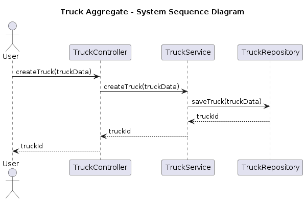
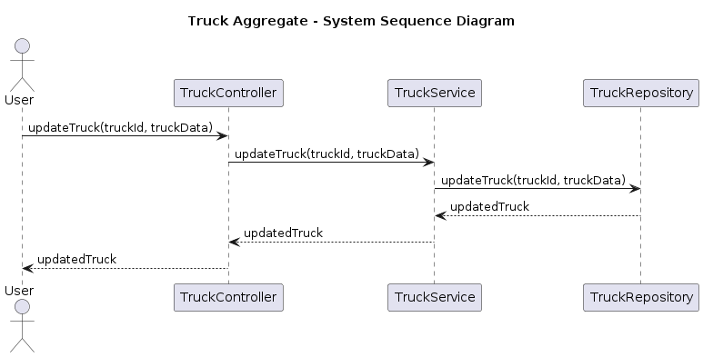
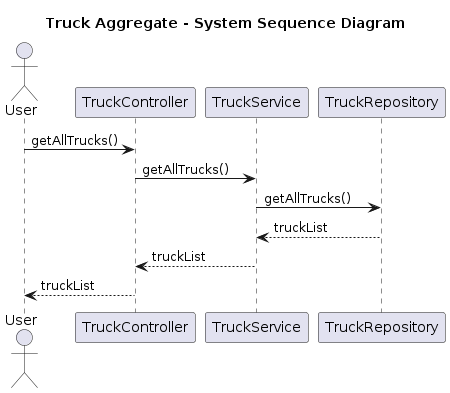
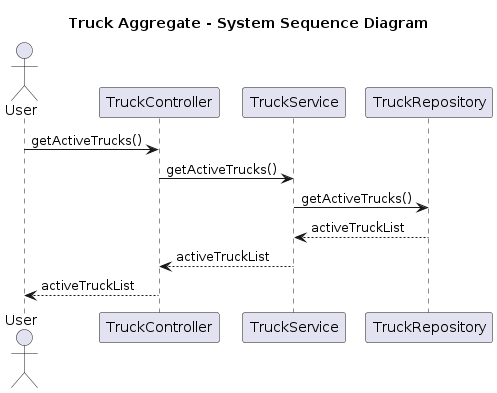
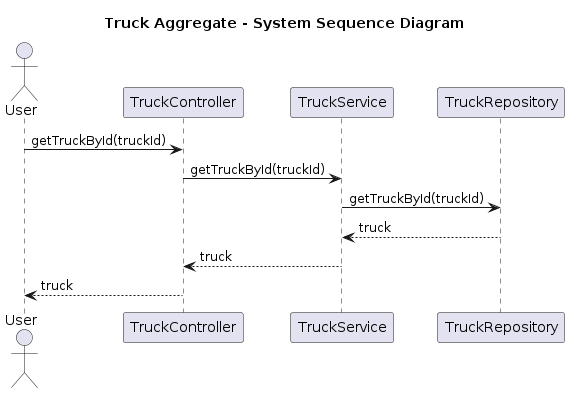
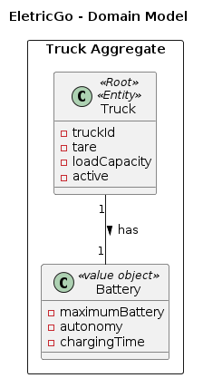

# Software Architectural Analysis and Design of Truck Aggregate
- This document describes the architecture of EletricGo's Truck aggregate, providing an overview of the design decisions and architectural analysis made during development.
- Truck Aggregate is a sub-system developed to provide transportation services using electric trucks.
 
# Table of Contents
1. [Requirements Engineering](#1-requirements-engineering)
   1. [User Stories Description](#11-user-stories-description)
   2. [Customer Specifications and Clarifications](#12-customer-specifications-and-clarifications)
   3. [Acceptance Criteria](#13-acceptance-criteria)
   4. [Found out Dependencies](#14-found-out-dependencies)
   5. [Input and Output Data](#15-input-and-output-data)
   6. [System Sequence Diagram (SSD)](#16-system-sequence-diagram-ssd)
   7. [API Endpoints](#17-api-endpoints)
   8. [Database Schema](#18-database-schema)
   9. [Authorization Roles](#19-authorization-roles)
2. [Analysis](#2-analysis)
   1. [Preliminary Software Risk Analysis](#21-preliminary-software-risk-analysis)
   2. [Security Requirements Engineering](#22-security-requirements-engineering)
   3. [Abuse Cases](#23-abuse-cases)
   4. [Functional Security Requirements](#24-functional-security-requirements)
   5. [Non-Functional Security Requirements](#25-non-functional-security-requirements)
   6. [Secure Development Requirements](#26-secure-development-requirements)
3. [Design](#3-design)
   1. [Security Risk-Driven Design](#31-security-risk-driven-design)
   2. [Secure Architecture](#32-secure-architecture)
   3. [Secure Design Patterns](#33-secure-design-patterns)
   4. [Threat Modelling](#34-threat-modelling)
   5. [Security Test Planning](#35-security-test-planning)
   6. [Security Architecture Review](#36-security-architecture-review)
 
# 1. Requirements Engineering
 
## 1.1 User Stories Description
- As a System Administrator, I want to be able to create a new truck entry in the system, including its battery details.
- As a System Administrator, I want to be able to update the details of any truck, including its battery details.
- As a System Administrator, I want to be able to delete any truck from the system.
- As a Warehouse Manager, I want to be able to view the details of any truck, including its battery details.
- As a Fleet Manager, I want to be able to create a new truck entry in the system, including its battery details.
- As a Fleet Manager, I want to be able to update the details of any truck, including its battery details.
- As a Fleet Manager, I want to be able to delete any truck from the system.
- As a Logistics Manager, I want to be able to view the details of any truck, including its battery details.
- As an Operator, I want to be able to view the details of any truck, including its battery details.

## 1.2 Customer Specifications and Clarifications
1. **Truck Details**: Each truck in the system should have a unique identifier, tare, load capacity, and an active status. The active status indicates whether the truck is currently in use.

2. **Battery Details**: Each truck is equipped with one battery. The details of each battery, including its maximum capacity, autonomy, and charging time, should be stored in the system.

3. **Truck-Battery Relationship**: The system should maintain the relationship between each truck and its battery. 

4. **Truck Management**: System administrators and fleet managers should be able to create, update, and delete truck entries in the system. Warehouse managers, logistics managers, and operators should be able to view the details of any truck.

5. **Battery Management**: System administrators and fleet managers should also be able to manage the battery details of the trucks when creating or updating a truck entry.

## 1.3 Acceptance Criteria
- The system should allow the user to create a new truck entry, including its battery details, by sending a POST request to `/trucks`.
- The system should allow the user to update the details of a specific truck, including its battery details, by sending a PUT request to `/trucks/:truckId`.
- The system should retrieve a list of all trucks in the system, including their battery details, by sending a GET request to `/trucks`.
- The system should retrieve a list of active trucks in the system, including their battery details, by sending a GET request to `/trucks/active`.
- The system should retrieve the details of a specific truck, including its battery details, by sending a GET request to `/trucks/:truckId`.
- The system should validate the input fields to ensure data integrity. This includes the validation of the battery details.
- The system should generate a unique identifier for each truck entry.
- The system should provide an audit trail of all changes made to the truck entries, including changes to the battery details.
- The user should be able to search for trucks based on their load capacity, autonomy, and battery details.
- The user should be able to filter the list of trucks based on their status (active or inactive) and battery details.
- The user should be able to sort the list of trucks based on different criteria, such as truckId, load capacity, autonomy, and battery details.

## 1.4 Found out Dependencies
- The truck aggregate depends on the availability of a database management system to store and retrieve truck data.
- The truck aggregate depends on the authentication and authorization system to enforce access control and security.

## 1.5 Input and Output Data
The input and output data for the Truck aggregate are as follows:

### Input Data
- When creating a new truck entry, the input data should include the truck details such as tare, load capacity, and active status. It should also include the battery details such as maximum capacity, autonomy, and charging time.

### Output Data
- When retrieving a list of all trucks or a specific truck, the output data should include the truck details and the associated battery details.
- When creating or updating a truck entry, the output data should include the unique identifier assigned to the truck.
- When deleting a truck entry, there is no specific output data.

The input and output data should be formatted according to the API specifications and communicated through the appropriate HTTP request methods and response codes.

## 1.6 System Sequence Diagram (SSD)

### SSD for Use Case 1: Create Truck Entry

### SSD for Use Case 2: Update Truck Details

### SSD for Use Case 3: Retrieve All Trucks

### SSD for Use Case 4: Retrieve Active Trucks

### SSD for Use Case 5: Retrieve Specific Truck

## 1.7 API Endpoints
The following API endpoints are available for the Truck aggregate:

- `POST /trucks`: Creates a new truck entry in the system.
- `PUT /trucks/:truckId`: Updates the details of a specific truck.
- `GET /trucks`: Retrieves a list of all trucks in the system.
- `GET /trucks/active`: Retrieves a list of active trucks in the system.
- `GET /trucks/:truckId`: Retrieves the details of a specific truck.

These endpoints allow users to perform various operations on the truck aggregate, such as creating, updating, and retrieving truck information.

## 1.8 Database Schema: Relational Model
The Domain Model for the Truck Aggregate is as follows:

Considering the previous model, the Truck Aggregate has the following database schema:

## 1.9 Authorization Roles
The system has the following types of users:

- **System Administrator** - This user has full access to the truck aggregate. They can create, update, delete, and view details of any truck in the system.

- **Warehouse Manager** - This user has limited access to the truck aggregate. They can view details of trucks, but cannot create, update, or delete truck entries.

- **Fleet Manager** - This user has full access to the truck aggregate. They can create, update, delete, and view details of any truck in the system.

- **Logistics Manager** - This user has limited access to the truck aggregate. They can view details of trucks, but cannot create, update, or delete truck entries.

- **Operator** - This user has limited access to the truck aggregate. They can view details of trucks, but cannot create, update, or delete truck entries.

# 2. Analysis
Security in Filtering and Searching (Database Queries)

## 2.1 Preliminary Software Risk Analysis
 
## 2.2 Security Requirements Engineering
 
## 2.3 Abuse Cases
Abuse cases are scenarios where the system can be intentionally misused or exploited. Here are some abuse cases for the Truck aggregate:

1. **Unauthorized Access**: An attacker tries to access the truck aggregate API endpoints without proper authentication or authorization.
2. **Injection Attacks**: An attacker attempts to inject malicious code or SQL queries through the input fields of the truck aggregate.
3. **Denial of Service (DoS)**: An attacker floods the truck aggregate with a high volume of requests, causing the system to become unresponsive or crash.
4. **Data Tampering**: An attacker modifies the data of a truck entry, leading to incorrect information being displayed or processed.
5. **Elevation of Privilege**: An unauthorized user tries to gain elevated privileges by exploiting vulnerabilities in the truck aggregate.
6. **Cross-Site Scripting (XSS)**: An attacker injects malicious scripts into the truck aggregate, which are then executed by other users' browsers.
7. **Information Disclosure**: A user gains access to sensitive information, such as truck details or API endpoints, that they are not authorized to view.
8. **Man-in-the-Middle (MitM) Attack**: An attacker intercepts the communication between the truck aggregate and its clients, potentially gaining access to sensitive data.

These abuse cases should be considered during the design and implementation of the truck aggregate to ensure its security and resilience against potential threats.
 
## 2.4 Functional Security Requirements
 
## 2.5 Non-Functional Security Requirements
 
## 2.6 Secure Development Requirements
 
# 3. Design
 
## 3.1 Security Risk-Driven Design
 
## 3.2 Secure Architecture
 
## 3.3 Secure Design Patterns
 
## 3.4 Threat Modelling
 
## 3.5 Security Test Planning
 
## 3.6 Security Architecture Review