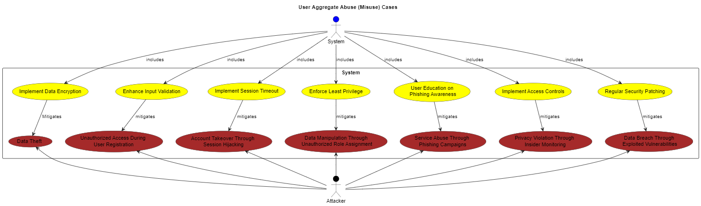
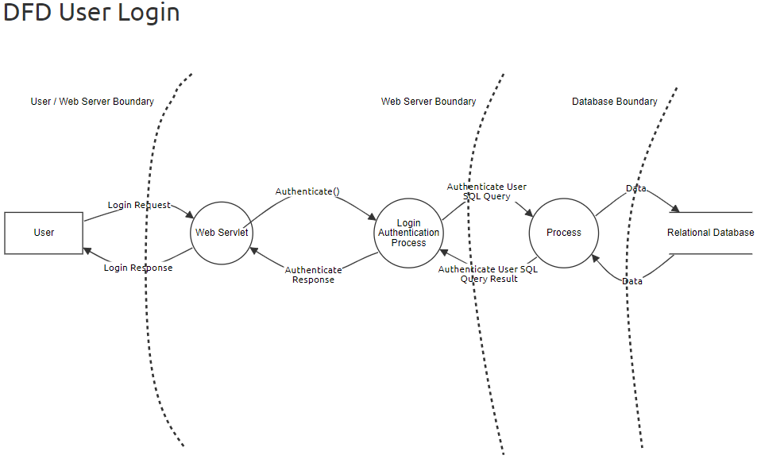
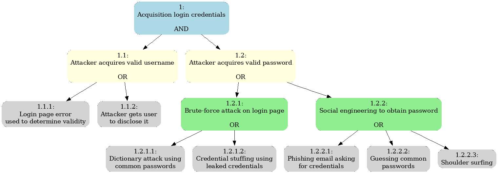

[Clixk here to show global document](../README.md)

# Software Architectural Analysis and Design of User Aggregate

- This document describes the architecture of EletricGo's User aggregate, providing an overview of the design decisions and architectural analysis made during development.

- User Aggregate is a sub-system developed to allow users interact with the system.
Each user will have restrictions, based on roles and each role will give permission for different features of EletricGo.

# Table of Contents
1. [Requirements Engineering](#1-requirements-engineering)
   1. [User Stories Description](#11-user-stories-description)
   2. [Customer Specifications and Clarifications](#12-customer-specifications-and-clarifications)
   3. [Acceptance Criteria](#13-acceptance-criteria)
   4. [Found out Dependencies](#14-found-out-dependencies)
   5. [Input and Output Data](#15-input-and-output-data)
   6. [System Sequence Diagram (SSD)](#16-system-sequence-diagram-ssd)
   7. [API Endpoints](#17-api-endpoints)
   8. [Database Schema](#18-database-schema)
   9. [Authorization Roles](#19-authorization-roles)
2. [Analysis](#2-analysis)
   1. [Preliminary Software Risk Analysis](#21-preliminary-software-risk-analysis)
   2. [Security Requirements Engineering](#22-security-requirements-engineering)
   3. [Abuse Cases](#23-abuse-cases)
      1. [Login Abuse Case](#231-login-abuse-case)
      2. [System User Aggregate Abuse Cases](#232-system-user-aggregate-abuse-cases)
   4. [Functional Security Requirements](#24-functional-security-requirements)
   5. [Non-Functional Security Requirements](#25-non-functional-security-requirements)
   6. [Secure Development Requirements](#26-secure-development-requirements)
3. [Design](#3-design)
   1. [Security Risk-Driven Design](#31-security-risk-driven-design)
   2. [Secure Architecture](#32-secure-architecture)
   3. [Secure Design Patterns](#33-secure-design-patterns)
   4. [Threat Modelling](#34-threat-modelling)
      1. [Threat Model Information](#341-threat-model-information)
      2. [External Dependencies](#342-external-dependencies)
      3. [Entry Points](#343-entry-points)
      4. [Exit Points](#344-exit-points)
      5. [Assets](#345-assets)
      6. [Trust Levels](#346-trust-levels)
      7. [Data Flow Diagrams](#347-data-flow-diagrams)
      8. [Threat Analysis](#348-threat-analysis)
      9. [Ranking of Threats](#349-ranking-of-threats)
      10. [Qualitative Risk Model](#3410-qualitative-risk-model)
   5. [Security Test Planning](#35-security-test-planning)
      1. [Objective](#351-objective)
      2. [Scope](#352-scope)
      3. [Methodology](#353-methodology)
      4. [Test Scenarios](#354-test-scenarios)
      5. [Deliverables](#355-deliverables)
   6. [Security Architecture Review](#36-security-architecture-review)
      1. [Objectives](#361-objectives)
      2. [Components to Review](#362-components-to-review)
      3. [Review Process](#363-review-process)
      4. [Deliverables](#364-deliverables)

## 1. Requirements Engineering

### 1.1 User Stories Description

- As a System Administrator, I want to be able to register new users and assign roles to them.
- As an existing user, I want to log in to the system with my username and password.
- As a logged-in user, I want to log out of the system to securely end my session.

### 1.2 Customer Specifications and Clarifications

- The application should provide a user-friendly login process for existing users to access the system securely.
- After successful login, users should have access to functionalities based on their assigned role.
- Logging out of the system should terminate the user's session and require re-authentication to access protected resources.
- Only the System Administrator should have the authority to register new users and assign roles to them.

### 1.3 Acceptance Criteria

- Users should be able to log in to the system using their registered credentials.
- After logging in, users should have access to functionalities based on their assigned role.
- Logging out of the system should terminate the user's session and require re-authentication to access protected resources.
- New users should not be able to register themselves; registration and role assignment should only be performed by the System Administrator.

### 1.4 Found out Dependencies

- The login and logout functionalities depend on backend services for user authentication and session management.
- Role assignment depends on user management functionalities, specifically accessible by the System Administrator.

### 1.5 Input and Output Data

- Input data for login includes the user's username and password.
- Output data includes a success message upon successful login or logout and error messages in case of failures.

### 1.6 System Sequence Diagram (SSD)

- Login / Logout

- User Registration

### 1.7 API Endpoints

- POST /user/login - Log in to the system with username and password
- POST /user/logout - Log out of the system and terminate the session
- POST /user/register - Register a new user and assign a role (accessible only by the System Administrator)
- PUT /user/{id}/assign-role - Assign a role to a user (accessible only by the System Administrator)

### 1.8 Database Schema

The Domain Model for the User Aggregate is as follows:

Considering the previous model, the user aggregate has the following database schema:

### 1.9 Authorization Roles

- System Administrator: Full access to user management functionalities and authority to assign roles to users.
- Warehouse Manager: Access to functionalities related to warehouse data management and delivery tracking.
- Fleet Manager: Access to functionalities related to managing truck data and fleet operations.
- Logistics Manager: Access to functionalities related to route data management and distribution planning.
- Operator: Restricted access for querying and limited operations within each aggregate, with permissions tailored to their role responsibilities.

# 2. Analysis

## 2.1 Preliminary Software Risk Analysis

The Preliminary Software Risk Analysis is a systematic process crucial for understanding and mitigating potential threats to user data privacy and system integrity. Following the ISO 27005 standard, it combines qualitative and quantitative techniques to identify and assess risks associated with the user aggregate. 

Risks, including unauthorized access to sensitive data and non-compliance with regulations like GDPR (General Data Protection Regulation) or CCPA (California Consumer Privacy Act), are categorized and prioritized based on their severity.

Mitigation strategies, such as implementing encryption and multi-factor authentication, are proposed to address these risks. Effective communication and a comprehensive risk management plan ensure stakeholders are informed and proactive measures are taken to safeguard user privacy and data security.

## 2.2 Security Requirements Engineering

Security Requirements Engineering is a crucial process in software development aimed at identifying and documenting security requirements to protect the user aggregate from potential threats and vulnerabilities. 

Following established methodologies like STRIDE (Spoofing, Tampering, Repudiation, Information Disclosure, Denial of Service (DoS), Elevation of Privilege), security requirements are systematically elicited from stakeholders and analysed for completeness, consistency, and feasibility.

These requirements encompass aspects such as authentication mechanisms, access control policies, encryption, and audit trails. They are formalized into a specification that serves as a reference throughout the development process. Validation techniques, including reviews, inspections, and testing, ensure that security requirements effectively address potential risks. Compliance requirements related to industry standards and regulations, such as GDPR and CCPA, are also integrated.

The requirements identified for the user aggregate are explored and detailed in 2.4 and 2.5 chapters.

## 2.3 Abuse Cases

Abuse cases (also know misused cases) are scenarios that describe how a system could be intentionally misused or exploited for malicious purposes. Here are the abuse cases for the user aggregate:

| Abuse Case | Description | Impact |
|-------------|-------------|--------|
| **Data Theft During User Login**                       | A malicious insider intercepts login credentials during the authentication process and steals user data for personal gain.                                         | The insider extract sensitive information, compromising user privacy and security.                                       |
| Unauthorized Access During User Registration       | An attacker exploits a vulnerability in the user registration process to gain unauthorized access to the system before proper authentication is established.   | The attacker gains access to sensitive user data or system resources before they should be allowed.                          |
| Account Takeover Through Session Hijacking         | An attacker hijacks a user's session after successful login, gaining control over the account to perform malicious activities.                                     | The attacker can impersonate the legitimate user, access sensitive information, or perform unauthorized actions.            |
| Data Manipulation Through Unauthorized Role Assignment | A disgruntled employee with elevated privileges assigns unauthorized roles to user accounts, granting them access to sensitive functionalities.                 | The employee can manipulate user data, alter account settings, or perform actions causing confusion or harm.                |
| Service Abuse Through Phishing Campaigns           | An attacker launches a phishing campaign targeting system users, tricking them into divulging their credentials or personal information.                           | The attacker abuses system resources or compromises user accounts, leading to unauthorized access or data theft.            |
| Privacy Violation Through Insider Monitoring       | A developer or administrator accesses user data without authorization for personal curiosity or monitoring, violating user privacy and data protection regulations. | User trust is undermined, and sensitive information is exposed, potentially leading to legal and regulatory consequences. |
| Data Breach Through Exploited Vulnerabilities      | A cybercriminal exploits vulnerabilities in the system to gain unauthorized access to the user aggregate's database, exfiltrating sensitive user data.            | Large volumes of sensitive user data, including usernames, passwords, and payment information, are exposed.                 |

### 2.3.1 Login Abuse Case

> We will see in detail a specific use case witch is the common one and it will be done several times in the system, the login process.

> It is possible to see that there are some ways to try to access the system. In this case are considered the following:
   - **Brute Force Attack**: The attacker tries to guess the user's password by repeatedly attempting different combinations until the correct one is found.
   - **Credential Stuffing**: The attacker uses stolen credentials from other data breaches to gain unauthorized access to the system.

> To mitigate these threats, the system should implement security measures such as:
   - **Account Lockout**: After a certain number of failed login attempts, the account should be locked to prevent further unauthorized access.
   - **Multi-Factor Authentication (MFA)**: Require users to provide an additional authentication factor, such as a one-time code sent to their mobile device, to verify their identity.
   - **Password Policy**: Enforce strong password policies, including minimum length, complexity requirements, and expiration periods, to prevent easy guessing or reuse of passwords.

### 2.3.2 System User Aggregate Abuse Cases

> As is known, the user aggregate is a critical component of the system, and it is essential to protect it from potential abuse cases.

> Here are many of abuse cases that could affect the user aggregate:
   - **Implement Data Encryption**: Sensitive user data should be encrypted at rest and in transit to protect against unauthorized access or disclosure.
   - **Enhance Input Validation**: Implement robust input validation mechanisms to prevent injection attacks, such as SQL injection or cross-site scripting (XSS).
   - **Implement Session Timeout**: Enforce session timeouts to automatically log out users after a period of inactivity, reducing the risk of session hijacking.
   - **Enforce Least Privilege**: Apply the principle of least privilege to restrict user access to only the resources and functionalities necessary to perform their tasks.
   - **User Education and Awareness**: Provide security training and awareness programs for users to educate them about common threats, such as phishing or social engineering attacks.
   - **Implement Access Controls**: Enforce access controls to ensure that users can only access resources and perform actions that are authorized for their role.
   - **Regular Security Patching**: Keep software and systems up to date with the latest security patches and updates to address known vulnerabilities and weaknesses.

> To mitigate these threats, the system should implement security measures such as:
   - **Data Theft**: Implement secure communication channels, such as HTTPS, to protect user credentials during the login process.
   - **Unauthorized Access**: Implement strong authentication mechanisms, such as multi-factor authentication, to verify user identities and prevent unauthorized access.
   - **Account Takeover**: Implement secure session management practices, such as session tokens and expiration policies, to prevent session hijacking attacks.
   - **Data Manipulation**: Implement role-based access control (RBAC) to restrict user permissions and prevent unauthorized role assignments.
   - **Service Abuse**: Implement email verification or CAPTCHA challenges during the registration process to prevent automated account creation by bots.
   - **Privacy Violation**: Implement audit logging and monitoring to track user activities and detect unauthorized access to sensitive data.
   - **Data Breach**: Implement secure coding practices, such as input validation and output encoding, to prevent common vulnerabilities that could be exploited by attackers.

## 2.4 Functional Security Requirements

Here's the corrected table with all the functional security requirements for user management, including the requirement for passwords to be at least 12 characters long:

| Security Requirement             | Description                                                                                                                                                 |
|----------------------------------|-------------------------------------------------------------------------------------------------------------------------------------------------------------|
| **User Authentication**          | The system must provide mechanisms for authenticating users, including username/password and multi-factor authentication (MFA).                              |
| **Access Control**               | The system must enforce access controls to ensure that only authorized users have access to specific resources or functionalities. This includes role-based access control (RBAC), permissions management, and segregation of duties. |
| **Encryption**                   | The system must support encryption for sensitive data both at rest and in transit. This includes encryption algorithms, key management, and secure communication protocols (e.g., SSL/TLS).|
| **Audit Logging**                | The system must log relevant security events and user activities for monitoring, auditing, and forensic purposes. This includes logging user logins, access attempts, system changes, and security-related events.|
| **Session Management**           | The system must manage user sessions securely, including session expiration, session tokens, and preventing session hijacking or fixation attacks.                |
| **Data Integrity**               | The system must ensure the integrity of data by implementing measures to prevent unauthorized modification or tampering. This includes data validation, checksums, digital signatures, and hash functions.|
| **Secure Configuration**         | The system must be configured securely according to best practices and industry standards. This includes hardening of servers, secure configuration of network devices, and regular security assessments.|
| **Secure APIs**                  | If the system exposes APIs (Application Programming Interfaces), they must be designed and implemented securely to prevent API abuse, injection attacks, and unauthorized access. |
| **Secure File Handling**         | The system must handle files securely, including file uploads, downloads, storage, and transmission. This includes validation of file types, malware scanning, and access controls on stored files.|
| **Error Handling**               | The system must handle errors gracefully and securely, avoiding information leakage that could be exploited by attackers. Error messages should be informative to users but not reveal sensitive system details.|
| **Secure Communication**         | The system must ensure secure communication channels between components, including encryption of network traffic, secure configuration of web servers, and protection against common attacks like man-in-the-middle (MITM).|
| **Backup and Recovery**          | The system must implement secure backup and recovery procedures to protect against data loss, corruption, and ransomware attacks. This includes regular backups, off-site storage, and testing of recovery procedures.|
| **User Registration**            | The system must allow users to register securely, including validation of user-provided information, such as email addresses, and prevention of automated bots. |
| **Password Complexity**          | User passwords must meet complexity requirements, such as including a combination of uppercase and lowercase letters, numbers, and special characters.       |
| **Password Expiry**              | The system must enforce password expiry policies to ensure that users periodically change their passwords and enhance security.                              |
| **Account Lockout**              | The system must implement account lockout mechanisms to temporarily lock user accounts after a specified number of failed login attempts.                      |
| **Password History**             | The system must prevent users from reusing previous passwords to enhance security and prevent password cycling.                                             |
| **Multi-Factor Authentication (MFA)** | The system should provide support for multi-factor authentication methods, such as SMS codes, authenticator apps, or hardware tokens, to add an extra layer of security. |
| **User Profile Management**      | Users should be able to manage their profile securely, including updating personal information, changing passwords, and configuring security settings.       |
| **User Deactivation**            | Administrators should have the ability to deactivate or suspend user accounts temporarily when necessary, such as in cases of suspicious activity or non-compliance. |
| **User Role Assignment**         | Administrators should be able to assign appropriate roles and permissions to users based on their responsibilities and access requirements.                    |
| **User Activity Monitoring**     | The system should log and monitor user activities, such as login attempts, password changes, and profile modifications, for security and compliance purposes.    |
| **User Session Revocation**      | Administrators should have the capability to revoke or terminate user sessions remotely, especially in cases of suspected unauthorized access or compromised accounts. |
| **Password Recovery**            | The system should provide secure mechanisms for users to recover or reset forgotten passwords, such as email-based password reset links or security questions.    |
| **Password Length**              | User passwords must be at least 12 characters long to enhance security and prevent brute-force attacks.                                                      |

## 2.5 Non-Functional Security Requirements

| Security Requirement   | Description|
|------------------------|------------|
| **Performance**        | The system should maintain efficient performance even under high loads or during security-related operations such as encryption and decryption|
| **Scalability**        | The system should be scalable to accommodate increasing user loads and data volumes while maintaining security measures.|
| **Availability**       | The system should have high availability to ensure continuous access to resources, even in the event of security incidents or attacks.|
| **Reliability**        | The system should be reliable, ensuring that security mechanisms function correctly and consistently to protect against threats.|
| **Resilience**         | The system should be resilient to withstand and recover from security breaches or incidents, minimizing the impact on operations and data integrity.|
| **Compliance**         | The system should comply with relevant security standards, regulations, and industry best practices to ensure legal and regulatory compliance.|
| **Usability**          | Security features should be designed with usability in mind to minimize user friction while still providing effective protection against threats.|
| **Interoperability**   | Security measures should be interoperable with other systems and technologies to ensure seamless integration and communication.|
| **Auditability**       | The system should support auditing and logging capabilities to enable monitoring, analysis, and forensic investigations of security-related events.|
| **Documentation**      | Comprehensive documentation should be provided for security features, configurations, and procedures to support system administration and compliance efforts.|
| **Incident Response**  | The system should have established incident response procedures and mechanisms to detect, respond to, and recover from security incidents in a timely and effective manner.|
| **Training and Awareness** | Regular security training and awareness programs should be conducted for system users, administrators, and other stakeholders to promote a security-conscious culture and enhance security posture.|

## 2.6 Secure Development Requirements

These secure development requirements help ensure that applications are developed with security in mind from the outset, reducing the risk of security vulnerabilities and improving overall system security.

| Security Practice          | Description|
|----------------------------|------------|
| **Security Training**      | Developers should receive regular security training to understand common vulnerabilities, secure coding practices, and threat mitigation techniques.|
| **Secure Coding Standards**| Development teams should adhere to secure coding standards and guidelines, such as OWASP Top 10, CERT Secure Coding Standards, or industry-specific standards.|
| **Input Validation**       | All user input should be validated to prevent injection attacks, such as SQL injection, XSS (Cross-Site Scripting), and command injection.|
| **Output Encoding**        | Output should be encoded to prevent XSS attacks and ensure that user-supplied data is treated as data, not code.|
| **Authentication and Authorization** | Strong authentication and authorization mechanisms should be implemented to control access to sensitive resources and functionalities.|
| **Session Management**     | Secure session management practices should be followed to prevent session fixation, session hijacking, and session replay attacks.|
| **Data Protection**        | Sensitive data should be encrypted at rest and in transit using strong encryption algorithms and protocols.|
| **Least Privilege**        | Principle of least privilege should be applied to limit user and system privileges to the minimum necessary to perform required tasks.|
| **Secure Configuration**   | Systems and components should be securely configured according to best practices and industry standards to reduce the attack surface. |
| **Secure Dependencies**    | Third-party dependencies should be regularly updated and vetted for security vulnerabilities to prevent supply chain attacks.|
| **Secure Development Lifecycle** | Security should be integrated throughout the development lifecycle, including requirements, design, coding, testing, and deployment phases.|
| **Security Testing**       | Comprehensive security testing, including static analysis, dynamic analysis, and penetration testing, should be conducted to identify and remediate vulnerabilities.|
| **Code Review**            | Regular code reviews should be performed to identify security issues, adherence to coding standards, and compliance with security requirements.|
| **Secure Deployment**      | Secure deployment practices should be followed to ensure that applications and components are deployed securely and securely configured in production environments.|
| **Incident Response**      | Incident response procedures should be in place to detect, respond to, and recover from security incidents in a timely and effective manner.|
| **Secure Communication**   | Secure communication channels should be used to protect data in transit, including encryption, authentication, and integrity checks.|
| **Logging and Monitoring** | Comprehensive logging and monitoring should be implemented to detect and investigate security events, anomalies, and suspicious activities.|

# 3. Design

## 3.1 Security Risk-Driven Design

Security risk-driven design involves integrating security considerations into the design process to proactively identify and mitigate potential security risks. Here are key aspects:

1. **Secure Architecture**: Designing a secure architecture that incorporates security controls and mitigations to address identified security risks. This includes designing secure network architectures, data flow diagrams, and component interactions.

2.  **Security by Design**: Embedding security principles and practices into the design process from the outset. This includes considering security requirements during system requirements gathering, architecture design, and implementation phases.

3.  **Security Patterns**: Utilizing security design patterns and best practices to address common security challenges and recurring security requirements. This includes patterns for authentication, access control, data protection, and secure communication.

4. **Threat Modelling**: Conducting threat modelling exercises to identify potential threats, vulnerabilities, and attack vectors that may impact the system. This includes identifying assets, potential attackers, and potential attack scenarios.

5.  **Risk Assessment**: Performing risk assessments to evaluate the likelihood and potential impact of identified security risks. This helps prioritize risks based on their severity and potential consequences.

6. **Attack Surface Reduction**: Minimizing the attack surface by reducing the exposure of system components and limiting access to sensitive resources. This includes applying the principle of least privilege, implementing strong authentication and authorization mechanisms, and enforcing strict input validation.

7. **Security Controls Selection**: Selecting appropriate security controls and countermeasures to mitigate identified security risks. This may include implementing technical controls, procedural measures, and security best practices.

8. **Continuous Improvement**: Continuously evaluating and improving the security posture of the system throughout the design and development lifecycle. This includes conducting regular security reviews, assessments, and audits to identify and address emerging security risks.

Security risk-driven design aims to build security into the DNA of the system, ensuring that security considerations are integrated into every aspect of the design process. By identifying and addressing security risks early in the design phase, organizations can reduce the likelihood of security incidents and minimize the impact of potential vulnerabilities.

## 3.2 Secure Architecture

Secure architecture involves designing systems and applications with security as a primary consideration. It encompasses various principles, practices, and components aimed at mitigating security risks and ensuring the confidentiality, integrity, and availability of assets. Key aspects of secure architecture include:

1. **Defense in Depth**: Implementing multiple layers of defense to protect against different types of threats and attacks. This includes network security controls, host-based security measures, and application-level security mechanisms.

2. **Principle of Least Privilege**: Restricting access rights and privileges to the minimum necessary for users, processes, and systems to perform their intended functions. This helps minimize the potential impact of security breaches and limit the exposure of sensitive resources.

3. **Secure Network Architecture**: Designing network architectures with security in mind, including segmentation, isolation, and zoning to prevent unauthorized access and limit the spread of attacks. This may involve implementing firewalls, intrusion detection/prevention systems (IDS/IPS), and virtual private networks (VPNs).

4. **Data Encryption**: Employing encryption to protect data both at rest and in transit. This includes using strong encryption algorithms and key management practices to safeguard sensitive information from unauthorized access and interception.

5. **Identity and Access Management (IAM)**: Implementing robust IAM controls to manage user identities, authenticate users, and enforce access controls. This includes centralized authentication services, multi-factor authentication (MFA), and role-based access control (RBAC).

6. **Secure Application Design**: Developing applications with security features and controls integrated into their design. This includes secure coding practices, input validation, output encoding, and secure session management to prevent common vulnerabilities such as injection attacks, XSS, and CSRF.

7. **Resilience and Redundancy**: Building resilience and redundancy into the architecture to ensure continuous operation and availability, even in the face of disruptions or attacks. This may involve deploying redundant systems, failover mechanisms, and disaster recovery plans.

8. **Logging and Monitoring**: Implementing comprehensive logging and monitoring capabilities to detect security incidents, track user activities, and generate audit trails for forensic analysis. This includes logging security events, system activities, and access attempts for monitoring and analysis.

9. **Secure Integration**: Ensuring secure integration with external systems, services, and third-party components. This includes implementing secure APIs, message validation, and access controls to prevent unauthorized access and data leakage.

10. **Security Testing and Validation**: Conducting regular security testing and validation to identify and address vulnerabilities and weaknesses in the architecture. This includes vulnerability assessments, penetration testing, and security code reviews to identify and remediate security issues.

11. **Compliance and Governance**: Ensuring compliance with relevant security standards, regulations, and industry best practices. This includes establishing security policies, procedures, and controls to govern the design, implementation, and operation of secure architectures.

By incorporating these principles and practices into the design and implementation of architectures, organizations can build systems that are resilient, secure, and capable of protecting against a wide range of security threats and attacks.

## 3.3 Secure Design Patterns

Secure design patterns are reusable architectural solutions that address common security challenges and requirements. They provide guidance and best practices for designing secure systems and applications. Key secure design patterns include:

1. **Authentication Patterns**:
   - **Credential Management**: Securely manage user credentials, including password hashing, salting, and storage.
   - **Multi-factor Authentication (MFA)**: Implement additional authentication factors to enhance security, such as SMS codes, biometrics, or hardware tokens.
   - **Single Sign-On (SSO)**: Enable users to authenticate once and access multiple applications or services securely.

2. **Authorization Patterns**:
   - **Role-Based Access Control (RBAC)**: Assign permissions to roles and manage user access based on their roles within the system.
   - **Attribute-Based Access Control (ABAC)**: Make access control decisions based on attributes associated with users, resources, and environmental conditions.
   - **Permission Inheritance**: Inherit permissions from higher-level entities to streamline access control and minimize configuration overhead.

3. **Data Protection Patterns**:
   - **Data Encryption**: Encrypt sensitive data at rest and in transit using strong encryption algorithms and key management practices.
   - **Data Masking**: Hide or obfuscate sensitive data when displaying it to users or transmitting it over insecure channels.
   - **Data Tokenization**: Replace sensitive data with tokens or placeholders to prevent exposure in logs, databases, or external systems.

4. **Input Validation Patterns**:
   - **Whitelist Input Validation**: Validate input against a whitelist of expected values to prevent injection attacks, such as SQL injection or XSS.
   - **Blacklist Input Validation**: Filter input against a blacklist of known malicious patterns to block potentially harmful inputs.
   - **Regular Expression Validation**: Use regular expressions to validate complex input patterns, such as email addresses or URLs.

5. **Secure Communication Patterns**:
   - **Transport Layer Security (TLS)**: Use TLS to encrypt communication channels and protect data integrity and confidentiality.
   - **Mutual Authentication**: Implement mutual authentication to verify the identities of both clients and servers during communication.
   - **Secure Headers**: Set secure HTTP headers to mitigate common web security vulnerabilities, such as cross-site scripting (XSS) and clickjacking.

6. **Error Handling Patterns**:
   - **Custom Error Messages**: Provide informative error messages to users without revealing sensitive information that could aid attackers.
   - **Centralized Error Logging**: Log errors and exceptions centrally to facilitate monitoring, troubleshooting, and incident response.

7. **Logging and Monitoring Patterns**:
   - **Audit Logging**: Log security-relevant events, such as authentication attempts, access control decisions, and data modifications, for auditing and compliance purposes.
   - **Anomaly Detection**: Monitor system behaviour and user activities to detect anomalies indicative of security incidents or unauthorized behaviour.

By leveraging these secure design patterns, developers and architects can build resilient, secure, and reliable systems that effectively mitigate security risks and protect against common threats and attacks.

## 3.4 Threat Modelling

Threat modelling is a methodical way of finding and addressing possible security risks and weaknesses in software. It includes studying the system's structure, data flow and possible points of attack to determine its vulnerabilities to security breaches.

## 3.4.1. Threat Model Information

> **Application Name:** EletricGo.

> **Application Version:** 1.0.

> **Description:** The application EletricGo is a system created to manage the deliveries of packages through eletric trucks.

> **Document Owner:** Pedro Fernandes.

> **Participants:** 
  - Pedro Fernandes
  - Alexandra Leite
  - Fábio Cruz
  - Vitor Costa
  - Cristiano Soares

> **Reviewer:** Vitor Costa.

- **Purpose of the threat model**: 
  The purpose of this threat model is to identify and assess potential security threats and vulnerabilities associated with the user aggregate of the logistics application. By understanding these threats, we aim to implement appropriate security controls to safeguard user data, ensure user privacy, and maintain the integrity of the application.

- **Scope and boundaries**:
  - **In-Scope**: 
    - User authentication and authorization mechanisms.
    - User account management functionalities such as registration, login, password reset and profile management.
    - Protection of sensitive user data including personal information, authentication credentials and transaction history.
    - Interaction with external services and APIs related to user functionalities.
  - **Out-of-Scope**:
    - Backend infrastructure components not directly related to user management.
    - Third-party services or integrations not controlled or managed by the application.
    - Physical security measures or threats beyond the digital realm.

- **Assumptions and constraints**:
  - **Assumptions**:
    - Users will interact with the application using standard web and/or mobile interfaces.
    - User data will be stored securely and encrypted at rest.
    - Users will access the application from devices and networks with a reasonable level of security hygiene.
  - **Constraints**:
    - Limited resources for implementing security controls.
    - Compliance requirements such as GDPR, CCPA or other relevant regulations.
    - Time constraints for threat assessment and mitigation.

## 3.4.2. External Dependencies

|ID | Description|
|---|------------|
| 1 | The database will be a relational database. |
| 2 | The communication between the frontend and backend will be using RESTful API.|
| 3 | Authentication library like JWT or OAuth will integrated.|
| 4 | Libraries for encryption proposes like Bcrypt for password hashing and validation.|
| 5 | External media APIs for enabling social logins like Google.|
| 6 | Biometric devices for user authentication. |

## 3.4.3. Entry Points

|ID | Name | Description | Trust Level |
|---|------|-------------|-------------|
| 1 | HTTPS Port | Users interact with a initial web form through the user interface, making HTTP requests to the backend API endpoints. | (1) Anonymous Web User (2) Operator (3) Logistics Manager (4) Fleet Manager (5) Warehouse Manager (6) System Administrator |
| 2 | Login Page | Logistics, fleet and warehouse managers, operators and system administrator interact with a initial web form through the user interface, making HTTP requests to the backend API endpoints. | (1) Anonymous Web User (2) Operator (3) Logistics Manager (4) Fleet Manager (5) Warehouse Manager (6) System Administrator |
| 3 | Profile page | All authenticated users have access to view their profile. | (2) Operator (3) Logistics Manager (4) Fleet Manager (5) Warehouse Manager (6) System Administrator |
| 4 | External APIs | Integration with external APIs such as social media APIs for authentication | (1) Anonymous Web User (2) Operator (3) Logistics Manager (4) Fleet Manager (5) Warehouse Manager (6) System Administrator |
| 5 | Database Interface | This entry point allows the backend to interact with the database | (7) Database Read/Write User |
| 6 | Register page | This entry point allows system administrator register a user into the system | (6) System Administrator |

## 3.4.4. Exit Points

| ID | Name | Description | Trust Level |
|----|------|-------------|-------------|
| 1 | Response Data | The backend API endpoint returns a response to the user interface based on the request made by the user. This response may include user data or authentication tokens. | (1) Anonymous Web User (2) Operator (3) Logistics Manager (4) Fleet Manager (5) Warehouse Manager (6) System Administrator |
| 2 | Database Response | After interacting with the database to store or retrieve user-related information, the backend API endpoint receives a response indicating the success or failure of the database operation. This response may include status codes, error messages or retrieved data. | (1) Anonymous Web User (2) Operator (3) Logistics Manager (4) Fleet Manager (5) Warehouse Manager (6) System Administrator |
| 3 | Email Notifications | System-generated email notifications sent to users, containing sensitive information like account details or transaction confirmations. Without proper security, these emails risk interception or manipulation, leading to information disclosure or account takeover. | (8) Notifier |
| 4 | Logging Activity | Logged events of user activity, system errors or security events. These logs are crucial for auditing, troubleshooting and security monitoring purposes.  | (2) Operator (3) Logistics Manager (4) Fleet Manager (5) Warehouse Manager (6) System Administrator |

## 3.4.5. Assets

| ID | Name | Description | Trust Level |
|----|------|-------------|-------------|
| 1 | User Data | Personal information of users, including names, email addresses, passwords, and other sensitive data stored in the application's database. | (2) Operator (3) Logistics Manager (4) Fleet Manager (5) Warehouse Manager (6) System Administrator |
| 2 | Critical Data | Information of delivery, distribution planning, warehouse and other sensitive data stored in the application's database. | (2) Operator (3) Logistics Manager (4) Fleet Manager (5) Warehouse Manager (6) System Administrator |
| 3 | Configuration Data | Application configuration settings, including system settings, user permissions and access controls stored in the application's database. | (6) System Administrator |

## 3.4.6. Trust Levels

| ID| Name | Description |
|---|------|-------------|
| 1 | Anonymous Web User | External entities accessing the application without authentication. They have limited access to public resources and functionalities. |
| 2 | Operator | Authenticated users who have successfully logged into the application. They have basic access for querying and limited operations within each aggregate. |
| 3 | Logistics Manager | Authenticated users with administrative privileges responsible for managing route data and distribution planning and overseeing the application's operation. |
| 4 | Fleet Manager | Authenticated users with administrative privileges responsible for managing truck data and overseeing the application's operation. |
| 5 | Warehouse Manager | Authenticated users with administrative privileges responsible for managing warehouse data and deliveries and overseeing the application's operation. |
| 6 | System Administrator | Authenticated users with all privileges. Is responsible for managing user accounts and role permissions. |
| 7 | Database Read/Write User | Specific user for access database management like read and write into database. |
| 8 | Notifier | Specific user for notifications like sending emails. |

## 3.4.7. Data Flow Diagrams

Data Flow Diagrams (DFDs) are visual depictions that illustrate how data moves within a system, showcasing its journey from input to processing, storage, and eventual output. In the context of our user aggregate, DFDs are invaluable tools for users to grasp how data flows within the system, starting from initial input such as user registration or login details, progressing through any updates or modifications, and ultimately being stored securely within the system for future access or retrieval as needed.

## 3.4.8. Threat Analysis

For threat analysis, we will use the STRIDE model to identify potential threats to the user aggregate. STRIDE stands for Spoofing, Tampering, Repudiation, Information Disclosure, Denial of Service and Elevation of Privilege.

| Category  | Property | Violated Description |
|-----------|----------|----------------------|
| **Spoofing (S)** | **Authentication** | Attackers may attempt to spoof user identities by impersonating legitimate users during the login process. This could involve using stolen credentials, phishing attacks or exploiting weak authentication mechanisms. |
|                |                    | Attackers may attempt to steal user credentials by spoofing login forms or tricking users into entering their credentials on malicious websites. |
|                |                    | Attackers may spoof IP addresses to bypass IP-based access controls and submit forms from unauthorized locations.                                  |
| **Tampering (T)**  | **Data Integrity** | Unauthorized modification of login data during transmission or storage, leading to compromised credentials. This could occur through data interception, man-in-the-middle attacks, or injection vulnerabilities. |
|                |                    | Attackers may tamper with form data, such as modifying hidden fields or intercepting and modifying data in transit, to manipulate system behaviour or submit unauthorized requests. |
|                |                    |  Attackers may tamper with form parameters to bypass validation checks or gain unauthorized access to sensitive resources.                     |
| **Repudiation (R)**| **Non-Repudiation**| Lack of mechanisms to track and verify user login attempts, leading to repudiation of legitimate logins. Without proper logging and auditing, users may deny their login activities, complicating accountability. |
|                |                    | Users may deny submitting certain forms or actions, leading to difficulties in tracing and resolving disputes over the authenticity of submitted data. |
|                |                    | Users may repudiate form submissions, claiming that they did not initiate certain transactions, leading to disputes and challenges in establishing accountability. |
| **Information Disclosure (I)** | **Confidentiality** | Unauthorized access to login credentials or session tokens, resulting in the exposure of sensitive information. This could happen due to weak encryption, insecure storage, or leakage of credentials through various means. |
|                |                    | Attackers may exploit vulnerabilities in form processing to disclose sensitive information entered by users, such as personal information, payment details, or confidential documents. |
|                |                    | Insecure error handling may reveal sensitive information in error messages, aiding attackers in crafting targeted attacks or exploiting system vulnerabilities. |
| **Denial of Service (D)** | **Availability** | Malicious actors may launch denial-of-service (DoS) attacks to overwhelm the login system, rendering it inaccessible. This could result in legitimate users being unable to log in, leading to service disruptions and user frustration. |
|                |                    |  Attackers may flood form submission endpoints with a large volume of requests, overwhelming system resources and causing denial of service to legitimate users. |
|                |                    |  Attackers may exploit vulnerabilities to exhaust system resources, such as memory or CPU, leading to degradation or unavailability of form submission services. |
| **Elevation of Privilege (E)** | **Authorization** | Exploitation of vulnerabilities to gain elevated privileges during the login process, granting unauthorized access. Attackers may bypass authentication controls or manipulate user roles to gain unauthorized access to sensitive resources. |
|                |                    |  Attackers may hijack user sessions to gain unauthorized access to form submission functionalities and perform actions on behalf of legitimate users. |
|                |                    | Exploitation of vulnerabilities may allow attackers to elevate their privileges and gain access to administrative features or sensitive form submission functionalities. |

Additionally, there other ways to analyse the threats, like Attack Trees. Attack trees are graphical representations of potential attack scenarios, illustrating how attackers could exploit vulnerabilities to achieve their objectives. By mapping out attack trees, security teams can identify potential threats, assess their severity and prioritize mitigation efforts.

## 3.4.9. Ranking of Threats

1. **User Credential Theft**
- Damage potential: Threat to reputation as legal liability (8)
- Reproducibility: Fully reproducible (10)
- Exploitability: Require to be on the same subnet or have compromised a router (7)
- Affected users: Affects all users (10)
- Discoverability: Can be found out easily (10)
- Overall DREAD score for this threat: (8 + 10 + 7 + 10 + 10) / 5 = 9

2. **IP Spoofing**
- Damage potential: Can lead to unauthorized access and potential data breaches (6)
- Reproducibility: Fairly reproducible but requires technical knowledge (5)
- Exploitability: Relatively high, especially if network security measures are weak (8)
- Affected users: Potentially affects all users accessing the system (7)
- Discoverability: Can be discovered by analyzing network logs and traffic patterns (4)
- Overall DREAD score for this threat: (6 + 5 + 8 + 7 + 4) / 5 = 6

3. **Data Manipulation**
- Damage potential: High, as it can lead to data corruption, unauthorized access, and integrity violations (9)
- Reproducibility: Moderately reproducible, depending on the attacker's knowledge and access level (6)
- Exploitability: Requires a certain level of access to the system and knowledge of data structures (8)
- Affected users: Potentially affects all users relying on the manipulated data (8)
- Discoverability: May be difficult to detect if proper logging and monitoring mechanisms are not in place (5)
- Overall DREAD score for this threat: (9 + 6 + 8 + 8 + 5) / 5 = 7.2

4. **Parameter Tampering**
- Damage potential: Moderate, depending on the context, can lead to unauthorized access or data manipulation (7)
- Reproducibility: Moderately reproducible, especially if input validation mechanisms are weak (6)
- Exploitability: Relatively high, as it involves manipulating input parameters of the system (7)
- Affected users: Potentially affects users interacting with vulnerable input fields (7)
- Discoverability: Can be discovered through security testing and code review (6)
- Overall DREAD score for this threat: (7 + 6 + 7 + 7 + 6) / 5 = 6.6

5. **False Submission Denial**
- Damage potential: Moderate, may lead to confusion or incorrect data processing (6)
- Reproducibility: Moderately reproducible, especially if the attacker has access to the submission process (6)
- Exploitability: Moderate, requires knowledge of the submission process and potential vulnerabilities (7)
- Affected users: Potentially affects users relying on the integrity of submitted data (8)
- Discoverability: Can be discovered through anomaly detection or user reports (5)
- Overall DREAD score for this threat: (6 + 6 + 7 + 8 + 5) / 5 = 6.4

6. **Sensitive Data Exposure**
- Damage potential: High, can lead to privacy breaches and legal consequences (9)
- Reproducibility: Fairly reproducible, especially if the attacker can exploit vulnerabilities in data handling processes (7)
- Exploitability: Moderate to high, depending on the security measures in place (8)
- Affected users: Potentially affects all users whose data is exposed (9)
- Discoverability: Can be discovered through security testing or incident response activities (6)
- Overall DREAD score for this threat: (9 + 7 + 8 + 9 + 6) / 5 = 7.8

7. **Error Message Disclosure**
- Damage potential: Moderate, may lead to information leakage and aid attackers in crafting targeted attacks (7)
- Reproducibility: Moderately reproducible, especially if error messages are not properly handled (6)
- Exploitability: Moderate, requires analysis of error messages and understanding of system vulnerabilities (7)
- Affected users: Potentially affects users who receive error messages from the system (7)
- Discoverability: Can be discovered through security testing or analysis of system behavior (6)
- Overall DREAD score for this threat: (7 + 6 + 7 + 7 + 6) / 5 = 6.6

8. **Resource Exhaustion**
- Damage potential: High, can lead to denial of service and system unavailability (8)
- Reproducibility: Fully reproducible, especially if the attacker can launch resource-intensive attacks (8)
- Exploitability: High, as it involves exhausting system resources such as CPU, memory, or bandwidth (9)
- Affected users: Potentially affects all users trying to access the overwhelmed system (9)
- Discoverability: Can be discovered through monitoring of system performance and resource usage (6)
- Overall DREAD score for this threat: (8 + 8 + 9 + 9 + 6) / 5 = 8

9. **Session Hijacking**
- Damage potential: High, can lead to unauthorized access and identity theft (9)
- Reproducibility: Fairly reproducible, especially if session management mechanisms are weak (7)
- Exploitability: High, requires interception or manipulation of session tokens (9)
- Affected users: Potentially affects all users whose sessions are hijacked (9)
- Discoverability: Can be discovered through anomaly detection or monitoring of session activity (7)
- Overall DREAD score for this threat: (9 + 7 + 9 + 9 + 7) / 5 = 8.2

10. **Unauthorized Access**
- Damage potential: High, can lead to unauthorized access to sensitive data or functionalities (9)
- Reproducibility: Fairly reproducible, especially if authentication mechanisms are weak (7)
- Exploitability: High, requires bypassing authentication controls or exploiting vulnerabilities (9)
- Affected users: Potentially affects all users whose accounts are compromised (9)
- Discoverability: Can be discovered through security monitoring or incident response activities (8)
- Overall DREAD score for this threat: (9 + 7 + 9 + 9 + 8) / 5 = 8.4

## 3.4.10 Qualitative Risk Model

1. **User Credential Theft**:
   - Likelihood of occurrence: High, as attackers frequently attempt to steal user credentials through various means such as phishing attacks and password cracking.
   - Potential impact: Severe, as the theft of user credentials can lead to unauthorized access to sensitive information, financial loss, and reputational damage.
   - Likelihood: 9
   - Impact: 8
   - Risk = Likelihood x Impact = 9 x 8 = 72

2. **IP Spoofing**:
   - Likelihood of occurrence: Moderate, as IP spoofing requires specific technical knowledge and access to certain tools.
   - Potential impact: Significant, as successful IP spoofing can bypass access controls, leading to unauthorized access and potential data breaches.
   - Likelihood: 6
   - Impact: 6
   - Risk = Likelihood x Impact = 6 x 6 = 36

3. **Data Manipulation**:
   - Likelihood of occurrence: Moderate, as data manipulation attacks often target vulnerabilities in data processing and storage systems.
   - Potential impact: Severe, as unauthorized data manipulation can lead to data corruption, integrity breaches, and financial losses.
   - Likelihood: 7
   - Impact: 9
   - Risk = Likelihood x Impact = 7 x 9 = 63

4. **Parameter Tampering**:
   - Likelihood of occurrence: Moderate, as attackers may attempt to manipulate input parameters to bypass security controls or gain unauthorized access.
   - Potential impact: Moderate, as successful parameter tampering can lead to data integrity issues, unauthorized access, and service disruptions.
   - Likelihood: 6
   - Impact: 7
   - Risk = Likelihood x Impact = 6 x 7 = 42

5. **False Submission Denial**:
   - Likelihood of occurrence: Moderate, as attackers may attempt to deny the submission of legitimate forms or transactions.
   - Potential impact: Moderate, as false submission denial can lead to confusion, delays in processing, and potential loss of business opportunities.
   - Likelihood: 6
   - Impact: 6
   - Risk = Likelihood x Impact = 6 x 6 = 36

6. **Sensitive Data Exposure**:
   - Likelihood of occurrence: High, as sensitive data exposure vulnerabilities are common in systems that handle confidential information.
   - Potential impact: Severe, as the exposure of sensitive data can lead to regulatory non-compliance, financial penalties, and reputational damage.
   - Likelihood: 8
   - Impact: 9
   - Risk = Likelihood x Impact = 8 x 9 = 72

7. **Error Message Disclosure**:
   - Likelihood of occurrence: Moderate, as error message disclosure vulnerabilities may exist due to improper error handling practices.
   - Potential impact: Moderate, as disclosure of error messages can provide valuable information to attackers and aid in further exploitation of system vulnerabilities.
   - Likelihood: 6
   - Impact: 7
   - Risk = Likelihood x Impact = 6 x 7 = 42

8. **Resource Exhaustion**:
   - Likelihood of occurrence: High, as resource exhaustion attacks are relatively easy to execute and can target various system resources.
   - Potential impact: Significant, as resource exhaustion can lead to denial of service, system unavailability, and disruption of business operations.
   - Likelihood: 8
   - Impact: 8
   - Risk = Likelihood x Impact = 8 x 8 = 64

9. **Session Hijacking**:
   - Likelihood of occurrence: High, as session hijacking attacks target authentication and session management mechanisms.
   - Potential impact: Severe, as successful session hijacking can lead to unauthorized access to user accounts, data leakage, and identity theft.
   - Likelihood: 8
   - Impact: 9
   - Risk = Likelihood x Impact = 8 x 9 = 72

10. **Unauthorized Access**:
    - Likelihood of occurrence: High, as unauthorized access attempts are common in systems with weak authentication mechanisms or unpatched vulnerabilities.
    - Potential impact: Severe, as unauthorized access can lead to data breaches, system compromise, and loss of trust among users and stakeholders.
    - Likelihood: 8
    - Impact: 9
    - Risk = Likelihood x Impact = 8 x 9 = 72

In the table bellow, we summarize the risk assessment for each threat based on the likelihood and impact scores, as well as the overall risk score calculated using the DREAD model.

| Threat                    | Likelihood      | Impact           | Risk   |
|---------------------------|-----------------|------------------|--------|
| User Credential Theft     | High (9)        | Severe (8)       | 72     |
| IP Spoofing               | Moderate (6)    | Significant (6)  | 36     |
| Data Manipulation         | Moderate (7)    | Severe (9)       | 63     |
| Parameter Tampering       | Moderate (6)    | Moderate (7)     | 42     |
| False Submission Denial   | Moderate (6)    | Moderate (6)     | 36     |
| Sensitive Data Exposure   | High (8)        | Severe (9)       | 72     |
| Error Message Disclosure  | Moderate (6)    | Moderate (7)     | 42     |
| Resource Exhaustion       | High (8)        | Significant (8)  | 64     |
| Session Hijacking         | High (8)        | Severe (9)       | 72     |
| Unauthorized Access       | High (8)        | Severe (9)       | 72     |

## 3.5 Security Test Planning

### 3.5.1. Objective
- Identify and mitigate security vulnerabilities related to user authentication, access control, data handling, and user management.
- Ensure compliance with security best practices and regulatory requirements.
- Validate the effectiveness of security controls implemented for user-related functionalities.

### 3.5.2. Scope
The security testing will cover the following aspects related to the users aggregate:
- User authentication mechanisms, including login, password management and session handling.
- Access control mechanisms to ensure that users have appropriate permissions and restrictions.
- User profile management functionalities, including registration, profile updates and password recovery.
- Security controls related to user data handling, such as encryption, integrity protection and secure transmission.

### 3.5.3. Methodology
The security testing will employ a combination of automated tools and manual techniques, including:
- Automated vulnerability scanning to identify common security flaws such as injection vulnerabilities, cross-site scripting (XSS) and insecure configurations.
- Manual penetration testing to identify complex security vulnerabilities and validate the effectiveness of security controls.
- Code review and static analysis to identify potential security weaknesses in the source code related to user functionalities.
- Dynamic analysis of user interactions with the application to identify security risks and vulnerabilities.

### 3.5.4. Test Scenarios
The following test scenarios will be executed as part of the security testing:
1. **User Authentication Testing:**
   - Verify that strong password policies are enforced, including minimum password length and complexity requirements.
   - Test for account lockout mechanisms after multiple failed login attempts.
   - Validate the effectiveness of multi-factor authentication (MFA) in enhancing security.
2. **Access Control Testing:**
   - Test access controls to ensure that users can only access authorized resources and functionalities.
   - Verify that sensitive operations require appropriate permissions and that unauthorized access attempts are blocked.
3. **User Profile Management Testing:**
   - Test user registration process for security vulnerabilities such as injection attacks and account enumeration.
   - Verify that users can update their profiles securely and that sensitive information is protected.
   - Test password recovery mechanisms for security and usability.
4. **Data Handling Testing:**
   - Test encryption mechanisms for user data at rest and in transit.
   - Verify data integrity measures such as checksums and digital signatures.
   - Test for proper access controls and authorization checks when accessing user data.

### 3.5.5. Deliverables
- A comprehensive report will be generated, detailing the findings of the security testing, including identified vulnerabilities, their severity levels, and recommendations for remediation. The report will be shared with the development team and stakeholders for review and action.

- The security testing activities will be conducted over a specified period, with regular updates provided to stakeholders on progress and any emerging issues. The timeline for testing will be determined based on the complexity of the application and the scope of testing required.

- The security testing will require access to testing environments, tools, and skilled security professionals with expertise in penetration testing, secure coding practices, and security assessment methodologies.

- By conducting thorough security testing of the users aggregate, we aim to identify and address potential security vulnerabilities proactively, thereby enhancing the overall security posture of the system and mitigating risks associated with user-related functionalities.

## 3.6 Security Architecture Review

### 3.6.1 Objectives
- Evaluate the effectiveness of security controls in place to protect user-related functionalities.
- Identify any design flaws or weaknesses in the security architecture that could expose the system to potential threats.
- Ensure alignment with security best practices and compliance requirements.

### 3.6.2 Components to Review
The security architecture review will assess the following components related to the user aggregate:
1. User authentication mechanisms, including login processes and password management.
2. Access control mechanisms governing user permissions and privileges.
3. User profile management functionalities, such as registration, profile updates and password recovery.
4. Security measures for handling user data, including encryption, data integrity and secure transmission.

### 3.6.3 Review Process
The review process will involve the following steps:
1. **Documentation Review:** Examine design documents, architecture diagrams and security requirements to understand the intended security architecture.
2. **Interviews:** Conduct interviews with key stakeholders, including developers, architects and security professionals, to gather insights into the security design and implementation.
3. **Technical Analysis:** Perform a technical analysis of the implemented security controls, including code review, configuration assessment and testing of security features.
4. **Threat Modelling:** Conduct threat modelling exercises to identify potential threats and vulnerabilities specific to the user aggregate.
5. **Risk Assessment:** Evaluate the identified security risks and prioritize them based on severity and potential impact on the system.
6. **Recommendations:** Provide recommendations for improving the security architecture, including mitigating identified risks and enhancing overall security posture.

### 3.6.4 Deliverables
- A detailed report will be generated, summarizing the findings of the security architecture review, including identified strengths, weaknesses, and recommendations for improvement. The report will be shared with relevant stakeholders for review and action.

- The security architecture review will be conducted over a defined period, with milestones established for each phase of the review process. The timeline will be determined based on the complexity of the system and the scope of the review.

- The review will require access to documentation, source code, and development environments, as well as the expertise of security professionals experienced in security architecture reviews and threat modelling.

- The security architecture review aims to enhance the overall security posture of the user aggregate by identifying and addressing potential security weaknesses and ensuring alignment with security best practices and standards.