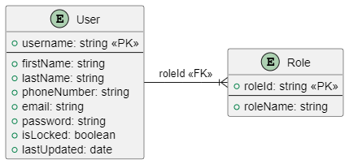

[Clixk here to show global document](../README.md)

# Software Architectural Analysis and Design of User Aggregate

- This document describes the architecture of EletricGo's User aggregate, providing an overview of the design decisions and architectural analysis made during development.

- User Aggregate is a sub-system developed to allow users interact with the system.
Each user will have restrictions, based on roles and each role will give permission for different features of EletricGo.

# Table of Contents
1. [Requirements Engineering](#1-requirements-engineering)
   1. [User Stories Description](#11-user-stories-description)
   2. [Customer Specifications and Clarifications](#12-customer-specifications-and-clarifications)
   3. [Acceptance Criteria](#13-acceptance-criteria)
   4. [Found out Dependencies](#14-found-out-dependencies)
   5. [Input and Output Data](#15-input-and-output-data)
   6. [System Sequence Diagram (SSD)](#16-system-sequence-diagram-ssd)
   7. [API Endpoints](#17-api-endpoints)
   8. [Database Schema](#18-database-schema)
   9. [Authorization Roles](#19-authorization-roles)
2. [Analysis](#2-analysis)
   1. [Preliminary Software Risk Analysis](#21-preliminary-software-risk-analysis)
   2. [Security Requirements Engineering](#22-security-requirements-engineering)
   3. [Abuse Cases](#23-abuse-cases)
   4. [Functional Security Requirements](#24-functional-security-requirements)
   5. [Non-Functional Security Requirements](#25-non-functional-security-requirements)
   6. [Secure Development Requirements](#26-secure-development-requirements)
3. [Design](#3-design)
   1. [Security Risk-Driven Design](#31-security-risk-driven-design)
   2. [Secure Architecture](#32-secure-architecture)
   3. [Secure Design Patterns](#33-secure-design-patterns)
   4. [Threat Modelling](#34-threat-modelling)
      1. [Threat Model Information](#341-threat-model-information)
      2. [External Dependencies](#342-external-dependencies)
      3. [Entry Points](#343-entry-points)
      4. [Exit Points](#344-exit-points)
      5. [Assets](#345-assets)
      6. [Trust Levels](#346-trust-levels)
      7. [Data Flow Diagrams](#7-data-flow-diagrams)
   5. [Security Test Planning](#35-security-test-planning)
   6. [Security Architecture Review](#36-security-architecture-review)

## 1. Requirements Engineering

### 1.1 User Stories Description

- As a System Administrator, I want to be able to register new users and assign roles to them.
- As an existing user, I want to log in to the system with my username and password.
- As a logged-in user, I want to log out of the system to securely end my session.

### 1.2 Customer Specifications and Clarifications

- The application should provide a user-friendly login process for existing users to access the system securely.
- After successful login, users should have access to functionalities based on their assigned role.
- Logging out of the system should terminate the user's session and require re-authentication to access protected resources.
- Only the System Administrator should have the authority to register new users and assign roles to them.

### 1.3 Acceptance Criteria

- Users should be able to log in to the system using their registered credentials.
- After logging in, users should have access to functionalities based on their assigned role.
- Logging out of the system should terminate the user's session and require re-authentication to access protected resources.
- New users should not be able to register themselves; registration and role assignment should only be performed by the System Administrator.

### 1.4 Found out Dependencies

- The login and logout functionalities depend on backend services for user authentication and session management.
- Role assignment depends on user management functionalities, specifically accessible by the System Administrator.

### 1.5 Input and Output Data

- Input data for login includes the user's username and password.
- Output data includes a success message upon successful login or logout and error messages in case of failures.

### 1.6 System Sequence Diagram (SSD)

- Login / Logout

- User Registration

### 1.7 API Endpoints

- POST /user/login - Log in to the system with username and password
- POST /user/logout - Log out of the system and terminate the session
- POST /user/register - Register a new user and assign a role (accessible only by the System Administrator)
- PUT /user/{id}/assign-role - Assign a role to a user (accessible only by the System Administrator)

### 1.8 Database Schema

The Domain Model for the User Aggregate is as follows:

Considering the previous model, the user aggregate has the following database schema:

### 1.9 Authorization Roles

- System Administrator: Full access to user management functionalities and authority to assign roles to users.
- Warehouse Manager: Access to functionalities related to warehouse data management and delivery tracking.
- Fleet Manager: Access to functionalities related to managing truck data and fleet operations.
- Logistics Manager: Access to functionalities related to route data management and distribution planning.
- Operator: Restricted access for querying and limited operations within each aggregate, with permissions tailored to their role responsibilities.

# 2. Analysis

## 2.1 Preliminary Software Risk Analysis

The Preliminary Software Risk Analysis is a systematic process crucial for understanding and mitigating potential threats to user data privacy and system integrity. Following the ISO 27005 standard, it combines qualitative and quantitative techniques to identify and assess risks associated with the user aggregate. 

Risks, including unauthorized access to sensitive data and non-compliance with regulations like GDPR (General Data Protection Regulation) or CCPA (California Consumer Privacy Act), are categorized and prioritized based on their severity.

Mitigation strategies, such as implementing encryption and multi-factor authentication, are proposed to address these risks. Effective communication and a comprehensive risk management plan ensure stakeholders are informed and proactive measures are taken to safeguard user privacy and data security.

## 2.2 Security Requirements Engineering

Security Requirements Engineering is a crucial process in software development aimed at identifying and documenting security requirements to protect the user aggregate from potential threats and vulnerabilities. 

Following established methodologies like STRIDE (Spoofing, Tampering, Repudiation, Information Disclosure, Denial of Service (DoS), Elevation of Privilege), security requirements are systematically elicited from stakeholders and analysed for completeness, consistency, and feasibility.

These requirements encompass aspects such as authentication mechanisms, access control policies, encryption, and audit trails. They are formalized into a specification that serves as a reference throughout the development process. Validation techniques, including reviews, inspections, and testing, ensure that security requirements effectively address potential risks. Compliance requirements related to industry standards and regulations, such as GDPR and CCPA, are also integrated.

Overall, Security Requirements Engineering ensures that security considerations are systematically addressed from the outset, resulting in the development of secure software solutions that safeguard the user aggregate from threats and vulnerabilities.

## 2.3 Abuse Cases

Abuse cases (also know misused cases) are scenarios that describe how a system could be intentionally misused or exploited for malicious purposes. Here are the abuse cases for the user aggregate:

| Abuse Case | Description | Impact |
|-------------|-------------|--------|
| **Data Theft During User Login**                       | A malicious insider intercepts login credentials during the authentication process and steals user data for personal gain.                                         | The insider extract sensitive information, compromising user privacy and security.                                       |
| Unauthorized Access During User Registration       | An attacker exploits a vulnerability in the user registration process to gain unauthorized access to the system before proper authentication is established.   | The attacker gains access to sensitive user data or system resources before they should be allowed.                          |
| Account Takeover Through Session Hijacking         | An attacker hijacks a user's session after successful login, gaining control over the account to perform malicious activities.                                     | The attacker can impersonate the legitimate user, access sensitive information, or perform unauthorized actions.            |
| Data Manipulation Through Unauthorized Role Assignment | A disgruntled employee with elevated privileges assigns unauthorized roles to user accounts, granting them access to sensitive functionalities.                 | The employee can manipulate user data, alter account settings, or perform actions causing confusion or harm.                |
| Service Abuse Through Phishing Campaigns           | An attacker launches a phishing campaign targeting system users, tricking them into divulging their credentials or personal information.                           | The attacker abuses system resources or compromises user accounts, leading to unauthorized access or data theft.            |
| Privacy Violation Through Insider Monitoring       | A developer or administrator accesses user data without authorization for personal curiosity or monitoring, violating user privacy and data protection regulations. | User trust is undermined, and sensitive information is exposed, potentially leading to legal and regulatory consequences. |
| Data Breach Through Exploited Vulnerabilities      | A cybercriminal exploits vulnerabilities in the system to gain unauthorized access to the user aggregate's database, exfiltrating sensitive user data.            | Large volumes of sensitive user data, including usernames, passwords, and payment information, are exposed.                 |

We will see in detail a specific use case witch is the common one and it will be done several times in the system, the login process.

## 2.4 Functional Security Requirements

| Security Requirement | Description|
|----------------------|------------|
| **User Authentication** | The system must provide mechanisms for authenticating users, including username/password and multi-factor authentication (MFA).|
| **Access Control**      | The system must enforce access controls to ensure that only authorized users have access to specific resources or functionalities. This includes role-based access control (RBAC), permissions management, and segregation of duties. |
| **Encryption**          | The system must support encryption for sensitive data both at rest and in transit. This includes encryption algorithms, key management, and secure communication protocols (e.g., SSL/TLS).|
| **Audit Logging**       | The system must log relevant security events and user activities for monitoring, auditing, and forensic purposes. This includes logging user logins, access attempts, system changes, and security-related events.|
| **Session Management**  | The system must manage user sessions securely, including session expiration, session tokens, and preventing session hijacking or fixation attacks.|
| **Data Integrity**      | The system must ensure the integrity of data by implementing measures to prevent unauthorized modification or tampering. This includes data validation, checksums, digital signatures, and hash functions.|
| **Secure Configuration** | The system must be configured securely according to best practices and industry standards. This includes hardening of servers, secure configuration of network devices, and regular security assessments.|
| **Secure APIs**         | If the system exposes APIs (Application Programming Interfaces), they must be designed and implemented securely to prevent API abuse, injection attacks, and unauthorized access.|
| **Secure File Handling** | The system must handle files securely, including file uploads, downloads, storage, and transmission. This includes validation of file types, malware scanning, and access controls on stored files.|
| **Error Handling**      | The system must handle errors gracefully and securely, avoiding information leakage that could be exploited by attackers. Error messages should be informative to users but not reveal sensitive system details.|
| **Secure Communication** | The system must ensure secure communication channels between components, including encryption of network traffic, secure configuration of web servers, and protection against common attacks like man-in-the-middle (MITM).|
| **Backup and Recovery** | The system must implement secure backup and recovery procedures to protect against data loss, corruption, and ransomware attacks. This includes regular backups, off-site storage, and testing of recovery procedures.|

## 2.5 Non-Functional Security Requirements

| Security Requirement   | Description|
|------------------------|------------|
| **Performance**        | The system should maintain efficient performance even under high loads or during security-related operations such as encryption and decryption|
| **Scalability**        | The system should be scalable to accommodate increasing user loads and data volumes while maintaining security measures.|
| **Availability**       | The system should have high availability to ensure continuous access to resources, even in the event of security incidents or attacks.|
| **Reliability**        | The system should be reliable, ensuring that security mechanisms function correctly and consistently to protect against threats.|
| **Resilience**         | The system should be resilient to withstand and recover from security breaches or incidents, minimizing the impact on operations and data integrity.|
| **Compliance**         | The system should comply with relevant security standards, regulations, and industry best practices to ensure legal and regulatory compliance.|
| **Usability**          | Security features should be designed with usability in mind to minimize user friction while still providing effective protection against threats.|
| **Interoperability**   | Security measures should be interoperable with other systems and technologies to ensure seamless integration and communication.|
| **Auditability**       | The system should support auditing and logging capabilities to enable monitoring, analysis, and forensic investigations of security-related events.|
| **Documentation**      | Comprehensive documentation should be provided for security features, configurations, and procedures to support system administration and compliance efforts.|
| **Incident Response**  | The system should have established incident response procedures and mechanisms to detect, respond to, and recover from security incidents in a timely and effective manner.|
| **Training and Awareness** | Regular security training and awareness programs should be conducted for system users, administrators, and other stakeholders to promote a security-conscious culture and enhance security posture.|

## 2.6 Secure Development Requirements

These secure development requirements help ensure that applications are developed with security in mind from the outset, reducing the risk of security vulnerabilities and improving overall system security.

| Security Practice          | Description|
|----------------------------|------------|
| **Security Training**      | Developers should receive regular security training to understand common vulnerabilities, secure coding practices, and threat mitigation techniques.|
| **Secure Coding Standards**| Development teams should adhere to secure coding standards and guidelines, such as OWASP Top 10, CERT Secure Coding Standards, or industry-specific standards.|
| **Input Validation**       | All user input should be validated to prevent injection attacks, such as SQL injection, XSS (Cross-Site Scripting), and command injection.|
| **Output Encoding**        | Output should be encoded to prevent XSS attacks and ensure that user-supplied data is treated as data, not code.|
| **Authentication and Authorization** | Strong authentication and authorization mechanisms should be implemented to control access to sensitive resources and functionalities.|
| **Session Management**     | Secure session management practices should be followed to prevent session fixation, session hijacking, and session replay attacks.|
| **Data Protection**        | Sensitive data should be encrypted at rest and in transit using strong encryption algorithms and protocols.|
| **Least Privilege**        | Principle of least privilege should be applied to limit user and system privileges to the minimum necessary to perform required tasks.|
| **Secure Configuration**   | Systems and components should be securely configured according to best practices and industry standards to reduce the attack surface. |
| **Secure Dependencies**    | Third-party dependencies should be regularly updated and vetted for security vulnerabilities to prevent supply chain attacks.|
| **Secure Development Lifecycle** | Security should be integrated throughout the development lifecycle, including requirements, design, coding, testing, and deployment phases.|
| **Security Testing**       | Comprehensive security testing, including static analysis, dynamic analysis, and penetration testing, should be conducted to identify and remediate vulnerabilities.|
| **Code Review**            | Regular code reviews should be performed to identify security issues, adherence to coding standards, and compliance with security requirements.|
| **Secure Deployment**      | Secure deployment practices should be followed to ensure that applications and components are deployed securely and securely configured in production environments.|
| **Incident Response**      | Incident response procedures should be in place to detect, respond to, and recover from security incidents in a timely and effective manner.|
| **Secure Communication**   | Secure communication channels should be used to protect data in transit, including encryption, authentication, and integrity checks.|
| **Logging and Monitoring** | Comprehensive logging and monitoring should be implemented to detect and investigate security events, anomalies, and suspicious activities.|

# 3. Design

## 3.1 Security Risk-Driven Design

Security risk-driven design involves integrating security considerations into the design process to proactively identify and mitigate potential security risks. Here are key aspects:

1. **Threat Modelling**: Conducting threat modelling exercises to identify potential threats, vulnerabilities, and attack vectors that may impact the system. This includes identifying assets, potential attackers, and potential attack scenarios.

2. **Risk Assessment**: Performing risk assessments to evaluate the likelihood and potential impact of identified security risks. This helps prioritize risks based on their severity and potential consequences.

3. **Security Controls Selection**: Selecting appropriate security controls and countermeasures to mitigate identified security risks. This may include implementing technical controls, procedural measures, and security best practices.

4. **Secure Architecture**: Designing a secure architecture that incorporates security controls and mitigations to address identified security risks. This includes designing secure network architectures, data flow diagrams, and component interactions.

5. **Security Patterns**: Utilizing security design patterns and best practices to address common security challenges and recurring security requirements. This includes patterns for authentication, access control, data protection, and secure communication.

6. **Attack Surface Reduction**: Minimizing the attack surface by reducing the exposure of system components and limiting access to sensitive resources. This includes applying the principle of least privilege, implementing strong authentication and authorization mechanisms, and enforcing strict input validation.

7. **Security by Design**: Embedding security principles and practices into the design process from the outset. This includes considering security requirements during system requirements gathering, architecture design, and implementation phases.

8. **Continuous Improvement**: Continuously evaluating and improving the security posture of the system throughout the design and development lifecycle. This includes conducting regular security reviews, assessments, and audits to identify and address emerging security risks.

Security risk-driven design aims to build security into the DNA of the system, ensuring that security considerations are integrated into every aspect of the design process. By identifying and addressing security risks early in the design phase, organizations can reduce the likelihood of security incidents and minimize the impact of potential vulnerabilities.

## 3.2 Secure Architecture

Secure architecture involves designing systems and applications with security as a primary consideration. It encompasses various principles, practices, and components aimed at mitigating security risks and ensuring the confidentiality, integrity, and availability of assets. Key aspects of secure architecture include:

1. **Defense in Depth**: Implementing multiple layers of defense to protect against different types of threats and attacks. This includes network security controls, host-based security measures, and application-level security mechanisms.

2. **Principle of Least Privilege**: Restricting access rights and privileges to the minimum necessary for users, processes, and systems to perform their intended functions. This helps minimize the potential impact of security breaches and limit the exposure of sensitive resources.

3. **Secure Network Architecture**: Designing network architectures with security in mind, including segmentation, isolation, and zoning to prevent unauthorized access and limit the spread of attacks. This may involve implementing firewalls, intrusion detection/prevention systems (IDS/IPS), and virtual private networks (VPNs).

4. **Data Encryption**: Employing encryption to protect data both at rest and in transit. This includes using strong encryption algorithms and key management practices to safeguard sensitive information from unauthorized access and interception.

5. **Identity and Access Management (IAM)**: Implementing robust IAM controls to manage user identities, authenticate users, and enforce access controls. This includes centralized authentication services, multi-factor authentication (MFA), and role-based access control (RBAC).

6. **Secure Application Design**: Developing applications with security features and controls integrated into their design. This includes secure coding practices, input validation, output encoding, and secure session management to prevent common vulnerabilities such as injection attacks, XSS, and CSRF.

7. **Resilience and Redundancy**: Building resilience and redundancy into the architecture to ensure continuous operation and availability, even in the face of disruptions or attacks. This may involve deploying redundant systems, failover mechanisms, and disaster recovery plans.

8. **Logging and Monitoring**: Implementing comprehensive logging and monitoring capabilities to detect security incidents, track user activities, and generate audit trails for forensic analysis. This includes logging security events, system activities, and access attempts for monitoring and analysis.

9. **Secure Integration**: Ensuring secure integration with external systems, services, and third-party components. This includes implementing secure APIs, message validation, and access controls to prevent unauthorized access and data leakage.

10. **Security Testing and Validation**: Conducting regular security testing and validation to identify and address vulnerabilities and weaknesses in the architecture. This includes vulnerability assessments, penetration testing, and security code reviews to identify and remediate security issues.

11. **Compliance and Governance**: Ensuring compliance with relevant security standards, regulations, and industry best practices. This includes establishing security policies, procedures, and controls to govern the design, implementation, and operation of secure architectures.

By incorporating these principles and practices into the design and implementation of architectures, organizations can build systems that are resilient, secure, and capable of protecting against a wide range of security threats and attacks.

## 3.3 Secure Design Patterns

Secure design patterns are reusable architectural solutions that address common security challenges and requirements. They provide guidance and best practices for designing secure systems and applications. Key secure design patterns include:

1. **Authentication Patterns**:
   - **Credential Management**: Securely manage user credentials, including password hashing, salting, and storage.
   - **Multi-factor Authentication (MFA)**: Implement additional authentication factors to enhance security, such as SMS codes, biometrics, or hardware tokens.
   - **Single Sign-On (SSO)**: Enable users to authenticate once and access multiple applications or services securely.

2. **Authorization Patterns**:
   - **Role-Based Access Control (RBAC)**: Assign permissions to roles and manage user access based on their roles within the system.
   - **Attribute-Based Access Control (ABAC)**: Make access control decisions based on attributes associated with users, resources, and environmental conditions.
   - **Permission Inheritance**: Inherit permissions from higher-level entities to streamline access control and minimize configuration overhead.

3. **Data Protection Patterns**:
   - **Data Encryption**: Encrypt sensitive data at rest and in transit using strong encryption algorithms and key management practices.
   - **Data Masking**: Hide or obfuscate sensitive data when displaying it to users or transmitting it over insecure channels.
   - **Data Tokenization**: Replace sensitive data with tokens or placeholders to prevent exposure in logs, databases, or external systems.

4. **Input Validation Patterns**:
   - **Whitelist Input Validation**: Validate input against a whitelist of expected values to prevent injection attacks, such as SQL injection or XSS.
   - **Blacklist Input Validation**: Filter input against a blacklist of known malicious patterns to block potentially harmful inputs.
   - **Regular Expression Validation**: Use regular expressions to validate complex input patterns, such as email addresses or URLs.

5. **Secure Communication Patterns**:
   - **Transport Layer Security (TLS)**: Use TLS to encrypt communication channels and protect data integrity and confidentiality.
   - **Mutual Authentication**: Implement mutual authentication to verify the identities of both clients and servers during communication.
   - **Secure Headers**: Set secure HTTP headers to mitigate common web security vulnerabilities, such as cross-site scripting (XSS) and clickjacking.

6. **Error Handling Patterns**:
   - **Custom Error Messages**: Provide informative error messages to users without revealing sensitive information that could aid attackers.
   - **Centralized Error Logging**: Log errors and exceptions centrally to facilitate monitoring, troubleshooting, and incident response.

7. **Logging and Monitoring Patterns**:
   - **Audit Logging**: Log security-relevant events, such as authentication attempts, access control decisions, and data modifications, for auditing and compliance purposes.
   - **Anomaly Detection**: Monitor system behaviour and user activities to detect anomalies indicative of security incidents or unauthorized behaviour.

By leveraging these secure design patterns, developers and architects can build resilient, secure, and reliable systems that effectively mitigate security risks and protect against common threats and attacks.

## 3.4 Threat Modelling

## 3.4.1. Threat Model Information

- **Purpose of the threat model**: 
  The purpose of this threat model is to identify and assess potential security threats and vulnerabilities associated with the user aggregate of the logistics application. By understanding these threats, we aim to implement appropriate security controls to safeguard user data, ensure user privacy, and maintain the integrity of the application.

- **Scope and boundaries**:
  - **In-Scope**: 
    - User authentication and authorization mechanisms.
    - User account management functionalities such as registration, login, password reset and profile management.
    - Protection of sensitive user data including personal information, authentication credentials and transaction history.
    - Interaction with external services and APIs related to user functionalities.
  - **Out-of-Scope**:
    - Backend infrastructure components not directly related to user management.
    - Third-party services or integrations not controlled or managed by the application.
    - Physical security measures or threats beyond the digital realm.

- **Assumptions and constraints**:
  - **Assumptions**:
    - Users will interact with the application using standard web and/or mobile interfaces.
    - User data will be stored securely and encrypted at rest.
    - Users will access the application from devices and networks with a reasonable level of security hygiene.
  - **Constraints**:
    - Limited resources for implementing security controls.
    - Compliance requirements such as GDPR, CCPA or other relevant regulations.
    - Time constraints for threat assessment and mitigation.

- **Team members involved**:
  - Developers: Provide insights into the implementation details and feasibility of security controls.

## 3.4.2. External Dependencies
- Third-party services or libraries
- APIs and integrations
- External systems interacting with the application

## 3.4.3. Entry Points
- User interfaces (web, mobile, desktop)
- APIs and web services
- External devices or sensors

## 3.4.4. Exit Points
- Data storage systems (databases, file systems)
- Output channels (API responses, logs)
- External integrations or services

## 3.4.5. Assets
- Critical data and information
- User accounts and credentials
- Intellectual property and proprietary information

## 3.4.6. Trust Levels
- Classification of users or entities based on trust levels
- Differentiation between internal and external actors
- Trust boundaries and access control policies

## 3.4.7. Data Flow Diagrams
- Visualization of data flows within the system
- Identification of data sources, sinks, and processes
- Mapping of data flows to system components and interactions

### 3.4.2. Scope

The scope of the threat modelling exercise for the user component of the logistics application includes:
- User authentication and authorization mechanisms
- User account management functionalities
- Protection of sensitive user data (e.g., personal information, authentication credentials)

### 3.4.3. Assets

Assets that need to be protected in the user component of the logistics application include:
- User account information (e.g., usernames, passwords)
- Personal and contact information of users
- Authorization tokens and session identifiers

### 3.4.4. Threats

#### Unauthorized Access
Threat: An attacker gains unauthorized access to user accounts due to weak authentication mechanisms or stolen credentials.
Mitigation: Implement strong password policies, multi-factor authentication, and secure session management.

#### Account Hijacking
Threat: Attackers hijack user accounts by exploiting vulnerabilities in session management or password reset mechanisms.
Mitigation: Implement secure session handling, enforce password reset procedures, and monitor for suspicious activities.

#### Data Breach
Threat: Sensitive user data, such as personal information or authentication credentials, is exposed due to insecure storage or transmission mechanisms.
Mitigation: Encrypt sensitive data at rest and in transit, adhere to secure coding practices, and regularly audit data access controls.

#### Insider Threats
Threat: Malicious insiders or compromised accounts pose a threat to the confidentiality and integrity of user data.
Mitigation: Implement role-based access control, conduct regular security awareness training, and monitor user activities for anomalies.

### 3.4.5. Vulnerabilities

#### Injection Attacks
Vulnerability: Input validation flaws in user input fields could lead to SQL injection or other injection attacks.
Mitigation: Use parameterized queries, input validation, and output encoding to prevent injection vulnerabilities.

#### Cross-Site Scripting (XSS)
Vulnerability: Lack of input validation and output encoding in web forms or user-generated content could lead to XSS attacks.
Mitigation: Implement content security policies, sanitize user input, and encode output to prevent XSS vulnerabilities.

#### Insecure Direct Object References (IDOR)
Vulnerability: Improper access controls could allow attackers to access unauthorized user data by manipulating object references.
Mitigation: Implement proper access controls, such as role-based access control (RBAC) or access control lists (ACLs), and validate user permissions before accessing sensitive data.

#### Insufficient Logging and Monitoring
Vulnerability: Inadequate logging and monitoring make it difficult to detect and respond to security incidents or suspicious activities.
Mitigation: Implement comprehensive logging of user activities, monitor logs for unusual behaviour, and establish incident response procedures.

### 3.4.6. Attack Surface Analysis

The attack surface of the user component of the logistics application includes:
- Web interfaces for user authentication and account management
- Mobile application interfaces for user interaction and data access
- APIs for user-related functionalities such as user registration and profile management

### 3.4.7. Threat Scenarios

Threat scenarios for the user component of the logistics application include:
- Unauthorized access to user accounts due to weak or compromised passwords
- Theft of user credentials through phishing emails or fake login pages
- Account takeover attacks targeting privileged user accounts
- Disclosure of sensitive user information due to insufficient access controls

### 3.4.8. Risk Assessment

Assessment of risks in the user component of the logistics application includes:
- Likelihood of occurrence based on historical data and threat intelligence
- Potential impact on user privacy, data confidentiality, and system integrity
- Prioritization of risks based on severity and potential consequences

### 3.4.9. Countermeasure Selection

Countermeasures to mitigate risks in the user component of the logistics application include:
- Implementation of strong password policies and multi-factor authentication
- Encryption of sensitive user data both at rest and in transit
- Regular security patches and updates to address known vulnerabilities
- Implementation of proper input validation and access controls to prevent injection attacks and unauthorized access

### 3.4.10. Security Requirements

Security requirements for the user component of the logistics application include:
- Use of secure communication protocols (e.g., TLS) to protect user data in transit
- Logging and monitoring of user activities to detect and respond to suspicious behaviour
- Regular security training and awareness programs for users to recognize and report security threats
- Incident response plan and procedures for addressing security incidents and breaches involving user accounts

### 3.4.11. Documentation

Documentation for the threat modelling process of the user component of the logistics application includes:
- Threat models detailing identified threats, vulnerabilities, and risk assessments
- Risk assessment reports outlining prioritized risks and recommended countermeasures
- Security requirements documentation specifying security controls and implementation guidelines
- Incident response plan and procedures for responding to security incidents and breaches involving user accounts

### 3.4.12. Conclusion

In conclusion, the threat modelling process for the user component of the logistics application provides valuable insights into potential security risks and vulnerabilities. By systematically identifying and addressing these risks, we can enhance the security posture of the system and protect user accounts and sensitive information.

## 3.5 Security Test Planning

## 3.6 Security Architecture Review