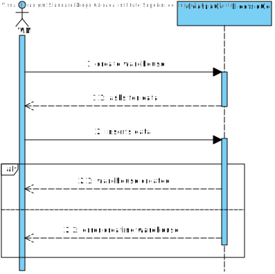
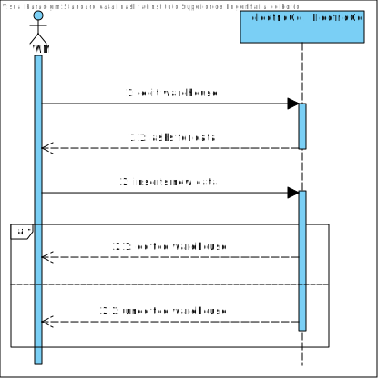
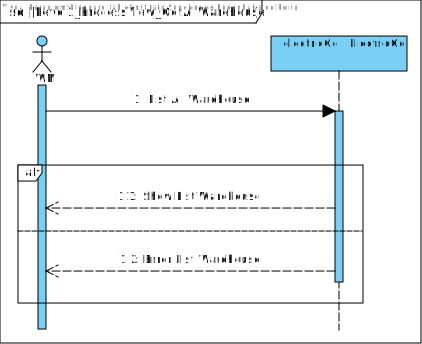
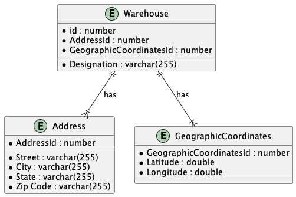
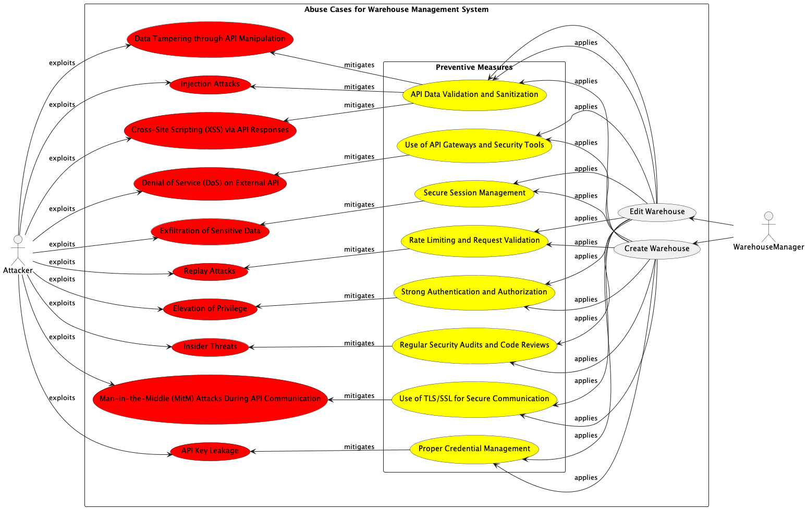

# Software Architectural Analysis and Design of Warehouse Aggregate
- This document describes the architecture of EletricGo's Warehouse aggregate, providing an overview of the design decisions and architectural analysis made during development.
- Warehouse Aggregate is a sub-system developed to ...

# Table of Contents
1. [Requirements Engineering](#1-requirements-engineering)
  1. [User Stories Description](#11-user-stories-description)
  2. [Customer Specifications and Clarifications](#12-customer-specifications-and-clarifications)
  3. [Acceptance Criteria](#13-acceptance-criteria)
  4. [Found out Dependencies](#14-found-out-dependencies)
  5. [Input and Output Data](#15-input-and-output-data)
  6. [System Sequence Diagram (SSD)](#16-system-sequence-diagram-ssd)
  7. [API Endpoints](#17-api-endpoints)
  8. [Database Schema](#18-database-schema)
  9. [Authorization Roles](#19-authorization-roles)
2. [Analysis](#2-analysis)
  1. [Preliminary Software Risk Analysis](#21-preliminary-software-risk-analysis)
  2. [Security Requirements Engineering](#22-security-requirements-engineering)
  3. [Abuse Cases](#23-abuse-cases)
  4. [Functional Security Requirements](#24-functional-security-requirements)
  5. [Non-Functional Security Requirements](#25-non-functional-security-requirements)
  6. [Secure Development Requirements](#26-secure-development-requirements)
3. [Design](#3-design)
  1. [Security Risk-Driven Design](#31-security-risk-driven-design)
  2. [Secure Architecture](#32-secure-architecture)
  3. [Secure Design Patterns](#33-secure-design-patterns)
  4. [Threat Modelling](#34-threat-modelling)
  5. [Security Test Planning](#35-security-test-planning)
  6. [Security Architecture Review](#36-security-architecture-review)

# 1. Requirements Engineering

## 1.1 User Stories Description

- As a warehouse manager, I want to be able to create a new warehouse.
- As a warehouse manager, I want to be able to update a warehouse.
- As a warehouse manager, I want to be able to delete a warehouse.
- As a warehouse manager, I want to be able to list all warehouses.

## 1.2 Customer Specifications and Clarifications

- The warehouse should contain the following information:
  - Id
  - Designation
  - Address
  - Geographic Coordinates

## 1.3 Acceptance Criteria

- The warehouse should be successfully created in the system.
- The log should be updated with the warehouse creation.
- The error message should be displayed if the warehouse is not created.

## 1.4 Found out Dependencies

- The warehouse aggregate depends on the following aggregates:
  - User

- The warehouse manager should be authenticated to create, update, and delete a warehouse.
- The Geographic Coordinates depend on the external api.

## 1.5 Input and Output Data

- Input:
  - Designation
  - Address (Street, City, State, Zip Code)
  - Geographic Coordinates (Latitude, Longitude)

## 1.6 System Sequence Diagram (SSD)

- Create Warehouse

- Update Warehouse

- Get All Warehouses

## 1.7 API Endpoints

- POST /warehouse/ - Create a new warehouse
- PUT /warehouse/{id} - Update a warehouse
- DELETE /warehouse/{id} - Delete a warehouse
- GET /warehouses/ - List all warehouses

## 1.8 Database Schema: modelo relacional

Considering the domain model, the Warehouse aggregate has the following database schema:

## 1.9 Authorization Roles

- Warehouse Manager: Access to functionalities related to warehouse data management and delivery tracking.
- Operator: Restricted access for querying and limited operations within each aggregate, with permissions tailored to their role responsibilities.

# 2. Analysis

## 2.1 Preliminary Software Risk Analysis
Given the user stories and system interactions with external APIs (specifically for geographic coordinates), there are several risks:
- **Data Integrity**: Risks associated with incorrect data from the external API affecting warehouse information.
- **Unauthorized Access**: If authentication mechanisms are weak, unauthorized users might access or manipulate warehouse data.
- **Dependency on External Services**: Reliance on external APIs for geographic coordinates could lead to failure in warehouse operations if these services are unavailable or responding with errors.

## 2.2 Security Requirements Engineering
- **Authentication**: Ensure that only authenticated users, specifically warehouse managers, can create, update, or delete warehouse information.
- **Authorization**: Implement role-based access control (RBAC) to enforce that only warehouse managers have write access while operators have limited read access.
- **Data Validation**: Inputs for warehouse creation and update (designation, address, geographic coordinates) must be validated to prevent injection attacks and ensure data integrity.
- **Secure Communication**: Ensure that all data transmitted to and from the external API is encrypted using TLS to protect against eavesdropping and man-in-the-middle attacks.

## 2.3 Abuse Cases

- **API Abuse**: An attacker might attempt to flood the system with rapid, repeated requests to the external geographic coordinates API, leading to denial of service.
- **Spoofing External API**: An attacker could spoof the external API to send incorrect geographic data, leading to erroneous warehouse locations being stored.
- **Unauthorized Data Access**: An attacker impersonates a warehouse manager to gain access to sensitive warehouse data or perform unauthorized operations.
- **Data Tampering through API Manipulation**: An attacker manipulates the data sent to or received from the external geographic coordinates API, potentially altering warehouse locations or corrupting the address data stored in the system.
- **Replay Attacks**: An attacker captures legitimate API requests and replays them to create unauthorized warehouse entries or duplicate transactions, which can disrupt inventory management and reporting.
- **Elevation of Privilege**: An attacker exploits vulnerabilities in the authentication or authorization process to gain higher-level privileges, such as those of a warehouse manager, allowing them to manipulate warehouse data and potentially disrupt operations.
- **Injection Attacks**: Through SQL injection, command injection, or similar attacks, an attacker could exploit insufficient input validation to execute arbitrary commands or queries within the system or the external API, leading to data breaches or unauthorized data alterations.
- **Exfiltration of Sensitive Data**: An attacker might exploit weak security configurations to access and exfiltrate sensitive data such as warehouse locations, inventory details, and personal information of the warehouse staff.
- **Denial of Service (DoS) on External API**: By overwhelming the external geographic coordinates API with high volumes of requests, an attacker could cause the service to become unavailable, leading to failures in warehouse operations that depend on real-time data.
- **Insider Threats**: An employee or insider could misuse their legitimate access to perform unauthorized actions, such as deleting or modifying critical warehouse information, either for personal gain or to cause damage to the organization.
- **Cross-Site Scripting (XSS) via API Responses**: If external API responses are not properly sanitized before being displayed on a user interface, an attacker could inject malicious scripts that are executed in the browsers of users viewing the data, leading to session hijacking or data leaks.
- **Man-in-the-Middle (MitM) Attacks During API Communication**: An attacker could intercept communications between the warehouse management system and the external APIs to steal or manipulate sensitive data transmitted during these exchanges.
- **API Key Leakage**: If API keys or credentials are not securely managed, they could be leaked or stolen, allowing an attacker to gain unauthorized access to the external APIs, leading to potential misuse or abuse of these services.

## 2.4 Functional Security Requirements
- **Secure API Gateway**: Use an API gateway to manage, throttle, and monitor access to the external geographic coordinates API to mitigate abuse.
- **Endpoint Security**: Each API endpoint (POST, PUT, DELETE, GET) should have security measures such as rate limiting, logging, and request validation.
- **Session Management**: Implement secure session management practices for warehouse managers to prevent session hijacking and unauthorized access.

## 2.5 Non-Functional Security Requirements
- **Availability**: Ensure high availability of the system, including during interactions with the external geographic coordinates API.
- **Performance**: The system should handle interactions with the external API efficiently, even under high load, without significant delays in response times.
- **Scalability**: The system should scale effectively as the number of warehouse operations and interactions with the external API increases.

## 2.6 Secure Development Requirements
- **Code Reviews**: Conduct regular security-focused code reviews to identify vulnerabilities early in the development process.
- **Security Training**: Provide security awareness and secure coding training to developers and involved personnel.
- **Automated Security Testing**: Integrate automated security testing tools into the development pipeline to detect vulnerabilities before deployment.

By addressing these points, the system's security posture can be significantly enhanced, especially in its interactions with external APIs and handling of sensitive warehouse data.

# 3. Design

## 3.1 Security Risk-Driven Design

The design will prioritize security risks identified in the analysis phase, particularly those related to the interactions with public APIs for geographic coordinates.

**Encapsulation of API Interactions**:
  - Purpose: To isolate API interaction logic from the rest of the application, reducing the risk of cascading failures and simplifying security updates.
  - Implementation: Create dedicated services or modules that handle all aspects of API communication, including request preparation, response processing, error handling, and data transformation.

**Design for Fail-Safe Operations**:
  - Purpose: To ensure the system remains operational even when external services fail.
  - Implementation: Implement circuit breakers to halt interactions after repeated failures, and use timeouts to prevent system hang-ups due to unresponsive external services.

**Data Integrity Checks**:
  - Purpose: To ensure that data from external sources remains unchanged and reliable throughout its transit.
  - Implementation: Use cryptographic hashes and checksums to validate the integrity of received data before processing it within the system.

## 3.2 Secure Architecture

**Layered Architecture**:
  - Purpose: To provide a clear separation of concerns, enhancing security by segregating systems into distinct layers that can be independently secured.
  - Implementation: Design the application with separate layers for presentation (UI), business logic, data access, and external API interactions. Apply specific security policies and controls to each layer as appropriate.

**Secure API Gateway**:
  - Purpose: To manage and secure all inbound and outbound API traffic.
  - Implementation: Deploy an API gateway that acts as a single entry point for all external communications. This gateway will authenticate API calls, enforce security policies, apply rate limiting, and log all transactions.

**Microservices for Modular Security**:
  - Purpose: To improve the security and maintenance of the system by dividing functionality into independently deployable services.
  - Implementation: Use a microservices architecture to separate functional areas of the application. Each microservice handles a specific aspect of the application and communicates with others via secure, well-defined interfaces.

## 3.3 Secure Design Patterns

**Proxy Pattern**:
  - Purpose: To control access and provide a layer of security between the client and the external API.
  - Implementation: Implement a proxy service that filters, validates, and relays requests to the external API. This service also handles responses by sanitizing data before passing it back to the client.

**Adapter Pattern**:
  - Purpose: To allow the system to interact with external APIs without changing internal data handling or exposing sensitive data structures.
  - Implementation: Design adapters that convert data between the format required by external APIs and the format used internally, shielding the internal systems from external changes.

**Singleton Pattern for API Client Instances**:
  - Purpose: To manage resources efficiently and ensure that critical API client instances are controlled and reused appropriately.
  - Implementation: Use the singleton pattern to create a single instance of each API client, which can be accessed by various parts of the application to ensure consistency and minimize resource usage.

## 3.4 Threat Modelling

## 3.5 Security Test Planning

**Automated Security Testing**:
  - Purpose: To regularly check for and fix vulnerabilities within the system, especially in components that interact with external APIs.
  - Implementation: Integrate automated security tools into the continuous integration/continuous deployment (CI/CD) pipeline to perform static and dynamic analysis, dependency checks, and security regression testing.

**Penetration Testing**:
  - Purpose: To actively seek out exploitable vulnerabilities in the system.
  - Implementation: Conduct regular penetration tests, simulating attacks on API endpoints and other critical system components to identify and address security weaknesses.

**API Security Testing**:
  - Purpose: To ensure the robustness of API endpoints against common and advanced security threats.
  - Implementation: Use specialized tools to simulate
